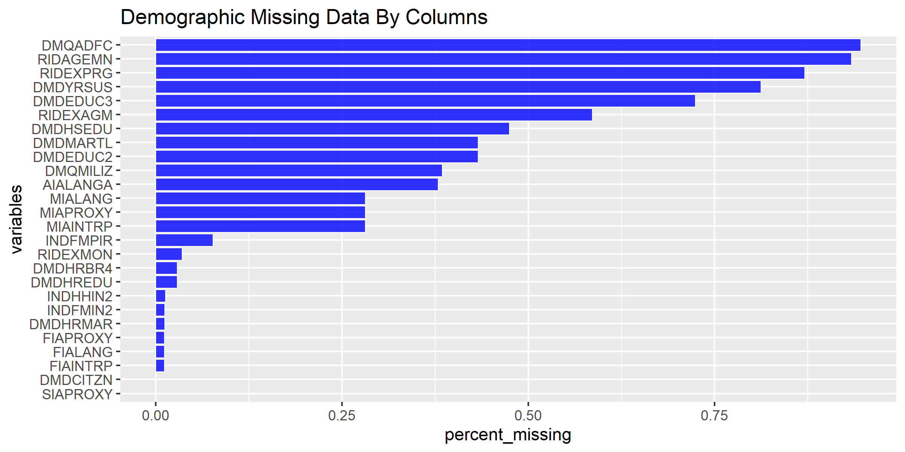
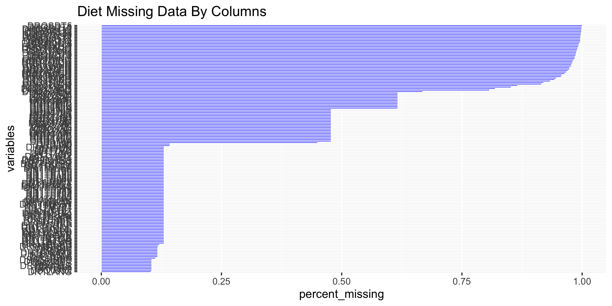
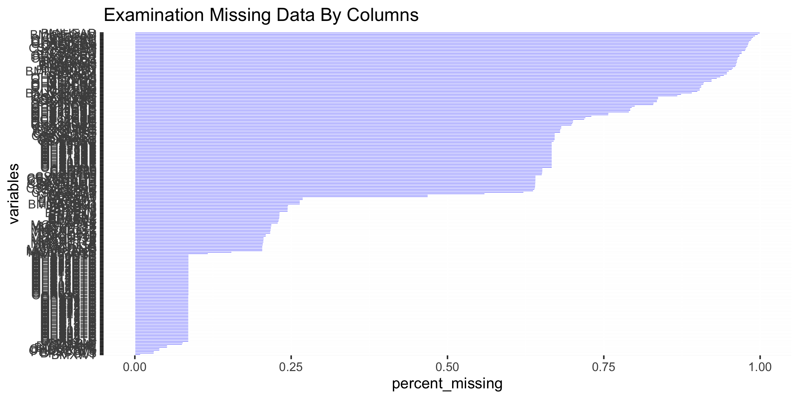
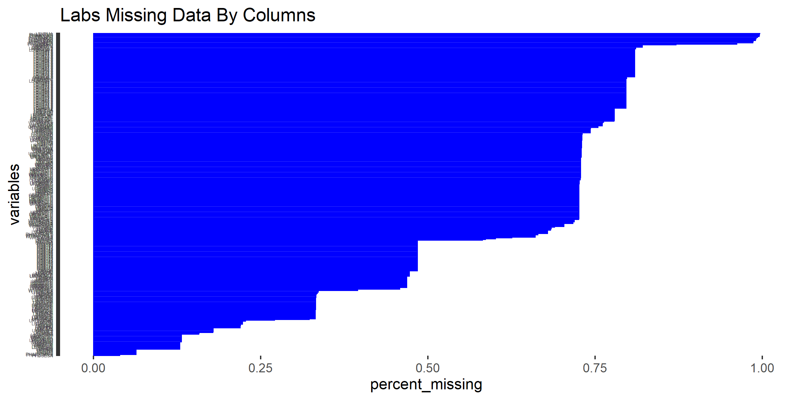
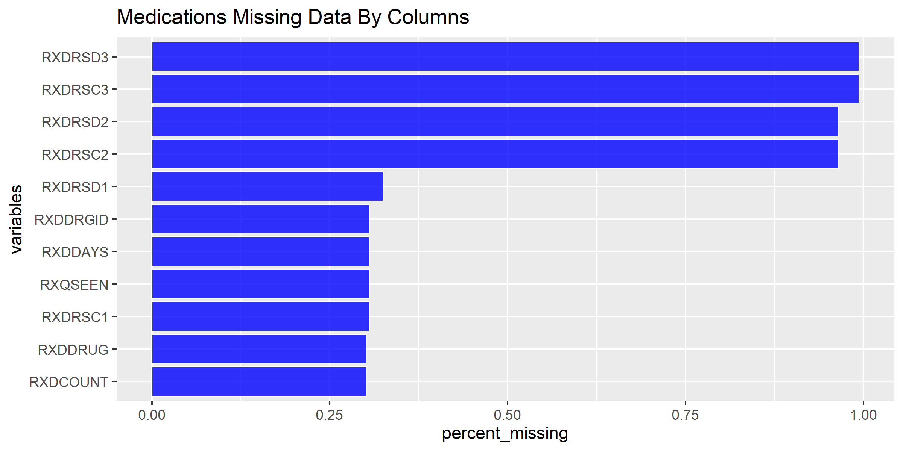
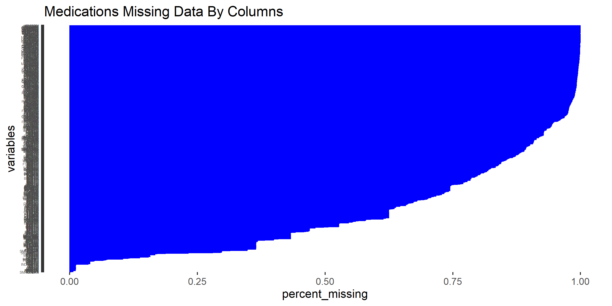
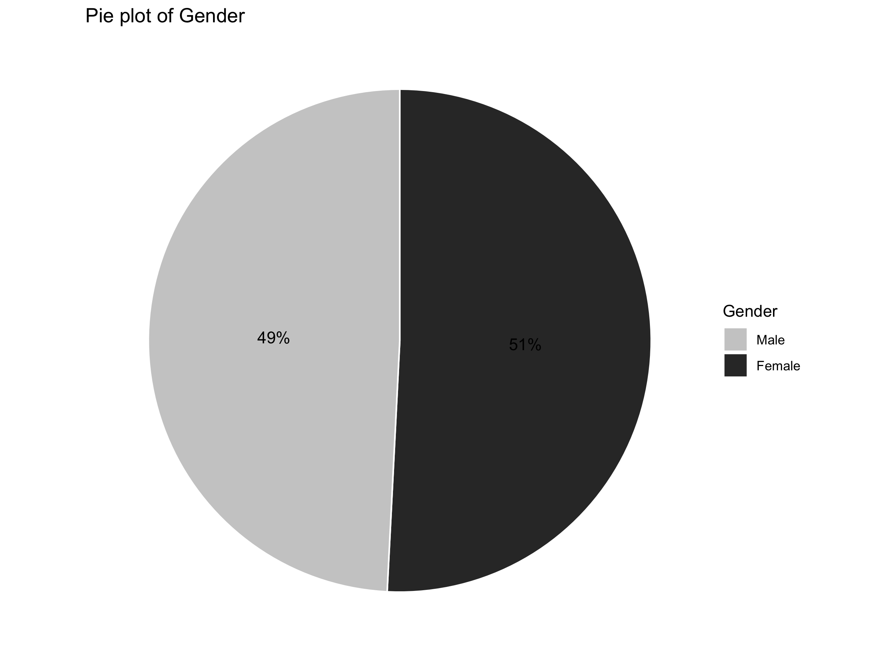
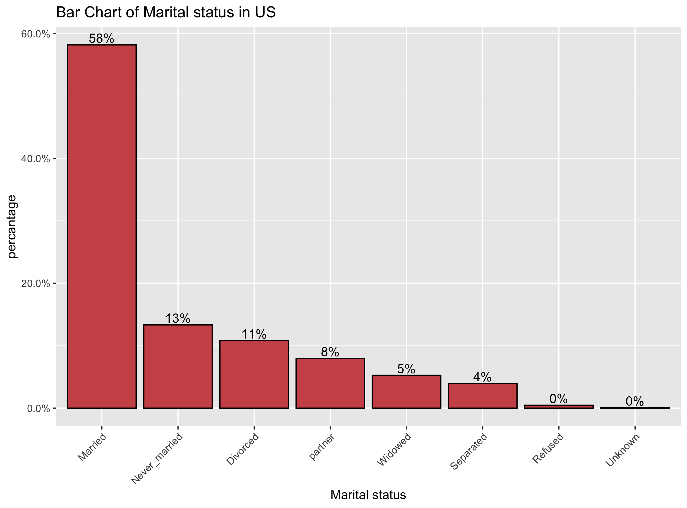
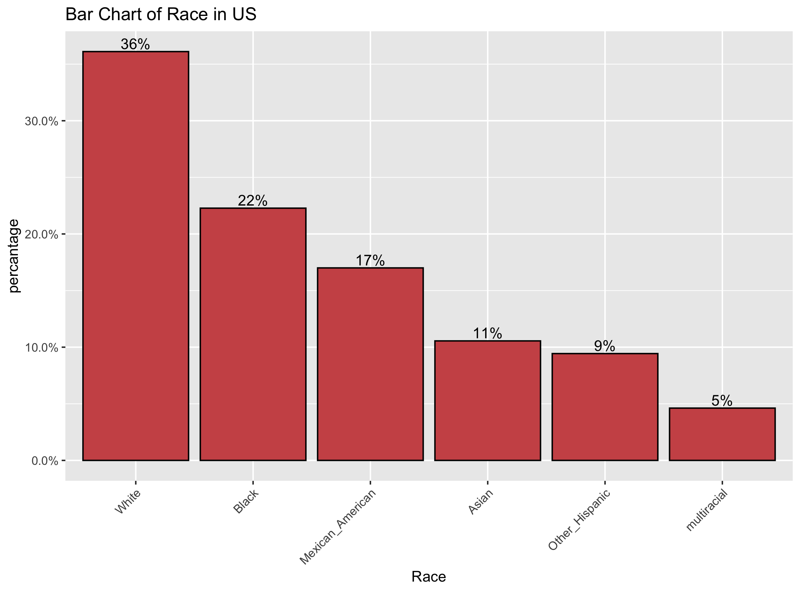

```{r setup, include=FALSE, warning = F}
knitr::opts_chunk$set(echo = TRUE, fig.align="center")
knitr::opts_chunk$set(fig.pos = 'H')
knitr::opts_chunk$set(comment=FALSE)
knitr::opts_chunk$set(warning=FALSE)
```

\newpage

# Introduction
The following is a hypothetical business problem: A pharmaceutical company is looking to better understand what the data related to subjects and various health conditions and miscellaneous attributes.

## Terms 

  * **Subject** - A person who has been surveyed by the NHMS dataset for various attributes related to the following: demographics, examinations, dietary, questionnaire (medical history), and medication.
  
  * **Health Conditions** - Various diseases or ailments that people may inhibit, such as sleep disorders, diabetes, oral health, cholesterol.  
  
  * **The National Health and Nutrition Examination Survey (NHANES)** - A program of studies designed to assess the health and nutritional status of adults and children in the United States.


## Data Description

The data is spread against 6 spreadsheets (CSV): Demographics, Examinations, Dietary, Laboratory, Questionnaire, and Medication.

# Business Case
A pharmaceutical company wants to develop new drugs. The company is curious as to whether existing data on subjects and their associated health conditions could provide advice and insight to their drug researchers. They have obtained the NHANES dataset.  This dataset contains subject/patient data along with various information including health conditions.  

The company is interested in devleoping new drugs for the following health conditions: diabetes and hypertension/cholesterol and cancer. <we can add or remove health conditions later.  At the very least, let’s keep diabetes or something>

They have approached our Machine Learning group for help on these problems:

## First Problem: 
What types of symptoms, medications, diet, demographics are common among various "health conditions"? For example: The type of dietary factors are commonly found with diabetes.

## Second Problem: 
Are there any commonalities between various people with the same health conditions? For example: The similarities that subjects have if they share a health condition.

\pagebreak

# Analytical Reframing for the Business Case.  
The **first business problem** involves using “health condition” features and finding related features. This is an association problem and we will need a model using an association algorithm.

* What features are associated with “health condition” features?
* We’re comparing the rows of the dataset.

The **second business problem** involves finding commonality between subjects. This is a clustering problem and we will need a model using a clustering algorithm. We need to determine whether the business’s presumption is accurate:

* According to their health conditions, can subjects be divided into discrete groups that could provide meaningful data for the drug researchers?
* We’re comparing the columns of the dataset.

If this is the case, we need to find clusters of subjects that segregate the data by health conditions and report these findings to the business.  

On the contrary, if there is too much commonality between “health condition” features and other features, we will also report this finding and note the clusters we did find.   

## How do we define "health condition" features within the dataset ? 
For the association problem, we will need to see which attributes are tied to the "health condition" features. In order to achieve this, we are postulating that the following columns/features of the Questionnaire dataset indicate that an individual has a "health condition":

### Diabetes
* **DID040** - "How old {was SP/were you} when a doctor or other health professional first told {you/him/her} that {you/he/she} had diabetes or sugar diabetes?"

* **DID060** - "For how long {have you/has SP} been taking insulin?"

NA in the above features might indicate the subject does not have diabetes.  

### Blood Pressure
* **BPD035** - How old {were you/was SP} when {you were/he/she was} first told that {you/he/she} had hypertension or high blood pressure?

* **BPQ020** - {Have you/Has SP} ever been told by a doctor or other health professional that {you/s/he} had hypertension, also called high blood pressure?

### Cancer 
* **MCQ220** - {Have you/Has SP} ever been told by a doctor or other health professional that {you/s/he} had cancer or a malignancy (ma-lig-nan-see) of any kind?  

\pagebreak

# Loading R packages

```{r,warning = F, message=F}
library(plyr)
library(dplyr)
library(tidyr)
library(ggplot2)
library(knitr)
library(mice)
library(scales)
library(randomForest)
library(psych)
library(factoextra)
library(RColorBrewer)
library(caret)
library(plotly)
library(scales)
```


# Data cleaning

<Describe what needs to happen to the data files> 

As indicated eariler, the dataset conists of six raw data files: Demographics, Examinations, Dietary, Laboratory, Questionnaire, and Medication. The largest dataset, in term of attributes, contains 953 variables; while the smallest one contains 47 variables.

Because this is a large amount of data, with over a thousand attributes cummulatively, we decided to employ the following guidelines to reduce the complexity of the data: 

* If more than 25% of the values are missing for an attribute(column), we will consider removing the column from further evaluation.
* If the majority of attributes are missing 25% or more of their values for a given dataset, we will use business/personal judgmement to subjectively select a smaller subset of values of interest. Of these subset of missing values, we will decide how to impute the values on these attributes.     

Ideally, we would like to analyse and impute every attribute with missing values, but in this situation, it may not be practical due to the large volume of missing data. 


```{r, warning = F, message=F}
# Reading files
demographic   = read.csv("Data/Raw/demographic.csv", header = TRUE, na.strings = c("NA","","#NA"))
diet          = read.csv("Data/Raw/diet.csv", header = TRUE, na.strings = c("NA","","#NA"))
examination   = read.csv("Data/Raw/examination.csv", header = TRUE, na.strings = c("NA","","#NA"))
labs          = read.csv("Data/Raw/labs.csv", header = TRUE, na.strings = c("NA","","#NA"))
medications   = read.csv("Data/Raw/medications.csv", header = TRUE, na.strings = c("NA","","#NA"))
questionnaire = read.csv("Data/Raw/questionnaire.csv", header = TRUE, na.strings = c("NA","","#NA"))

# Merging files
data_list = list(demographic,examination,diet,labs,questionnaire,medications)
data_joined = join_all(data_list)

```

\pagebreak

## Checking for missing data
It is always important to check for missing values and consider how to fix them.

We decided to represent the Demographic and Diet datasets as they are mostly complete.

We found that the percentage of missing data in four of the six spreadsheets is very significant. Almost all attributes/columns have varying degrees of missing values.

### Demographic
```{r, eval=F, echo=TRUE, warning = F, message=F}
demographic_MS <- demographic %>% summarise_all(~(sum(is.na(.))/n()))
demographic_MS <- gather(demographic_MS, key = "variables", value = "percent_missing")
demographic_MS <- demographic_MS[demographic_MS$percent_missing > 0.0, ] 

demographic_MS_plot  <- ggplot(demographic_MS, aes(x = reorder(variables,percent_missing), 
                                                   y = percent_missing)) +
  geom_bar(stat = "identity", fill = "blue", aes(color = I('white')), 
           size = 0.3, alpha = 0.8)+
  xlab('variables')+ coord_flip()+ 
  #theme_fivethirtyeight() +
  ggtitle("Demographic Missing Data By Columns")

#demographic_MS_plot
ggsave(plot = demographic_MS_plot, width = 8, height = 4, dpi = 300, 
       filename = "Figures/demographic_MS_plot.png")


```


\pagebreak

### Diet
```{r, eval=F, echo=TRUE, warning = F, message=F}
diet_MS <- diet %>% summarise_all(~(sum(is.na(.))/n()))
diet_MS <- gather(diet_MS, key = "variables", value = "percent_missing")
diet_MS <- diet_MS[diet_MS$percent_missing > 0.0, ] 
diet_MS_plot <- ggplot(diet_MS, aes(x = reorder(variables, percent_missing),
                                    y = percent_missing)
                       ) +
  geom_bar(stat = "identity", fill = "blue", aes(color = I('blue')), 
           size = 0.3, alpha = 0.8)+
  xlab('variables') + coord_flip()+ 
  #theme_fivethirtyeight() +
  ggtitle("Diet Missing Data By Columns")+
  theme(axis.text.y=element_text(size=3))


#diet_MS_plot
ggsave(plot = diet_MS_plot, width = 8, height = 4, dpi = 300, 
       filename = "Figures/diet_MS_plot.png")

```


\pagebreak

### Examination
```{r, eval=F, echo=TRUE, warning = F, message=F}
examination_MS <- examination %>% summarise_all(~(sum(is.na(.))/n()))
examination_MS <- gather(examination_MS, key = "variables", value = "percent_missing")
examination_MS <- examination_MS[examination_MS$percent_missing > 0.0, ] 

examination_MS_plot <- ggplot(examination_MS, aes(x = reorder(variables, percent_missing), 
                                                  y = percent_missing)) +
  geom_bar(stat = "identity", fill = "blue", aes(color = I('blue')),
           size = 0.3, alpha = 0.8)+
  xlab('variables')+ coord_flip()+ 
  #theme_fivethirtyeight() +
  ggtitle("Examination Missing Data By Columns")+
  theme(axis.text.y=element_text(size=3))

#examination_MS_plot
ggsave(plot = examination_MS_plot, width = 8, height = 4, dpi = 300, 
       filename = "Figures/examination_MS_plot.png")

```  


\pagebreak
### Labs
```{r, eval=F, echo=TRUE, warning = F, message=F}
labs_MS <- labs %>% summarise_all(~(sum(is.na(.))/n()))
labs_MS <- gather(labs_MS, key = "variables", value = "percent_missing")
labs_MS <- labs_MS[labs_MS$percent_missing > 0.0, ] 
labs_MS_plot <- ggplot(labs_MS, aes(x = reorder(variables, percent_missing),
                                    y = percent_missing)
                       ) +
  geom_bar(stat = "identity", fill = "blue", aes(color = I('blue')), 
           size = 0.3, alpha = 0.8)+
  xlab('variables') + coord_flip()+ 
  ggtitle("Labs Missing Data By Columns")+
  theme(axis.text.y=element_text(size=3))


#labs_MS_plot
ggsave(plot = labs_MS_plot, width = 8, height = 4, dpi = 300, 
       filename = "Figures/labs_MS_plot.png")

```


\pagebreak

### Medications
```{r, eval=F, echo=TRUE, warning = F, message=F}
medications_MS <- medications %>% summarise_all(~(sum(is.na(.))/n()))
medications_MS <- gather(medications_MS, key = "variables", value = "percent_missing")
medications_MS <- medications_MS[medications_MS$percent_missing > 0.0, ] 

medications_MS_plot <- ggplot(medications_MS, aes(x = reorder(variables, percent_missing),
                                                  y = percent_missing)) +
  geom_bar(stat = "identity", fill = "blue", aes(color = I('white')),
           size = 0.3, alpha = 0.8)+
  xlab('variables')+  coord_flip()+ 
  #theme_fivethirtyeight() +
  ggtitle("Medications Missing Data By Columns")

#medications_MS_plot
ggsave(plot = medications_MS_plot, width = 8, height = 4, dpi = 300, 
       filename = "Figures/medications_MS_plot.png")

```


\pagebreak


### Questionnaire
```{r, eval=F, echo=TRUE, warning = F, message=F}
questionnaire_MS <- questionnaire %>% summarise_all(~(sum(is.na(.))/n()))
questionnaire_MS <- gather(questionnaire_MS, key = "variables", value = "percent_missing")
questionnaire_MS <- questionnaire_MS[questionnaire_MS$percent_missing > 0.0, ] 

questionnaire_MS_plot <- ggplot(questionnaire_MS, aes(x = reorder(variables, percent_missing),
                                                      y = percent_missing)) +
geom_bar(stat = "identity", fill = "blue", aes(color = I('blue')),
           size = 0.3, alpha = 0.8)+
xlab('variables')+  coord_flip()+ 
ggtitle("Questionnaire Missing Data By Columns")+
theme(axis.text.y=element_text(size=3))

#questionnaire_MS_plot
ggsave(plot = questionnaire_MS_plot, width = 8, height = 4, dpi = 300, 
       filename = "Figures/questionnaire_MS_plot.png")

```


\pagebreak

## Data Imputation and  Vizualization

As per our guidelines, we will select attributes/columns of interest based on our business/personal judgements. The full NHANES data dictionary/variable list is available at the following URL:

https://wwwn.cdc.gov/nchs/nhanes/continuousnhanes/default.aspx?BeginYear=2013

We have inspected the above data dictionary and we have selected the following relevant values for further analysis:

### Demographic
We have selected the following 8 relevant columns among the 32 that have less than 25% of missing values:

* **ID (SEQN)** - Respondent sequence number..
* **Gender (RIAGENDR)** - Gender of the participant..
* **Age (RIDAGEYR)** - Age in years of the participant at the time of screening. Individuals 80 and over are topcoded at 80 years of age..
* **Race (RIDRETH3)** - Recode of reported race and Hispanic origin information, with Non-Hispanic Asian Category.
* **Country_of_birth (DMDBORN4)** - In what country {were you/was SP} born?.
* **Citizenship_status (DMDCITZN)** - {Are you/Is SP} a citizen of the United States? [Information about citizenship is being collected by the U.S. Public Health Service to perform health related research. Providing this information is voluntary and is collected under the authority of the Public Health Service Act. There will be no effect on pending immigration or citizenship petitions.].
* **Family_members (DMDFMSIZ)** - Total number of people in the Family.
* **Marital_status (DMDHRMAR)** - HH reference person's marital status.
* **Family_income (INDFMIN2)** - Total family income (reported as a range value in dollars).

```{r, eval=TRUE, echo=TRUE, warning = F, message=F}

demo_subset_8_list = c("RIAGENDR", "RIDAGEYR", "RIDRETH3", "DMDBORN4",
                        "DMDCITZN", "DMDFMSIZ", "DMDHRMAR", "INDFMIN2")

demo_subset_8  <- demographic%>% 
  select("SEQN",demo_subset_8_list)
  
demo_subset_8<- demo_subset_8 %>% 
  rename("ID"                 =         "SEQN",  
         "Gender"             =     "RIAGENDR",  
         "Age"                =     "RIDAGEYR",  
         "Race"               =     "RIDRETH3",  
         "Country_of_birth"   =     "DMDBORN4",  
         "Citizenship_status" =     "DMDCITZN",   
         "Family_members"     =     "DMDFMSIZ",  
         "Marital_status"     =     "DMDHRMAR",  
         "Family_income"      =     "INDFMIN2"  )
    
sapply(demo_subset_8, function(x) sum(is.na(x)))


```


```{r, eval=FALSE, echo=TRUE, warning = F, message=F}

## conversion to factors
demo_subset_8$Gender <- as.factor(demo_subset_8$Gender)
demo_subset_8$Race  <- as.factor(demo_subset_8$Race )
demo_subset_8$Country_of_birth <- as.factor(demo_subset_8$Country_of_birth)
demo_subset_8$Citizenship_status <- as.factor(demo_subset_8$Citizenship_status)
demo_subset_8$Marital_status <- as.factor(demo_subset_8$Marital_status)
#demo_subset_8$Family_income <- as.factor(demo_subset_8$Family_income)

require(mice)
init = mice(demo_subset_8, maxit=0)
meth = init$method
predM = init$predictorMatrix

# select the "ID" variable to not be included as predictor during imputation.
predM[, c("ID")]=0

#Skip a variable from imputation, this variable will still be used for prediction
meth[c("ID")]=""
meth[c("Gender")]=""
meth[c("Age")]=""
meth[c("Race")]=""
meth[c("Country_of_birth")]=""
meth[c("Family_members")]=""


#Now let specify the methods for imputing the missing values.
meth[c("Citizenship_status")]="cart"
meth[c("Marital_status")]="cart"
meth[c("Family_income")]="rf" # require randomforest 

set.seed(145)
imputed = mice(demo_subset_8, method=meth, predictorMatrix=predM, m=5)

#Create a dataset after imputation.
demo_subset_8_imputed<- complete(imputed)


```

```{r, eval=TRUE, echo=F, warning = F, message=F}
demo_subset_8_imputed = read.csv("Data/Working/demo_subset_8_imputed.csv", header = TRUE)
```


```{r, eval=TRUE, echo=TRUE, warning = F, message=F}


#demo_subset_8_imputed$Family_income <- as.factor(demo_subset_8_imputed$Family_income)

#Check for missings in the imputed dataset.
sapply(demo_subset_8_imputed, function(x) sum(is.na(x)))

```

\pagebreak

```{r, eval=F, echo=TRUE, warning = F, message=F}

require(dplyr)# because Race is a factor of level 6
demo_subset_8_labeled <- demo_subset_8_labeled %>%
  mutate(Race = recode(Race, "1" = "Mexican_American",
                       "2" = "Other_Hispanic",
                       "3" = "White",
                       "4" = "Black",
                       "6" = "Asian",
                       "7" = "multiracial"))

demo_subset_8_labeled <- demo_subset_8_labeled %>%
  mutate(Country_of_birth  = recode(Country_of_birth , "1" = "US",
                       "2" = "Others",
                       "77" = "Refused",
                       "99" = "Uknown"))

demo_subset_8_labeled <- demo_subset_8_labeled %>%
  mutate(Citizenship_status = recode(Citizenship_status, "1" = "US",
                       "2" = "Other",
                       "7" = "Refused",
                       "9" = "Unknown"))

demo_subset_8_labeled <- demo_subset_8_labeled %>%
  mutate(Marital_status = recode(Marital_status, "1" = "Married",
                       "2" = "Widowed",
                       "3" = "Divorced",
                       "4" = "Separated",
                       "5" = "Never_married",
                       "6" = "partner",
                       "77" = "Refused",
                       "99" = "Unknown"))

demo_subset_8_labeled <- demo_subset_8_labeled %>%
  mutate(Family_income = recode(Family_income, "1" = 	"$0 - $4999",
                                "2" =	"$5000 - $9999",
                                "3" =	"$10000 - $14999",
                                "4" =	"$15000 - $19999",		
                                "5" =	"$20000 - $24999",		
                                "6" =	"$25000 - $34999",		
                                "7" =	"$35000 - $44999",	
                                "8" =	"$45000 - $54999",		
                                "9" =	"$55000 - $64999",		
                                "10" = 	"$65000 - $74999",		
                                "12" =	"$20000 and Over",	
                                "13" =	"Under $20000",	
                                "14" =	"$75000 - $99999",	
                                "15" = "$100000 and Over",	
                                "77" =	"Refused",
                                "99" =	"Unknown"	))

demo_subset_8_labeled$Family_income <- as.factor(demo_subset_8_labeled$Family_income)

#write.csv(demo_subset_8_labeled,file = "Data/Working/demo_subset_8_labeled.csv")


```

```{r, eval=TRUE, echo=F, warning = F, message=F}
demo_subset_8_labeled  = read.csv("Data/Working/demo_subset_8_labeled.csv", header = TRUE)
```

\pagebreak

#### Gender
```{r, eval=TRUE, echo=TRUE, warning = F, message=F}

##########################  Gender #############
Gender  <- demo_subset_8_labeled %>%
  group_by(Gender) %>%
  summarize(count=n()) %>%
  arrange(desc(count))

#Pie plot
Gender_plot <- ggplot(Gender, aes(x = "", y =  round(100*count/sum(count), 1), 
                                  fill =  reorder(Gender,count))) +
  geom_bar(width = 1, stat = "identity", color = "white") +
  coord_polar("y", start = 0)+
  geom_text(aes(y = cumsum(100*count/sum(count)) - 0.5*(100*count/sum(count)),
                label = paste(round(count/sum(count)*100),"%")), color = "black")+
  ggtitle("Pie plot of Gender")+
  scale_fill_grey(start = 0.8, end = 0.2,"Gender") + theme_void()

#ggsave(plot = Gender_plot, width = 3, height = 3, dpi = 300, 
#       filename = "Figures/Gender_plot.png")


```
{width=300px}

\pagebreak

#### Country of birth
```{r, eval=TRUE, echo=TRUE, warning = F, message=F}
##########################  Country_of_birth #############
Country_of_birth  <- demo_subset_8_labeled %>%
  group_by(Country_of_birth) %>%
  summarize(count=n()) %>%
  arrange(desc(count))%>%
  mutate(pct = count / sum(count),
         pctlabel = paste0(round(pct*100), "%"),
         lab.ypos = 100*cumsum(pct) - 0.5  *100*pct) 


#Bar plot

require(scales)
Birth_plot <- ggplot(Country_of_birth, aes(x = reorder(Country_of_birth, -pct),y = pct)) + 
  geom_bar(stat = "identity", fill = "indianred3", color = "black") +
  geom_text(aes(label = pctlabel), vjust = -0.25) +
  scale_y_continuous(labels = percent) +
  labs(x = "Country of birth", y = "percantage", title  = "Bar Chart of Country of birth")  


#ggsave(plot = Birth_plot, width = 3, height = 3, dpi = 300, 
 #      filename = "Figures/Birth_plot.png")
```
{width=300px}

\pagebreak

#### Marital status
```{r, eval=TRUE, echo=TRUE, warning = F, message=F}
########################  Marital_status  #######################

Marital_status  <- demo_subset_8_labeled %>%
  group_by(Marital_status) %>%
  summarize(count=n()) %>%
  arrange(desc(count))%>%
  mutate(pct = count / sum(count),
         pctlabel = paste0(round(pct*100), "%"),
         lab.ypos = 100*cumsum(pct) - 0.5  *100*pct) 

#Bar plot

require(scales)
Marital_plot <- ggplot(Marital_status, aes(x = reorder(Marital_status, -pct),y = pct)) + 
  geom_bar(stat = "identity", fill = "indianred3", color = "black") +
  geom_text(aes(label = pctlabel), vjust = -0.25) +
  scale_y_continuous(labels = percent) +
  labs(x = "Marital statush", y = "percantage", title  = "Bar Chart of Marital status in US ")  +
  theme(axis.text.x = element_text(angle = 45, hjust = 1))


#ggsave(plot = Marital_plot, width = 3, height = 3, dpi = 300, 
#       filename = "Figures/Marital_plot.png")

```
{width=400px}

\pagebreak

#### Race
```{r, eval=TRUE, echo=TRUE, warning = F, message=F}
########################  Race  #######################

Race  <- demo_subset_8_labeled %>%
  group_by(Race) %>%
  summarize(count=n()) %>%
  arrange(desc(count))%>%
  mutate(pct = count / sum(count),
         pctlabel = paste0(round(pct*100), "%"),
         lab.ypos = 100*cumsum(pct) - 0.5  *100*pct) 


#Bar plot

require(scales)
Race_plot <- ggplot(Race, aes(x = reorder(Race, -pct),y = pct)) + 
  geom_bar(stat = "identity", fill = "indianred3", color = "black") +
  geom_text(aes(label = pctlabel), vjust = -0.25) +
  scale_y_continuous(labels = percent) +
  labs(x = "Race", y = "percantage", title  = "Bar Chart of Race in US ")  +
  theme(axis.text.x = element_text(angle = 45, hjust = 1))


#ggsave(plot = Race_plot, width = 3, height = 3, dpi = 300, 
#       filename = "Figures/Race_plot.png")


```
{width=400px}

#### Conclusion
Our samples is pretty representative of the US population: 

* The  US age structure is 20% under 15, 67% between 15 and 64 years old, and 13% over 65 (https://countrymeters.info/en/United_States_of_America_(USA)). 
* The Gender ratio is 51% for female and 49% for male (http://statisticstimes.com/demographics/countries-by-sex-ratio.php)
* The Race and ethnicity are:  White 	72.4%, Hispanic and Latino Americans  16.3%, Black or African American 	12.6%, Asian 	4.8%, Native 1.1 %, and the others 9.1 %.


### Diet
<!-- https://wwwn.cdc.gov/nchs/nhanes/search/variablelist.aspx?Component=Dietary&CycleBeginYear=2013 -->
We have selected the following 69 relevant columns among the 88 that have less than 25% of missing values:

* **ID (SEQN)** - Respondent sequence number.
* **Number_of_foods (DR1TNUMF)** - Total number of foods/beverages reported in the individual foods file.
* **Energy_kcal (DR1TKCAL)** - Energy (kcal).
* **Protein (DR1TPROT)** - Protein (gm).
* **Carbohydrate (DR1TCARB)** - Carbohydrate (gm).
* **Sugar (DR1TSUGR)** - Total sugars (gm).
* **Fiber (DR1TFIBE)** - Dietary fiber (gm).
* **Total_fat (DR1TTFAT)** - Total fat (gm).
* **Sat_fats (DR1TSFAT)** - Total saturated fatty acids (gm).
* **Mono_fats (DR1TMFAT)** - Total monounsaturated fatty acids (gm).
* **Poly_fats (DR1TPFAT)** - Total polyunsaturated fatty acids (gm).
* **Cholesterol (DR1TCHOL)** - Cholesterol (mg).
* **Tocopherol (DR1TATOC)** - Vitamin E as alpha-tocopherol (mg).
* **Tocopherol_alpha (DR1TATOA)** - Added alpha-tocopherol (Vitamin E) (mg).
* **Retinol (DR1TRET)** - Retinol (mcg).
* **Retinol_a (DR1TVARA)** - Vitamin A as retinol activity equivalents (mcg).
* **Carotene_alpha (DR1TACAR)** - Alpha-carotene (mcg).
* **Carotene_beta (DR1TBCAR)** - Beta-carotene (mcg).
* **Cryptoxanthin (DR1TCRYP)** - Beta-cryptoxanthin (mcg).
* **Lycopene (DR1TLYCO)** - Lycopene (mcg).
* **Lutein_zeaxanthin (DR1TLZ)** - Lutein + zeaxanthin (mcg).
* **Thiamin (DR1TVB1)** - Thiamin (Vitamin B1) (mg).
* **Riboflavin (DR1TVB2)** - Riboflavin (Vitamin B2) (mg).
* **Niacin (DR1TNIAC)** - Niacin (mg).
* **Vitamin_b6 (DR1TVB6)** - Vitamin B6 (mg).
* **Folate (DR1TFOLA)** - Total folate (mcg).
* **Folic_acid (DR1TFA)** - Folic acid (mcg).
* **Folate_food (DR1TFF)** - Food folate (mcg).
* **Folate_equivs (DR1TFDFE)** - Folate as dietary folate equivalents (mcg).
* **Choline (DR1TCHL)** - Total choline (mg).
* **Vitamine_b12 (DR1TVB12)** - Vitamin B12 (mcg).
* **Vitamine_b12_added (DR1TB12A)** - Added vitamin B12 (mcg).
* **Vitamine_c (DR1TVC)** - Vitamin C (mg).
* **Vitamine_d (DR1TVD)** - Vitamin D (D2 + D3) (mcg).
* **Vitamine_k (DR1TVK)** - Vitamin K (mcg).
* **Calcium (DR1TCALC)** - Calcium (mg).
* **Phosphorus (DR1TPHOS)** - Phosphorus (mg).
* **Magnesium (DR1TMAGN)** - Magnesium (mg).
* **Iron (DR1TIRON)** - Iron (mg).
* **Zinc (DR1TZINC)** - Zinc (mg).
* **Copper (DR1TCOPP)** - Copper (mg).
* **Sodium (DR1TSODI)** - Sodium (mg).
* **Potassium (DR1TPOTA)** - Potassium (mg).
* **Selenium (DR1TSELE)** - Selenium (mcg).
* **Caffeine (DR1TCAFF)** - Caffeine (mg).
* **Theobromine (DR1TTHEO)** - Theobromine (mg).
* **Alcohol (DR1TALCO)** - Alcohol (gm).
* **Moisture (DR1TMOIS)** - Moisture (gm).
* **Butanoic (DR1TS040)** - SFA 4:0 (Butanoic) (gm).
* **Hexanoic (DR1TS060)** - SFA 6:0 (Hexanoic) (gm).
* **Octanoic (DR1TS080)** - SFA 8:0 (Octanoic) (gm).
* **Decanoic (DR1TS100)** - SFA 10:0 (Decanoic) (gm).
* **Dodecanoic (DR1TS120)** - SFA 12:0 (Dodecanoic) (gm).
* **Tetradecanoic (DR1TS140)** - SFA 14:0 (Tetradecanoic) (gm).
* **Hexadecanoic (DR1TS160)** - SFA 16:0 (Hexadecanoic) (gm).
* **Octadecanoic (DR1TS180)** - SFA 18:0 (Octadecanoic) (gm).
* **Hexadecenoic (DR1TM161)** - MFA 16:1 (Hexadecenoic) (gm).
* **Octadecenoic (DR1TM181)** - MFA 18:1 (Octadecenoic) (gm).
* **Eicosenoic (DR1TM201)** - MFA 20:1 (Eicosenoic) (gm).
* **Docosenoic (DR1TM221)** - MFA 22:1 (Docosenoic) (gm).
* **Octadecadienoic (DR1TP182)** - PFA 18:2 (Octadecadienoic) (gm).
* **Octadecatrienoic (DR1TP183)** - PFA 18:3 (Octadecatrienoic) (gm).
* **Octadecatetraenoic (DR1TP184)** - PFA 18:4 (Octadecatetraenoic) (gm).
* **Eicosapentaenoic (DR1TP204)** - PFA 20:4 (Eicosatetraenoic) (gm).
* **Eicosapentaenoic (DR1TP205)** - PFA 20:5 (Eicosapentaenoic) (gm).
* **Docosapentaenoic (DR1TP225)** - PFA 22:5 (Docosapentaenoic) (gm).
* **Docosahexaenoic (DR1TP226)** - PFA 22:6 (Docosahexaenoic) (gm).
* **Food_yesterday (DR1_300)** - Was the amount of food that {you/NAME} ate yesterday much more than usual, usual, or much less than usual?.
* **Water_yesterday (DR1_320Z)** - Total plain water drank yesterday - including plain tap water, water from a drinking fountain, water from a water cooler, bottled water, and spring water..


diet_subset -> Need to impute it.  

Before imputation missing values: 
> sapply(diet_subset, function(x) sum(is.na(x)))
    SEQN DR1TNUMF DR1TKCAL DR1TPROT DR1TCARB DR1TSUGR DR1TFIBE DR1TTFAT DR1TSFAT 
       0     1152     1282     1282     1282     1282     1282     1282     1282 
DR1TMFAT DR1TPFAT DR1TCHOL DR1TATOC DR1TATOA  DR1TRET DR1TVARA DR1TACAR DR1TBCAR 
    1282     1282     1282     1282     1282     1282     1282     1282     1282 
DR1TCRYP DR1TLYCO   DR1TLZ  DR1TVB1  DR1TVB2 DR1TNIAC  DR1TVB6 DR1TFOLA   DR1TFA 
    1282     1282     1282     1282     1282     1282     1282     1282     1282 
  DR1TFF DR1TFDFE  DR1TCHL DR1TVB12 DR1TB12A   DR1TVC   DR1TVD   DR1TVK DR1TCALC 
    1282     1282     1282     1282     1282     1282     1282     1282     1282 
DR1TPHOS DR1TMAGN DR1TIRON DR1TZINC DR1TCOPP DR1TSODI DR1TPOTA DR1TSELE DR1TCAFF 
    1282     1282     1282     1282     1282     1282     1282     1282     1282 
DR1TTHEO DR1TALCO DR1TMOIS DR1TS040 DR1TS060 DR1TS080 DR1TS100 DR1TS120 DR1TS140 
    1282     1282     1282     1282     1282     1282     1282     1282     1282 
DR1TS160 DR1TS180 DR1TM161 DR1TM181 DR1TM201 DR1TM221 DR1TP182 DR1TP183 DR1TP184 
    1282     1282     1282     1282     1282     1282     1282     1282     1282 
DR1TP204 DR1TP205 DR1TP225 DR1TP226  DR1.300 DR1.320Z 

```{r, eval=FALSE, echo=TRUE}
# Using diet csv, we selected "interesting" values from and impute #
one_day_diet  <- c("SEQN","DR1TNUMF","DR1TKCAL","DR1TPROT","DR1TCARB","DR1TSUGR","DR1TFIBE","DR1TTFAT","DR1TSFAT","DR1TMFAT","DR1TPFAT","DR1TCHOL","DR1TATOC","DR1TATOA","DR1TRET","DR1TVARA","DR1TACAR","DR1TBCAR","DR1TCRYP","DR1TLYCO","DR1TLZ","DR1TVB1","DR1TVB2","DR1TNIAC","DR1TVB6","DR1TFOLA","DR1TFA","DR1TFF","DR1TFDFE","DR1TCHL","DR1TVB12","DR1TB12A","DR1TVC","DR1TVD","DR1TVK","DR1TCALC","DR1TPHOS","DR1TMAGN","DR1TIRON","DR1TZINC","DR1TCOPP","DR1TSODI","DR1TPOTA","DR1TSELE","DR1TCAFF","DR1TTHEO","DR1TALCO","DR1TMOIS","DR1TS040","DR1TS060","DR1TS080","DR1TS100","DR1TS120","DR1TS140","DR1TS160","DR1TS180","DR1TM161","DR1TM181","DR1TM201","DR1TM221","DR1TP182","DR1TP183","DR1TP184","DR1TP204","DR1TP205","DR1TP225","DR1TP226","DR1.300","DR1.320Z")
diet_subset = subset(diet,select=one_day_diet )
sapply(diet_subset, function(x) sum(is.na(x)))

imputed_diet_subset <- mice(diet_subset, m=5, maxit= 50, method = 'pmm', seed=501)
sapply(diet_subset, function(x) sum(is.na(x)))
imputed_diet_subset_complete <- mice::complete(imputed_diet_subset, 2)
imputed_diet_subset$method

str(imputed_diet_subset_complete)
sapply(imputed_diet_subset_complete, function(x) sum(is.na(x)))
write.csv(imputed_diet_subset_complete, "diet_subset_processed.csv")
```

After imputation missing values: 

These variables/attributes are referring to the one day nutrituion numerical attributes.  


\pagebreak

### Examination
<!-- https://wwwn.cdc.gov/nchs/nhanes/search/variablelist.aspx?Component=Examination&CycleBeginYear=2013 -->
We have selected the following 12 relevant columns among the 105 that have less than 25% of missing values:

* **ID (SEQN)** - Respondent sequence number.
* **BP_test_time (PEASCTM1)** - Blood Pressure Time in Seconds.
* **BP_arm (BPAARM)** - Arm selected:.
* **BP_Systolic (BPXSY2)** - Systolic: Blood pressure (second reading) mm Hg.
* **BP_Diastolic (BPXDI2)** - Diastolic: Blood pressure (second reading) mm Hg.
* **Weight (BMXWT)** - Weight (kg).
* **Height (BMXHT)** - Standing Height (cm).
* **Leg_length (BMXBMI)** - Body Mass Index (kg/m**2).
* **Arm_length (BMXLEG)** - Upper Leg Length (cm).
* **Waist_circumference (BMXWAIST)** - Waist Circumference (cm).
* **Dominant_hand (MGD130)** - Are you right-handed, left-handed, or do you use both hands equally?.
* **Grip_strength (MGDCGSZ)** - Combined grip strength (kg): the sum of the largest reading from each hand..


\pagebreak

### Labs
<!-- https://wwwn.cdc.gov/nchs/nhanes/search/variablelist.aspx?Component=Laboratory&CycleBeginYear=2013 -->
We have selected the following 9 relevant columns among the 46 that have less than 25% of missing values:

* **ID (SEQN)** - Respondent sequence number..
* **White_cells_count (LBXWBCSI)** - White blood cell count (1000 cells/uL).
* **Red_cells_count (LBXRBCSI)** - Red blood cell count (million cells/uL).
* **Caffeine (PHQ020)** - Coffee or tea with cream or sugar? [Include milk or non-dairy creamers.].
* **Alcohol (PHQ030)** - Alcohol, such as beer, wine, or liquor?.
* **Supplements (PHQ060)** - Dietary supplements such as vitamins and minerals? [Include multivitamins and single nutrient supplements.].
* **Hepatitis_a (LBXHA)** - Hepatitis A antibody.
* **Hepatitis_b (LBXHBC)** - Hepatitis B core antibody.
* **Cholesterol (LBXTC)** - Total Cholesterol( mg/dL).

First we create a subset of labs data and then relabel the columns to meaningful names.  

```{r, eval=FALSE, echo=TRUE}
select_columns_labs <- c("SEQN", "LBXWBCSI", "LBXRBCSI", "PHQ020", "PHQ030", "PHQ060", "LBXHA", "LBXHBC", "LBXTC" )
labs_subset = subset(labs, select=select_columns_labs)

# Relabel the columns to meaningful names.  

labs_subset <- labs_subset %>% 
  rename("ID"                =         "SEQN",  
         "White_blood_cells_labs" =     "LBXWBCSI",  
         "Red_bloods_cells_labs"  =     "LBXRBCSI",  
         "Caffeine_labs"          =     "PHQ020",  
         "Alcohol_labs"           =     "PHQ030",  
         "Supplements_labs"       =     "PHQ060",   
         "Hepatitis_a_labs"       =     "LBXHA",  
         "Hepatitis_b_labs"       =     "LBXHBC",  
         "Cholesterol_labs"       =     "LBXTC"  )
```
A look at the structure of the data.

> str(labs_subset)
'data.frame':	9813 obs. of  9 variables:
 $ ID                    : int  73557 73558 73559 73560 73561 73562 73563 73564 73566 73567 ...
 $ White_blood_cells_labs: num  4.7 12.6 7.2 7.8 6.6 9.4 NA 5.2 9.5 6.3 ...
 $ Red_bloods_cells_labs : num  5.09 3.84 5.53 4.61 4.72 4.93 NA 4.66 4.43 4.35 ...
 $ Caffeine_labs         : int  2 2 2 2 2 2 NA 2 2 2 ...
 $ Alcohol_labs          : int  2 2 2 2 2 2 NA 2 2 2 ...
 $ Supplements_labs      : int  2 2 2 2 2 2 NA 2 2 2 ...
 $ Hepatitis_a_labs      : int  1 2 2 1 2 2 NA 2 2 2 ...
 $ Hepatitis_b_labs      : int  1 2 2 2 2 2 NA 2 2 2 ...
 $ Cholesterol_labs      : int  167 170 126 168 201 226 NA 168 278 173 ...
 
 Convert the categorical values into factors, clean-up: 
 


Now we perform imputation: 

```{r, eval=FALSE, echo=TRUE}
labs_subset$Caffeine_labs <- as.factor(labs_subset$Caffeine_labs)
labs_subset$Alcohol_labs <- as.factor(labs_subset$Alcohol_labs)
labs_subset$Supplements_labs <- as.factor(labs_subset$Supplements_labs)
labs_subset$Hepatitis_a_labs <- as.factor(labs_subset$Hepatitis_a_labs)
labs_subset$Hepatitis_b_labs <- as.factor(labs_subset$Hepatitis_b_labs)

```


> str(labs_subset)
'data.frame':	9813 obs. of  9 variables:
 $ ID                    : int  73557 73558 73559 73560 73561 73562 73563 73564 73566 73567 ...
 $ White_blood_cells_labs: num  4.7 12.6 7.2 7.8 6.6 9.4 NA 5.2 9.5 6.3 ...
 $ Red_bloods_cells_labs : num  5.09 3.84 5.53 4.61 4.72 4.93 NA 4.66 4.43 4.35 ...
 $ Caffeine_labs         : Factor w/ 2 levels "1","2": 2 2 2 2 2 2 NA 2 2 2 ...
 $ Alcohol_labs          : Factor w/ 2 levels "1","2": 2 2 2 2 2 2 NA 2 2 2 ...
 $ Supplements_labs      : Factor w/ 2 levels "1","2": 2 2 2 2 2 2 NA 2 2 2 ...
 $ Hepatitis_a_labs      : Factor w/ 2 levels "1","2": 1 2 2 1 2 2 NA 2 2 2 ...
 $ Hepatitis_b_labs      : Factor w/ 2 levels "1","2": 1 2 2 2 2 2 NA 2 2 2 ...
 $ Cholesterol_labs      : int  167 170 126 168 201 226 NA 168 278 173 ..


Perform imputation: 

```{r, eval=FALSE, echo=TRUE}
init = mice(labs_subset, maxit=0)
meth = init$method
predM = init$predictorMatrix
# select the "ID" variable to not be included as predictor during imputation.
predM[, c("ID")]=0

# Cart usage: https://stefvanbuuren.name/fimd/sec-cart.html
# https://en.wikipedia.org/wiki/Random_forest 

#Skip a variable from imputation, this variable will still be used for prediction
meth[c("ID")]=""

#Now let specify the methods for imputing the missing values.

meth[c("White_blood_cells_labs")]="rf"
meth[c("Red_bloods_cells_labs" )]="rf"
meth[c("Caffeine_labs")]="cart"
meth[c("Alcohol_labs")]="cart"
meth[c("Supplements_labs")]="cart"
meth[c("Hepatitis_a_labs"  )] ="cart"
meth[c("Hepatitis_b_labs" )] ="cart"
meth[c("Cholesterol_labs")]="rf"

set.seed(145)
imputed = mice(labs_subset, method=meth, predictorMatrix=predM, m=5)
#Create a dataset after imputation.
labs_subset_imputed<- complete(imputed)
sapply(labs_subset_imputed, function(x) sum(is.na(x)))

write.csv(labs_subset_imputed,file = "labs_subset_imputed.csv")

```

Now we shall labelled the data: 

```{r, eval=FALSE, echo=TRUE}
# Label the data for factor/categorical values from imputed dataset.
labs_subset_labelled <- labs_subset_imputed

labs_subset_labelled = labs_subset_imputed %>% 
  mutate(Caffeine_labs= recode(Caffeine_labs, "1" = "Yes",
                              "2" = "No", 
                              "NA" = "Not Tested"))


labs_subset_labelled = labs_subset_imputed %>% 
  mutate(Alcohol_labs= recode(Alcohol_labs, "1" = "Yes",
                               "2" = "No", 
                               "NA" = "Not Tested"))

labs_subset_labelled = labs_subset_imputed %>% 
  mutate(Supplements_labs= recode(Supplements_labs, "1" = "Yes",
                               "2" = "No", 
                               "NA" = "Not Tested"))


labs_subset_labelled = labs_subset_imputed %>% 
  mutate(Hepatitis_a_labs= recode(Hepatitis_a_labs, "1" = "Positive",
                                  "2" = "Negative",
                                  "3" = "Indeterminate",
                                  "NA" = "Not Tested"))


labs_subset_labelled = labs_subset_imputed %>% 
  mutate(Hepatitis_b_labs= recode(Hepatitis_b_labs, "1" = "Positive",
                                  "2" = "Negative",
                                  "NA" = "Not Tested"))


str(labs_subset_labelled)
write.csv(labs_subset_labelled,file = "labs_subset_labelled.csv")
```


\pagebreak

### Medication
<!-- https://wwwn.cdc.gov/Nchs/Nhanes/2013-2014/RXQ_RX_H.htm -->
All of the columns had more than 25% missing values. Among the 8 columns with less than 32% of missing value we have selected the following 5 relevant columns:

* **ID (SEQN)** - Respondent sequence number.
* **Medication (RXDDRGID)** - Generic drug name
* **Days_taken (RXDDAYS)** - Number of days taken medicine
* **Medication_purpose (RXDRSD1)** - Reasons for use reported by participants
* **Amount_taken (RXDCOUNT)** - Number of prescription medicines taken


\pagebreak

First we would remove all the Near Zero Variance features from the data set:

```{r, eval=FALSE, echo=TRUE}


medsdata_major <- medications

if (length(nearZeroVar(medsdata_major, freqCut = 90/2, uniqueCut = 10, saveMetrics = FALSE,
                       names = FALSE, foreach = FALSE, allowParallel = TRUE)) > 0){
  medsdata_major <- medsdata_major[, -nearZeroVar(medsdata_major, freqCut = 90/2, uniqueCut = 10, saveMetrics = FALSE,
                                                  names = FALSE, foreach = FALSE, allowParallel = TRUE)] 
  
}
```

Now, we will remove the features having a missing values of more that 32% as decided before:

```{r, eval=FALSE, echo=TRUE}


Null_Num_medsdata <- apply(medsdata_major, 2, function(x) length(which(x == "" | is.na(x) | x == "NA" | x == "-999" ))/length(x))
Null_Colms_medsdata <- colnames(medsdata_major)[Null_Num_medsdata > 0.33]
medsdata68 <- select(medsdata_major, -Null_Colms_medsdata)

```

We will now refer to our Dictionary for making a reference dataframe to differentiate between different forms of variables in a fast and effective way:

```{r, eval=FALSE, echo=TRUE}


medsdata_indexed <- medsdata68
colnames(medsdata_indexed) <- with(Dictionary,
                                   Dictionary$Variable.Description[match(colnames(medsdata68),
                                                                         Dictionary$Variable.Name,
                                                                         nomatch = Dictionary$Variable.Name
                                   )])

medsdata_Col_Labels <- data.frame("Code"=c(colnames(medsdata68)), 
                                  "Desp"=c(colnames(medsdata_indexed)))

```


#######################################  Categorization of variables

############# 
# We have to now enter categorization of Factor/Numeric/ 'Computation not required' in the excel file generated
### Only to be done in 3rd column
## Code is 
# 0 = Factor requiring no computation
# 1 = Numeric requiring computation
# 2 = Factor requiring computation

# Please write Column name for the category as "Cat"

#######################################  Reading Index again

```{r}

Cat_meds <- c(0,2,2,2,2,1,2,2,1)
Cat_meds
medsdata_Col_Labels <- data.frame(medsdata_Col_Labels,Cat = Cat_meds)

write.csv(medsdata_Col_Labels,file = "Data/Labels/medsdata_Col_Labels.csv")


```

Now we prepare the dataset for impute from all the information.

```{r}
medsdata_Col_Labels[, 2] <- sapply(medsdata_Col_Labels[, 2], as.character)


Catcolmn_medsdata <- medsdata_Col_Labels[medsdata_Col_Labels$Cat ==2 , 2 ] 
Numcolmn_medsdata <- medsdata_Col_Labels[medsdata_Col_Labels$Cat ==1 , 2 ] 
Catcolmn_Nul_medsdata <- medsdata_Col_Labels[medsdata_Col_Labels$Cat ==0 , 2 ] 
WorkingColm_medsdata <- c(Catcolmn_Nul_medsdata, Numcolmn_medsdata, Catcolmn_medsdata)
```


#==========================  IMPUTATION( MICE package)   =======================
#recisely, the methods used by this package are:
#1)-PMM (Predictive Mean Matching) — For numeric variables
#2)-logreg(Logistic Regression) — For Binary Variables( with 2 levels)
#3)-polyreg(Bayesian polytomous regression) — For Factor Variables (>= 2 levels)
#4)-Proportional odds model (ordered, >= 2 levels)
#5)-cart  Classification and regression trees (any) 
#6)rf Random forest imputations (any)
#==============================================================================

```{r}

predM_medsdata[, c("SEQN")]=0

meth_medsdata[Catcolmn_Nul_medsdata] = ""

meth_medsdata[Catcolmn_medsdata]="rf"

meth_medsdata[Numcolmn_medsdata]="pmm"

set.seed(256)
imputed_medsdata = mice(medsdata_selected, method=meth_medsdata, predictorMatrix=predM_medsdata, m=5)

medsdata_imputed<- complete(imputed_medsdata)

#  Saving Impute

write.csv(medsdata_imputed , "Data/Working/medsdata_imputed.csv")
medsdata_imputed   = read.csv("Data/Working/medsdata_imputed.csv", header = TRUE, na.strings = c("NA","","#NA"))


```


Selecting the desired variables:-

```{r}
Meds_sel_Feat <- c("SEQN", "RXDDRGID", "RXDDAYS", "RXDRSD1","RXDCOUNT")
medsdata_imputed_subset = subset(medsdata_imputed,select=Meds_sel_Feat )

```


### Questionnaire
<!-- https://wwwn.cdc.gov/nchs/nhanes/search/variablelist.aspx?Component=Questionnaire&CycleBeginYear=2013 -->
We have selected the following 38 relevant columns among the 79 that have less than 25% of missing values:

* **ID (SEQN)** - Respondent sequence number.
* **Spent_total (CBD070)** - The next questions are about how much money {your family spends/you spend} on food. First I'll ask you about money spent at supermarkets or grocery stores. Then we will talk about money spent at other types of stores. During the past 30 days, how much money {did your family/did you} spend at supermarkets or grocery stores? Please include purchases made with food stamps..
* **Spent_groceries (CBD110)** - About how much money {did your family/did you} spend on food at these types of stores? (Please do not include any stores you have already told me about.).
* **Spent_vending (CBD120)** - During the past 30 days, how much money {did your family/did you} spend on eating out? Please include money spent in cafeterias at work or at school or on vending machines, for all family members..
* **Spent_delivered (CBD130)** - During the past 30 days, how much money {did your family/did you} spend on food carried out or delivered? Please do not include money you have already told me about..
* **Cold_30 (HSQ500)** - Did {you/SP} have a head cold or chest cold that started during those 30 days?.
* **Stomach_30 (HSQ510)** - Did {you/SP} have a stomach or intestinal illness with vomiting or diarrhea that started during those 30 days?.
* **Flu_30 (HSQ520)** - Did {you/SP} have flu, pneumonia, or ear infections that started during those 30 days?.
* **Diabetes (DIQ010)** - The next questions are about specific medical conditions. {Other than during pregnancy, {have you/has SP}/{Have you/Has SP}} ever been told by a doctor or health professional that {you have/{he/she/SP} has} diabetes or sugar diabetes?.
* **Taking_insuline (DIQ050)** - {Is SP/Are you} now taking insulin.
* **Milk_30 (DBQ197)** - Now I'm going to ask a few questions about milk products. Do not include their use in cooking. In the past 30 days, how often did {you/SP} have milk to drink or on {your/his/her} cereal? Please include chocolate and other flavored milks as well as hot cocoa made with milk. Do not count small amounts of milk added to coffee or tea. Would you say....
* **Meals_outside (DBD895)** - Next I'm going to ask you about meals. By meal, I mean breakfast, lunch and dinner. During the past 7 days, how many meals {did you/did SP} get that were prepared away from home in places such as restaurants, fast food places, food stands, grocery stores, or from vending machines? {Please do not include meals provided as part of the school lunch or school breakfast./Please do not include meals provided as part of the community programs you reported earlier.}.
* **Meals_premade (DBD905)** - Some grocery stores sell "ready to eat" foods such as salads, soups, chicken, sandwiches and cooked vegetables in their salad bars and deli counters. During the past 30 days, how often did {you/SP} eat "ready to eat" foods from the grocery store? Please do not include sliced meat or cheese you buy for sandwiches and frozen or canned foods..
* **Meals_frozen (DBD910)** - During the past 30 days, how often did you {SP} eat frozen meals or frozen pizzas? Here are some examples of frozen meals and frozen pizzas..
* **Deafness (DLQ010)** - With this next set of questions, we want to learn about people who have physical, mental, or emotional conditions that cause serious difficulties with their daily activities. Though different, these questions may sound similar to ones I asked earlier. {Are you/Is SP} deaf or {do you/does he/does she} have serious difficulty hearing?.
* **Blindness (DLQ020)** - {Are you/Is SP} blind or {do you/does he/does she} have serious difficulty seeing even when wearing glasses?.
* **Forgetfulness (DLQ040)** - Because of a physical, mental, or emotional condition, {do you/does he/does she} have serious difficulty concentrating, remembering, or making decisions?.
* **Food_assistance (FSD151)** - In the last 12 months, did {you/you or any member of your household} ever get emergency food from a church, a food pantry, or a food bank, or eat in a soup kitchen?.
* **WIC_assistance (FSQ162)** - In the last 12 months, did {you/you or any member of your household} receive benefits from the WIC program, that is, the Women, Infants and Children program?.
* **Hepatitis_b (HEQ010)** - Has a doctor or other health professional ever told {you/SP} that {you have/s/he/SP has} Hepatitis B? (Hepatitis is a form of liver disease. Hepatitis B is an infection of the liver from the Hepatitis B virus (HBV).).
* **Hepatitis_c (HEQ030)** - Has a doctor or other health professional ever told {you/SP} that {you have/s/he/SP has} Hepatitis C? (Hepatitis is a form of liver disease. Hepatitis C is an infection of the liver from the Hepatitis C virus (HCV).).
* **Insurance_current (HIQ011)** - The (first/next) questions are about health insurance. {Are you/Is SP} covered by health insurance or some other kind of health care plan? [Include health insurance obtained through employment or purchased directly as well as government programs like Medicare and Medicaid that provide medical care or help pay medical bills.].
* **Insurance_lapse_12 (HIQ210)** - In the past 12 months, was there any time when {you/SP} did not have any health insurance coverage?.
* **House_rooms (HOD050)** - How many rooms are in this home? Count the kitchen but not the bathroom..
* **Health_current (HUQ010)** - {First/Next} I have some general questions about {your/SP's} health. Would you say {your/SP's} health in general is . . ..
* **Health_institution (HUQ041)** - {What kind of place is it - a clinic, doctor's office, emergency room, or some other place?} {What kind of place {do you/does SP} go to most often - a clinic, doctor's office, emergency room, or some other place?}.
* **Doctor_visits_12 (HUQ051)** - {During the past 12 months, how/How} many times {have you/has SP} seen a doctor or other health care professional about {your/his/her} health at a doctor's office, a clinic or some other place? Do not include times {you were/s/he was} hospitalized overnight, visits to hospital emergency rooms, home visits or telephone calls..
* **Health_mental_12 (HUQ090)** - During the past 12 months, that is since {DISPLAY CURRENT MONTH} of {DISPLAY LAST YEAR}, {have you/has SP} seen or talked to a mental health professional such as a psychologist, psychiatrist, psychiatric nurse or clinical social worker about {your/his/her} health?.
* **Family_income_mo (IND235)** - Monthly family income (reported as a range value in dollars)..
* **Asthma (MCQ010)** - The following questions are about different medical conditions. Has a doctor or other health professional ever told {you/SP} that {you have/s/he/SP has} asthma (az-ma)?.
* **Anemia (MCQ053)** - During the past 3 months, {have you/has SP} been on treatment for anemia (a-nee-me-a), sometimes called "tired blood" or "low blood"? [Include diet, iron pills, iron shots, transfusions as treatment.].
* **Celiac (MCQ082)** - Has a doctor or other health professional ever told {you/SP} that {you have/s/he/SP has} celiac (sele-ak) disease, also called or sprue (sproo)?.
* **Gluten_free_diet (MCQ086)** - {Are you/is SP} on a gluten-free diet?.
* **Jaundice (MCQ203)** - Has anyone ever told {you/SP} that {you/she/he/SP} had yellow skin, yellow eyes or jaundice? Please do not include infant jaundice, which is common during the first weeks after birth..
* **Asthma_relatives (MCQ300B)** - Including living and deceased, were any of {SP's/your} close biological that is, blood relatives including father, mother, sisters or brothers, ever told by a health professional that they had asthma (az-ma)?.
* **Dentist_visit_since (OHQ030)** - The next questions are about {your/SP's} teeth and gums. About how long has it been since {you/SP} last visited a dentist? Include all types of dentists, such as, orthodontists, oral surgeons, and all other dental specialists, as well as dental hygienists..
* **TV_30 (PAQ710)** - Now I will ask you first about TV watching and then about computer use. Over the past 30 days, on average how many hours per day did {you/SP} sit and watch TV or videos? Would you say . . ..
* **Gaming_hours (PAQ715)** - Over the past 30 days, on average how many hours per day did {you/SP} use a computer or play computer games outside of school? Include Playstation, Nintendo DS, or other portable video games Would you say . . ..
* **Smoking_relatives (SMD460)** - Now I would like to ask you a few questions about smoking in this home. How many people who live here smoke cigarettes, cigars, little cigars, pipes, water pipes, hookah, or any other tobacco product?.
* **Ride_motor_vehicle (SMQ870)** - During the last 7 days, did {you/SP} ride in a car or motor vehicle?.


## Visualising all numeric columns

It is useful to show histograms of all numeric columns.

```{r, eval=FALSE, echo=TRUE}

```

## Visualising correlation

```{r, eval=FALSE, echo=TRUE}

```

## Exploring by location

```{r, eval=FALSE, echo=TRUE}

```

## Exploring by age 

```{r, eval=FALSE, echo=TRUE}

```


# Problem 1: Clustering

```{r, eval=FALSE, echo=TRUE}

```

##  PCA

```{r, eval=FALSE, echo=TRUE}

```

##  K-means 

```{r, eval=FALSE, echo=TRUE}

```

##  Hierarchical Agglomerative

```{r, eval=FALSE, echo=TRUE}

```

##  Summary of models

```{r, eval=FALSE, echo=TRUE}

```


# Problem 2: Association

```{r, eval=FALSE, echo=TRUE}

```


