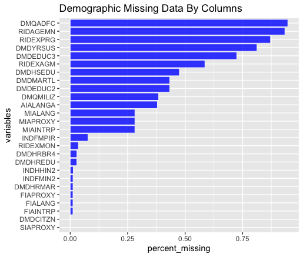
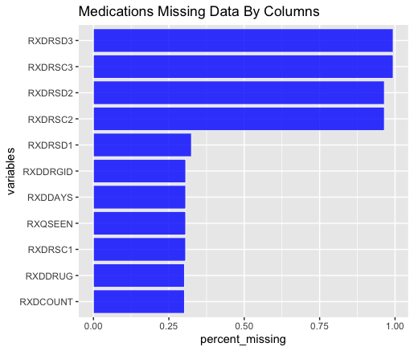
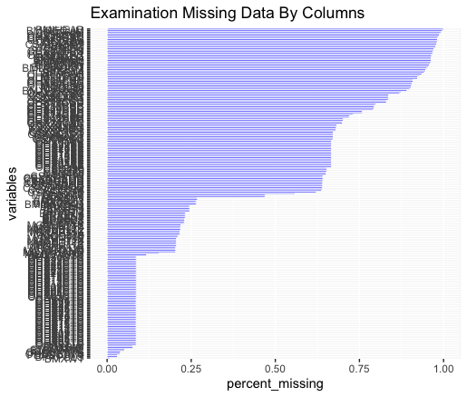

```{r setup, include=FALSE, warning = F}
knitr::opts_chunk$set(echo = TRUE)
knitr::opts_chunk$set(fig.pos = 'H')
knitr::opts_chunk$set(comment=FALSE)
knitr::opts_chunk$set(warning=FALSE)
```


\newpage

# Introduction: 

The following is a hypothetical business problem: A pharmaceutical company is looking to better understand what the data related to subjects and various health conditions and miscellaneous attributes.

* **Terms** 

  **Subject** - is a person who has been surveyed by the NHMS dataset for various attributes related to the following: demographics, examinations, dietary, questionnaire(medical conditions), and medication
  
  **Health Conditions** - various diseases or ailments that people may inhibit such as sleep disorders, diabetes, oral health, cholesterol.  
  
  **The National Health and Nutrition Examination Survey (NHANES)** - is a program of studies designed to assess the health and nutritional status of adults and children in the 


* **Data Description**

The data is spread against 6 spreadsheets (CSV): Demographics, Examinations, Dietary, Laboratory, Questionnaire, and Medication.

# Business Case

A pharmaceutical company wants to produce new drugs.  The company is curious as to whether existing data on subjects and their associated health conditions could provide advice and insight to their drug researchers.  They have obtained NHMS dataset.  This dataset contains subject/patient data along with various information including health conditions.  

The company is interested in producing new drugs for the following health conditions: diabetes and hypertension/cholesterol (we can add or remove health conditions later.  At the very least, let’s keep diabetes or something). 


## First Problem: 
What types of symptoms, medications, diet, demographics are common among various health conditions (such as diabetes)?  For example, what types of dietary factors are  commonly found with diabetes?        

## Second Problem: 
Are their any commonalities between various people with the same health conditions?  For example, if subject 1 and subject 2 have the same health condition (for example, diabetes) what other similarities would these subjects have?  

They have approached our Machine Learning group for help on these problems.  

# Analytical Reframing for the Business Case.  

The first business problem involves using “health condition” features and finding related features.  This is an association problem and we will need a model using an association algorithm.  What features are associated with “health condition” features? We’re comparing the rows of the dataset.  

The second business problem involves finding commonality between subjects.  This is a clustering problem and we will need a model using a clustering algorithm.   We need to determine whether business’s presumption is accurate:  Can subjects be divided into discrete groups according to their health conditions, which could then provide meaningful data for the drug researchers?  If yes, we need to find these clusters of subjects that can be used to segregate the data by health conditions, then we can report these findings to the business.  Or is there too much commonality between “health condition” features and other features?  If we cannot find clusters that could be divided by health conditions, then we will also report this finding to the company as well and note that clusters that we did find.  We’re comparing the columns/attributes of the dataset.   


# Loading R packages

```{r,warning = F, message=F}
library(plyr)
library(dplyr)
library(tidyr)
library(ggplot2)
library(knitr)
```


# Data Exploration

```{r, eval=FALSE, echo=TRUE}
# Reading files
demographic   = read.csv("Data/Raw/demographic.csv", header = TRUE, na.strings = c("NA","","#NA"))
diet          = read.csv("Data/Raw/diet.csv", header = TRUE, na.strings = c("NA","","#NA"))
examination   = read.csv("Data/Raw/examination.csv", header = TRUE, na.strings = c("NA","","#NA"))
labs          = read.csv("Data/Raw/labs.csv", header = TRUE, na.strings = c("NA","","#NA"))
medications   = read.csv("Data/Raw/medications.csv", header = TRUE, na.strings = c("NA","","#NA"))
questionnaire = read.csv("Data/Raw/questionnaire.csv", header = TRUE, na.strings = c("NA","","#NA"))

# Merging files
data_List = list(demographic,examination,diet,labs,questionnaire,medications)
Data_joined = join_all(data_List) #require(plyr)

```


```{r, eval=FALSE, echo=TRUE}

```


## Checking for missing data

Its always important to check for missing values and consider how to fix them.

* **Demographic**

````{r, eval=FALSE, echo=TRUE}

```

```{r,include=TRUE, fig.align="center", echo=T}
#library(knitr)

```

*  **Medications**

````{r, eval=FALSE, echo=TRUE}

```

```{r,include=TRUE, fig.align="center", echo=T}
#library(knitr)

```

*  **Others spreadsheets **

We did  represent the rest of spreadsheets because the percentage of missing data are very   important. Just for example 

```{r,include=TRUE, fig.align="center", echo=T}
#library(knitr)

```


## Data splitting & imputation

There are many ways to do data imputation, but random forest imputation will be used since it is robust and reliable method.

```{r, eval=FALSE, echo=TRUE}

```

## Visualising all numeric columns

It is useful to show histograms of all numeric columns.

```{r, eval=FALSE, echo=TRUE}

```

## Visualising correlation

```{r, eval=FALSE, echo=TRUE}

```

## Exploring by location

```{r, eval=FALSE, echo=TRUE}

```

## Exploring by age 

```{r, eval=FALSE, echo=TRUE}

```

# Problem 1: Clustering

```{r, eval=FALSE, echo=TRUE}

```

##  PCA

```{r, eval=FALSE, echo=TRUE}

```

##  K-means 

```{r, eval=FALSE, echo=TRUE}

```

##  Hierarchical Agglomerative

```{r, eval=FALSE, echo=TRUE}

```

##  Summary of models

```{r, eval=FALSE, echo=TRUE}

```


# Problem 2: Association

```{r, eval=FALSE, echo=TRUE}

```


