```{r setup, include=FALSE, warning = F}
knitr::opts_chunk$set(echo = TRUE, fig.align="center")
knitr::opts_chunk$set(fig.pos = 'H')
knitr::opts_chunk$set(comment=FALSE)
knitr::opts_chunk$set(warning=FALSE)
```

\newpage

# Introduction
Our client, a hypothetical pharmaceutical company, is looking to understand better what the data related to individuals (clients and potential clients) and various health conditions and miscellaneous attributes. The goal is to extract meaningful information that could guide future research and assist with the company rapidly expanding business and market share while focusing on and improving the wellbeing of the clients.

## Terms and defenitions

  * **Individual** - A person who has been surveyed by the NHMS (National Health Measurement Study) dataset for various attributes related to the following: demographics, examinations, dietary, questionnaire (medical history), and medication.
  
  * **Health Conditions** - Various diseases or ailments that people may inhibit, such as sleep disorders, diabetes, oral health, cholesterol.  
  
  * **The National Health and Nutrition Examination Survey (NHANES)** - A program of studies designed to assess the health and nutritional status of adults and children in the United States.

## Data Description

The data gettered is spread into six distinct files (CSV format): Demographics, Examinations, Dietary, Laboratory, Questionnaire, and Medication.

# Business Case
Our client wants to develop new drugs that primary intent to improve the quality of life of the individuals survived. The company is interested as to whether existing data on subjects and their associated health conditions could provide advice and insight to their researcher. They have obtained the NHANES dataset and requested our assistance to perform the intended analysis.  This dataset contains individuals data along with various information, including health conditions.  

The company is interested in developing new drugs for the following health conditions: diabetes, hypertension (blood pressure), and cancer. <we can add or remove health conditions later.  At the very least, let’s keep diabetes or something>

The company, aware of our Machine Learning skills, approached us for help on the following problems:

##  First Problem: Reduce lab/data collection costs 

With the healthcare dataset, the business has noted there are 1000s of attributes within the data.  There are also many missing values throughout the data.  The business would like to enrol more patients with their diabetes drugs, but they are unsure which attributes are the most meaningful in relation to diabetes.  Could there be a smaller subset of data could help predict diabetes, because data collection could be refined to only capture those elements.   

The company would ask us about possible wraping the model as a robust, easy to use App that could be present to managment and corporate to assist with the decision making, based on a few user inputs.

## Second Problem: Marketing

The marketing department is struggling with high costs of television advertisements and is interested in ways to reduce their costs while still hitting their target markets for both the advertisement of drugs and attracting candidates for trails.

## Third Problem: Development of Drugs

The company has a mature R&D function in relation to other pharmaceutical companies.  However, the researchers are looking for any type of edge or extra tidbit of information that might be beneficial to the researchers to develop their drugs for diabetes, hypertension, and cancer.   Also, the clinical trials are increasingly expensive for the development of new drugs for the treatment of diseases.  Is there anything in the data that could help us lower the costs? 


\pagebreak

# Analytical Reframing for the Business Case.  


The **first business problem** is a supervised machine learning problem.  Using the least amount of information, if a individual has diabetes, can we predict whether they have either hypertension or cancer (or both)?  

The **second business problem** involves using “health condition” features and finding related features. This is an association problem and we will need a model using an association algorithm.  For this, we only need to use diet and demographic data potentially.  This is a marketing problem so other attributes may not be applicable.  

The **third business problem** involves finding commonality between individuals. This is a clustering problem and we will need a model using a clustering algorithm. We need to determine whether the business’s presumption is accurate:

* According to their health conditions, can subjects be divided into discrete groups that could provide meaningful data for the drug researchers?  
* Can this information be useful to reduce the costs of clinical trials?  
* We’re comparing the columns of the dataset.

If this is the case, we need to find clusters of subjects that segregate the data by health conditions and report these findings to the business.  

* What features are associated with “health condition” features?
* We’re comparing the rows of the dataset.


## How do we define "health condition" features within the dataset ? 
For the association problem, we will need to see which attributes are tied to the "health condition" features. In order to achieve this, we are postulating that the following columns/features of the Questionnaire dataset indicate that an individual has a "health condition":

### Diabetes
DIQ010 - Doctor told you have diabetes
https://wwwn.cdc.gov/Nchs/Nhanes/2013-2014/DIQ_H.htm
The next questions are about specific medical conditions. {Other than during pregnancy, {have you/has SP}/{Have you/Has SP}} ever been told by a doctor or health professional that {you have/{he/she/SP} has} diabetes or sugar diabetes?

### Hypertension(blood pressure)
 BPQ020 - Ever told you had high blood pressure
 https://wwwn.cdc.gov/Nchs/Nhanes/2013-2014/BPQ_H.htm
{Have you/Has SP} ever been told by a doctor or other health professional that {you/s/he} had hypertension, also called high blood pressure?

### Cancer
 MCQ220 - Ever told you had cancer or malignancy
 https://wwwn.cdc.gov/Nchs/Nhanes/2013-2014/MCQ_H.htm#MCQ220
 {Have you/Has SP} ever been told by a doctor or other health professional that {you/s/he} had cancer or a malignancy (ma-lig-nan-see) of any kind?


\pagebreak

# Loading R packages

```{r,warning = F, message=F, eval=FALSE}
library(plyr)
library(dplyr)
library(tidyr)
library(ggplot2)
library(knitr)
library(mice)
library(scales)
library(randomForest)
library(psych)
library(factoextra)
library(RColorBrewer)
library(caret)
library(plotly)
library(scales)
library(AMR)
```


# Data cleaning

<Describe what needs to happen to the data files> 

As indicated earlier, the dataset consists of six raw data files: Demographics, Examinations, Dietary, Laboratory, Questionnaire, and Medication. The largest dataset, in terms of attributes, contains 953 variables, while the smallest one contains 47 variables.

Because this is a large amount of data, with over a thousand attributes cumulatively, we decided to employ the following guidelines to reduce the complexity of the data: 

* If more than 25% of the values are missing for an attribute(column), we will consider removing the column from further evaluation.
* If the majority of attributes are missing 25% or more of their values for a given dataset, we will use business and expert judgement to select a smaller subset of values of interest subjectively. Of these subsets of missing values, we will decide how to impute the values on these attributes.     

Ideally, we would like to analyze and impute every attribute with missing values, but in this situation, it may not be practical due to the large volume of missing data. 


```{eval=FALSE, r, warning = F, message=F}
# Reading files
demographic   = read.csv("Data/Raw/demographic.csv", header = TRUE, na.strings = c("NA","","#NA"))
diet          = read.csv("Data/Raw/diet.csv", header = TRUE, na.strings = c("NA","","#NA"))
examination   = read.csv("Data/Raw/examination.csv", header = TRUE, na.strings = c("NA","","#NA"))
labs          = read.csv("Data/Raw/labs.csv", header = TRUE, na.strings = c("NA","","#NA"))
medications   = read.csv("Data/Raw/medications.csv", header = TRUE, na.strings = c("NA","","#NA"))
questionnaire = read.csv("Data/Raw/questionnaire.csv", header = TRUE, na.strings = c("NA","","#NA"))
# Merging files
data_list = list(demographic,examination,diet,labs,questionnaire,medications)
data_joined = join_all(data_list)

```

\pagebreak


## Checking for missing data {.tabset}

It is always essentialto check for missing values and consider how to addreess them in the model.

We decided to represent the Demographic and Diet datasets as they are mostly complete.

We found that the percentage of missing data in four of the six spreadsheets is very significant. Almost all attributes/columns have varying degrees of missing values.

### Demographic
```{r, eval=F, echo=TRUE, warning = F, message=F}
demographic_MS <- demographic %>% summarise_all(~(sum(is.na(.))/n()))
demographic_MS <- gather(demographic_MS, key = "variables", value = "percent_missing")
demographic_MS <- demographic_MS[demographic_MS$percent_missing > 0.0, ] 
demographic_MS_plot  <- ggplot(demographic_MS, aes(x = reorder(variables,percent_missing), 
                                                   y = percent_missing)) +
  geom_bar(stat = "identity", fill = "blue", aes(color = I('white')), 
           size = 0.3, alpha = 0.8)+
  xlab('variables')+ coord_flip()+ 
  #theme_fivethirtyeight() +
  ggtitle("Demographic Missing Data By Columns")
#demographic_MS_plot
ggsave(plot = demographic_MS_plot, width = 8, height = 4, dpi = 300, 
       filename = "Figures/demographic_MS_plot.png")
```


\pagebreak

### Diet


```{r, eval=F, echo=TRUE, warning = F, message=F}
diet_MS <- diet %>% summarise_all(~(sum(is.na(.))/n()))
diet_MS <- gather(diet_MS, key = "variables", value = "percent_missing")
diet_MS <- diet_MS[diet_MS$percent_missing > 0.0, ] 
diet_MS_plot <- ggplot(diet_MS, aes(x = reorder(variables, percent_missing),
                                    y = percent_missing)
                       ) +
  geom_bar(stat = "identity", fill = "blue", aes(color = I('blue')), 
           size = 0.3, alpha = 0.8)+
  xlab('variables') + coord_flip()+ 
  #theme_fivethirtyeight() +
  ggtitle("Diet Missing Data By Columns")+
  theme(axis.text.y=element_text(size=3))
#diet_MS_plot
ggsave(plot = diet_MS_plot, width = 8, height = 4, dpi = 300, 
       filename = "Figures/diet_MS_plot.png")
```


\pagebreak

### Examination
```{r, eval=F, echo=TRUE, warning = F, message=F}
examination_MS <- examination %>% summarise_all(~(sum(is.na(.))/n()))
examination_MS <- gather(examination_MS, key = "variables", value = "percent_missing")
examination_MS <- examination_MS[examination_MS$percent_missing > 0.0, ] 
examination_MS_plot <- ggplot(examination_MS, aes(x = reorder(variables, percent_missing), 
                                                  y = percent_missing)) +
  geom_bar(stat = "identity", fill = "blue", aes(color = I('blue')),
           size = 0.3, alpha = 0.8)+
  xlab('variables')+ coord_flip()+ 
  #theme_fivethirtyeight() +
  ggtitle("Examination Missing Data By Columns")+
  theme(axis.text.y=element_text(size=3))
#examination_MS_plot
ggsave(plot = examination_MS_plot, width = 8, height = 4, dpi = 300, 
       filename = "Figures/examination_MS_plot.png")
```  


\pagebreak
### Labs
```{r, eval=F, echo=TRUE, warning = F, message=F}
labs_MS <- labs %>% summarise_all(~(sum(is.na(.))/n()))
labs_MS <- gather(labs_MS, key = "variables", value = "percent_missing")
labs_MS <- labs_MS[labs_MS$percent_missing > 0.0, ] 
labs_MS_plot <- ggplot(labs_MS, aes(x = reorder(variables, percent_missing),
                                    y = percent_missing)
                       ) +
  geom_bar(stat = "identity", fill = "blue", aes(color = I('blue')), 
           size = 0.3, alpha = 0.8)+
  xlab('variables') + coord_flip()+ 
  ggtitle("Labs Missing Data By Columns")+
  theme(axis.text.y=element_text(size=3))
#labs_MS_plot
ggsave(plot = labs_MS_plot, width = 8, height = 4, dpi = 300, 
       filename = "Figures/labs_MS_plot.png")
```


\pagebreak

### Medications
```{r, eval=F, echo=TRUE, warning = F, message=F}
medications_MS <- medications %>% summarise_all(~(sum(is.na(.))/n()))
medications_MS <- gather(medications_MS, key = "variables", value = "percent_missing")
medications_MS <- medications_MS[medications_MS$percent_missing > 0.0, ] 
medications_MS_plot <- ggplot(medications_MS, aes(x = reorder(variables, percent_missing),
                                                  y = percent_missing)) +
  geom_bar(stat = "identity", fill = "blue", aes(color = I('white')),
           size = 0.3, alpha = 0.8)+
  xlab('variables')+  coord_flip()+ 
  #theme_fivethirtyeight() +
  ggtitle("Medications Missing Data By Columns")
#medications_MS_plot
ggsave(plot = medications_MS_plot, width = 8, height = 4, dpi = 300, 
       filename = "Figures/medications_MS_plot.png")
```


\pagebreak


### Questionnaire
```{r, eval=F, echo=TRUE, warning = F, message=F}
questionnaire_MS <- questionnaire %>% summarise_all(~(sum(is.na(.))/n()))
questionnaire_MS <- gather(questionnaire_MS, key = "variables", value = "percent_missing")
questionnaire_MS <- questionnaire_MS[questionnaire_MS$percent_missing > 0.0, ] 
questionnaire_MS_plot <- ggplot(questionnaire_MS, aes(x = reorder(variables, percent_missing),
                                                      y = percent_missing)) +
geom_bar(stat = "identity", fill = "blue", aes(color = I('blue')),
           size = 0.3, alpha = 0.8)+
xlab('variables')+  coord_flip()+ 
ggtitle("Questionnaire Missing Data By Columns")+
theme(axis.text.y=element_text(size=3))
#questionnaire_MS_plot
ggsave(plot = questionnaire_MS_plot, width = 8, height = 4, dpi = 300, 
       filename = "Figures/questionnaire_MS_plot.png")
```


\pagebreak

# Data Imputation {.tabset}

As per our guidelines, we will select attributes/columns of interest based on our business/personal judgements. The full NHANES data dictionary/variable list is available at the following URL:

https://wwwn.cdc.gov/nchs/nhanes/continuousnhanes/default.aspx?BeginYear=2013

### Demographic 

We first remove the variables having near zero variance in the dataset.Later we will remove the variables having more that 25% missing values in the dataset for Demographics.

```{r, eval=F, echo=TRUE, warning = F, message=F}


if (length(nearZeroVar(demographic_major, freqCut = 90/2, uniqueCut = 10, saveMetrics = FALSE,
                       names = FALSE, foreach = FALSE, allowParallel = TRUE)) > 0){
  demographic_major <- demographic_major[, -nearZeroVar(demographic_major, freqCut = 90/2, uniqueCut = 10, saveMetrics = FALSE,
                                                        names = FALSE, foreach = FALSE, allowParallel = TRUE)] 
  
}


# Check the columns for missing values >25%

sapply(demographic_major, function(x) ((sum(is.na(x))))*.01) %>%
  stack %>% rev %>% filter(values > 25) %>% setNames(nm=c("variable", "missing"))


Null_Num <- apply(demographic_major, 2, function(x) length(which(is.na(x) | x == "NA"))/length(x))
Null_Colms <- colnames(demographic_major)[Null_Num > 0.25]
demographic75 <- select(demographic_major, -Null_Colms)
  
```

We will now refer to our Dictionary for making a reference dataframe to differentiate between different forms of variables in a fast and effective way:


```{r, eval=FALSE, echo=TRUE}

demographic_indexed <- demographic75
colnames(demographic_indexed) <- with(Dictionary,
                                      Dictionary$Variable.Description[match(colnames(demographic75),
                                                                            Dictionary$Variable.Name,
                                                                            nomatch = Dictionary$Variable.Name
                                      )])

Demogramphic_Col_Labels <- data.frame("Code"=c(colnames(demographic75)), 
                                      "Desp"=c(colnames(demographic_indexed)))
```


\pagebreak

 Categorization of variables

 
 We have to now enter categorization of Factor/Numeric/ 'Computation not required' in the excel file generated <br />
* Only to be done in 3rd column...<br />
* Code is....<br />
* **0** = Factor requiring no computation.<br />
* **1** = Numeric requiring computation.<br />
* **2** = Factor requiring computation.<br />
* **Please write Column name for the category as "Cat" **<br />
Reading Index again
```{r, eval=FALSE, echo=TRUE}

Cat_demo <- c(0,2,2,2,2,2,2,2,2,2,2,2,2,2,2,2,2,2,2,2,2,2,2,2,1,1,1,1,1,1,1)
Demogramphic_Col_Labels <- data.frame(Demogramphic_Col_Labels,Cat = Cat_demo)

```
Now we prepare the dataset for impute from all the information.
```{r, eval=FALSE, echo=TRUE}

Catcolmn <- Demogramphic_Col_Labels[Demogramphic_Col_Labels$Cat ==2 , 2 ] 
Numcolmn <- Demogramphic_Col_Labels[Demogramphic_Col_Labels$Cat ==1 , 2 ] 
Catcolmn_Nul <- Demogramphic_Col_Labels[Demogramphic_Col_Labels$Cat ==0 , 2 ] 
WorkingColm <- c(Catcolmn_Nul, Numcolmn, Catcolmn)
WorkingColm
)
demographic_selected = demographic75[ Catcolmn_Nul ]

demographic_selected = demographic75[ WorkingColm ]

demographic_selected[, Catcolmn] <- sapply(demographic_selected[, Catcolmn], as.numeric)
demographic_selected[, Catcolmn_Nul] <- sapply(demographic_selected[, Catcolmn_Nul], as.numeric)
demographic_selected[, Numcolmn] <- sapply(demographic_selected[, Numcolmn], as.numeric)

```
\pagebreak
* ==========================  IMPUTATION( MICE package)   =======================<br />
* Precisely, the methods used by this package are:<br />
* 1)-PMM (Predictive Mean Matching) For numeric variables<br />
* 2)-logreg(Logistic Regression) For Binary Variables( with 2 levels)<br />
* 3)-polyreg(Bayesian polytomous regression) For Factor Variables (>= 2 levels)<br />
* 4)-Proportional odds model (ordered, >= 2 levels)<br />
* 5)-cart  Classification and regression trees (any) <br />
* 6)rf Random forest imputations (any)<br />
* ==============================================================================<br />
Imputation and save results:
```{r, eval=FALSE, echo=TRUE}

meth = init$method
predM = init$predictorMatrix
predM[, c("SEQN")]=0
meth[Catcolmn_Nul] = ""
meth[Catcolmn]="cart"
meth[Numcolmn]="rf"
set.seed(103)
imputed = mice(demographic_selected, method=meth, predictorMatrix=predM, m=5)

#Create a dataset after imputation.

demographic_imputed<- complete(imputed)
rm(Demogramphic_Col_Labels,demographic75,demographic_selected, imputed)

dir.create("Data/Clean_Imputes")
#write.csv(demographic_imputed , "Data/Clean_Imputes/demographic_imputed.csv",row.names = FALSE)
demographic_imputed   = read.csv("Data/Clean_Imputes/demographic_imputed.csv", header = TRUE, na.strings = c("NA","","#NA"))

```


We have selected the following 8 relevant columns among the 32 that have less than 25% of missing values:


<!-- * **ID (SEQN)** - Respondent sequence number.. -->
<!-- * **Gender (RIAGENDR)** - Gender of the participant.. -->
<!-- * **Age (RIDAGEYR)** - Age in years of the participant at the time of screening. Individuals 80 and over are topcoded at 80 years of age.. -->
<!-- * **Race (RIDRETH3)** - Recode of reported race and Hispanic origin information, with Non-Hispanic Asian Category. -->
<!-- * **Country_of_birth (DMDBORN4)** - In what country {were you/was SP} born?. -->
<!-- * **Citizenship_status (DMDCITZN)** - {Are you/Is SP} a citizen of the United States? [Information about citizenship is being collected by the U.S. Public Health Service to perform health related research. Providing this information is voluntary and is collected under the authority of the Public Health Service Act. There will be no effect on pending immigration or citizenship petitions.]. -->
<!-- * **Family_members (DMDFMSIZ)** - Total number of people in the Family. -->
<!-- * **Marital_status (DMDHRMAR)** - HH reference person's marital status. -->
<!-- * **Family_income (INDFMIN2)** - Total family income (reported as a range value in dollars). -->

Now we will label the dataset for visualizations.

```{r, eval=FALSE, echo=TRUE, warning = F, message=F}

demo_subset_8<- demo_subset_8 %>% 
  rename("ID"                 =         "SEQN",  
         "Gender"             =     "RIAGENDR",  
         "Age"                =     "RIDAGEYR",  
         "Race"               =     "RIDRETH3",  
         "Country_of_birth"   =     "DMDBORN4",  
         "Citizenship_status" =     "DMDCITZN",   
         "Family_members"     =     "DMDFMSIZ",  
         "Marital_status"     =     "DMDHRMAR",  
         "Family_income"      =     "INDFMIN2"  )
    
sapply(demo_subset_8, function(x) sum(is.na(x)))
```


\pagebreak

```{r, eval=F, echo=TRUE, warning = F, message=F}
require(dplyr)# because Race is a factor of level 6
demo_subset_8_labeled <- demo_subset_8_labeled %>%
  mutate(Race = recode(Race, "1" = "Mexican_American",
                       "2" = "Other_Hispanic",
                       "3" = "White",
                       "4" = "Black",
                       "6" = "Asian",
                       "7" = "multiracial"))
demo_subset_8_labeled <- demo_subset_8_labeled %>%
  mutate(Country_of_birth  = recode(Country_of_birth , "1" = "US",
                       "2" = "Others",
                       "77" = "Refused",
                       "99" = "Uknown"))
demo_subset_8_labeled <- demo_subset_8_labeled %>%
  mutate(Citizenship_status = recode(Citizenship_status, "1" = "US",
                       "2" = "Other",
                       "7" = "Refused",
                       "9" = "Unknown"))
demo_subset_8_labeled <- demo_subset_8_labeled %>%
  mutate(Marital_status = recode(Marital_status, "1" = "Married",
                       "2" = "Widowed",
                       "3" = "Divorced",
                       "4" = "Separated",
                       "5" = "Never_married",
                       "6" = "partner",
                       "77" = "Refused",
                       "99" = "Unknown"))
demo_subset_8_labeled <- demo_subset_8_labeled %>%
  mutate(Family_income = recode(Family_income, "1" = 	"$0 - $4999",
                                "2" =	"$5000 - $9999",
                                "3" =	"$10000 - $14999",
                                "4" =	"$15000 - $19999",		
                                "5" =	"$20000 - $24999",		
                                "6" =	"$25000 - $34999",		
                                "7" =	"$35000 - $44999",	
                                "8" =	"$45000 - $54999",		
                                "9" =	"$55000 - $64999",		
                                "10" = 	"$65000 - $74999",		
                                "12" =	"$20000 and Over",	
                                "13" =	"Under $20000",	
                                "14" =	"$75000 - $99999",	
                                "15" = "$100000 and Over",	
                                "77" =	"Refused",
                                "99" =	"Unknown"	))
demo_subset_8_imputed$Family_income <- as.factor(demo_subset_8_imputed$Family_income)
#write.csv(demo_subset_8_labeled,file = "Data/Working/demo_subset_8_labeled.csv")
```

```{r, eval=FALSE, echo=F, warning = F, message=F}
demo_subset_8_labeled  = read.csv("Data/Working/demo_subset_8_labeled.csv", header = TRUE)
```

\pagebreak


### Diet
<!-- https://wwwn.cdc.gov/nchs/nhanes/search/variablelist.aspx?Component=Dietary&CycleBeginYear=2013 -->

First we would remove all the Near Zero Variance features from the data set, Cutt off being 45% :

```{r, eval=FALSE, echo=TRUE}
diet_major <- diet

if (length(nearZeroVar(diet_major, freqCut = 90/2, uniqueCut = 10, saveMetrics = FALSE,
                       names = FALSE, foreach = FALSE, allowParallel = TRUE)) > 0){
  diet_major <- diet_major[, -nearZeroVar(diet_major, freqCut = 90/2, uniqueCut = 10, saveMetrics = FALSE,
                                          names = FALSE, foreach = FALSE, allowParallel = TRUE)] 
  
}

```


\pagebreak


Now, we will remove the features having a missing values of more that 25% as decided before:

```{r, eval=FALSE, echo=TRUE}
Null_Num_diet <- apply(diet_major, 2, function(x) length(which(x == "" | is.na(x) | x == "NA" | x == "-999" ))/length(x))
Null_Colms_diet <- colnames(diet_major)[Null_Num_diet > 0.25]
diet75 <- select(diet_major, -Null_Colms_diet)

colSums(is.na(diet75))
diet75 %>% summarise_all(~(sum(is.na(.))/n()*100))

```

We have selected the following 69 relevant columns among the 88 that have less than 25% of missing values:

* **ID (SEQN)** - Respondent sequence number.
* **Number_of_foods (DR1TNUMF)** - Total number of foods/beverages reported in the individual foods file.
* **Energy_kcal (DR1TKCAL)** - Energy (kcal).
* **Protein (DR1TPROT)** - Protein (gm).
* **Carbohydrate (DR1TCARB)** - Carbohydrate (gm).
* **Sugar (DR1TSUGR)** - Total sugars (gm).
* **Fiber (DR1TFIBE)** - Dietary fiber (gm).
* **Total_fat (DR1TTFAT)** - Total fat (gm).
* **Sat_fats (DR1TSFAT)** - Total saturated fatty acids (gm).
* **Mono_fats (DR1TMFAT)** - Total monounsaturated fatty acids (gm).
* **Poly_fats (DR1TPFAT)** - Total polyunsaturated fatty acids (gm).
* **Cholesterol (DR1TCHOL)** - Cholesterol (mg).
* **Tocopherol (DR1TATOC)** - Vitamin E as alpha-tocopherol (mg).
* **Tocopherol_alpha (DR1TATOA)** - Added alpha-tocopherol (Vitamin E) (mg).
* **Retinol (DR1TRET)** - Retinol (mcg).
* **Retinol_a (DR1TVARA)** - Vitamin A as retinol activity equivalents (mcg).
* **Carotene_alpha (DR1TACAR)** - Alpha-carotene (mcg).
* **Carotene_beta (DR1TBCAR)** - Beta-carotene (mcg).
* **Cryptoxanthin (DR1TCRYP)** - Beta-cryptoxanthin (mcg).
* **Lycopene (DR1TLYCO)** - Lycopene (mcg).
* **Lutein_zeaxanthin (DR1TLZ)** - Lutein + zeaxanthin (mcg).
* **Thiamin (DR1TVB1)** - Thiamin (Vitamin B1) (mg).
* **Riboflavin (DR1TVB2)** - Riboflavin (Vitamin B2) (mg).
* **Niacin (DR1TNIAC)** - Niacin (mg).
* **Vitamin_b6 (DR1TVB6)** - Vitamin B6 (mg).
* **Folate (DR1TFOLA)** - Total folate (mcg).
* **Folic_acid (DR1TFA)** - Folic acid (mcg).
* **Folate_food (DR1TFF)** - Food folate (mcg).
* **Folate_equivs (DR1TFDFE)** - Folate as dietary folate equivalents (mcg).
* **Choline (DR1TCHL)** - Total choline (mg).
* **Vitamine_b12 (DR1TVB12)** - Vitamin B12 (mcg).
* **Vitamine_b12_added (DR1TB12A)** - Added vitamin B12 (mcg).
* **Vitamine_c (DR1TVC)** - Vitamin C (mg).
* **Vitamine_d (DR1TVD)** - Vitamin D (D2 + D3) (mcg).
* **Vitamine_k (DR1TVK)** - Vitamin K (mcg).
* **Calcium (DR1TCALC)** - Calcium (mg).
* **Phosphorus (DR1TPHOS)** - Phosphorus (mg).
* **Magnesium (DR1TMAGN)** - Magnesium (mg).
* **Iron (DR1TIRON)** - Iron (mg).
* **Zinc (DR1TZINC)** - Zinc (mg).
* **Copper (DR1TCOPP)** - Copper (mg).
* **Sodium (DR1TSODI)** - Sodium (mg).
* **Potassium (DR1TPOTA)** - Potassium (mg).
* **Selenium (DR1TSELE)** - Selenium (mcg).
* **Caffeine (DR1TCAFF)** - Caffeine (mg).
* **Theobromine (DR1TTHEO)** - Theobromine (mg).
* **Alcohol (DR1TALCO)** - Alcohol (gm).
* **Moisture (DR1TMOIS)** - Moisture (gm).
* **Butanoic (DR1TS040)** - SFA 4:0 (Butanoic) (gm).
* **Hexanoic (DR1TS060)** - SFA 6:0 (Hexanoic) (gm).
* **Octanoic (DR1TS080)** - SFA 8:0 (Octanoic) (gm).
* **Decanoic (DR1TS100)** - SFA 10:0 (Decanoic) (gm).
* **Dodecanoic (DR1TS120)** - SFA 12:0 (Dodecanoic) (gm).
* **Tetradecanoic (DR1TS140)** - SFA 14:0 (Tetradecanoic) (gm).
* **Hexadecanoic (DR1TS160)** - SFA 16:0 (Hexadecanoic) (gm).
* **Octadecanoic (DR1TS180)** - SFA 18:0 (Octadecanoic) (gm).
* **Hexadecenoic (DR1TM161)** - MFA 16:1 (Hexadecenoic) (gm).
* **Octadecenoic (DR1TM181)** - MFA 18:1 (Octadecenoic) (gm).
* **Eicosenoic (DR1TM201)** - MFA 20:1 (Eicosenoic) (gm).
* **Docosenoic (DR1TM221)** - MFA 22:1 (Docosenoic) (gm).
* **Octadecadienoic (DR1TP182)** - PFA 18:2 (Octadecadienoic) (gm).
* **Octadecatrienoic (DR1TP183)** - PFA 18:3 (Octadecatrienoic) (gm).
* **Octadecatetraenoic (DR1TP184)** - PFA 18:4 (Octadecatetraenoic) (gm).
* **Eicosapentaenoic (DR1TP204)** - PFA 20:4 (Eicosatetraenoic) (gm).
* **Eicosapentaenoic (DR1TP205)** - PFA 20:5 (Eicosapentaenoic) (gm).
* **Docosapentaenoic (DR1TP225)** - PFA 22:5 (Docosapentaenoic) (gm).
* **Docosahexaenoic (DR1TP226)** - PFA 22:6 (Docosahexaenoic) (gm).
* **Food_yesterday (DR1_300)** - Was the amount of food that {you/NAME} ate yesterday much more than usual, usual, or much less than usual?.
* **Water_yesterday (DR1_320Z)** - Total plain water drank yesterday - including plain tap water, water from a drinking fountain, water from a water cooler, bottled water, and spring water..


We will now refer to our Dictionary for making a reference dataframe to differentiate between different forms of variables in a fast and effective way:

```{r, eval=FALSE, echo=TRUE}
diet_indexed <- diet75
colnames(diet_indexed) <- with(Dictionary,
                               Dictionary$Variable.Description[match(colnames(diet75),
                                                                     Dictionary$Variable.Name,
                                                                     nomatch = Dictionary$Variable.Name
                               )])

diet_Col_Labels <- data.frame("Code"=c(colnames(diet75)), 
                              "Desp"=c(colnames(diet_indexed)))
```

\pagebreak

 Categorization of variables

 
 We have to now enter categorization of Factor/Numeric/ 'Computation not required' in the excel file generated <br />
* Only to be done in 3rd column...<br />
* Code is....<br />
* **0** = Factor requiring no computation.<br />
* **1** = Numeric requiring computation.<br />
* **2** = Factor requiring computation.<br />
* **Please write Column name for the category as "Cat" **<br />
Reading Index again
```{r, eval=FALSE, echo=TRUE}
Cat_diet <- c(0,1,1,2,2,2,1,2,2,2,2,2,2,2,2,1,1,1,1,1,1,1,1,1,1,1,1,1,1,1,1,1,1,1,1,
              1,1,1,1,1,1,1,1,1,1,1,1,1,1,1,1,1,1,1,1,1,1,1,1,1,1,1,1,1,1,1,1,1,1,1,
              1,1,1,1,1,1,1,1,1,1,1,1,2,2,2)
diet_Col_Labels <- data.frame(diet_Col_Labels,Cat = Cat_diet)

diet_Col_Labels   = read.csv("Data/Labels/diet_Col_Labels.csv", header = TRUE, na.strings = c("NA","","#NA"))

diet_Col_Labels[, 2] <- sapply(diet_Col_Labels[, 2], as.character)

```
Now we prepare the dataset for impute from all the information.
```{r, eval=FALSE, echo=TRUE}

Catcolmn_diet <- diet_Col_Labels[diet_Col_Labels$Cat ==2 , 2 ] 
Numcolmn_diet <- diet_Col_Labels[diet_Col_Labels$Cat ==1 , 2 ] 
Catcolmn_Nul_diet <- diet_Col_Labels[diet_Col_Labels$Cat ==0 , 2 ] 
WorkingColm_diet <- c(Catcolmn_Nul_diet, Numcolmn_diet, Catcolmn_diet)

```
\pagebreak
* ==========================  IMPUTATION( MICE package)   =======================<br />
* Precisely, the methods used by this package are:<br />
* 1)-PMM (Predictive Mean Matching) For numeric variables<br />
* 2)-logreg(Logistic Regression) For Binary Variables( with 2 levels)<br />
* 3)-polyreg(Bayesian polytomous regression) For Factor Variables (>= 2 levels)<br />
* 4)-Proportional odds model (ordered, >= 2 levels)<br />
* 5)-cart  Classification and regression trees (any) <br />
* 6)rf Random forest imputations (any)<br />
* ==============================================================================<br />
```{r, eval=FALSE, echo=TRUE}
meth_diet = init_diet$method
predM_diet = init_diet$predictorMatrix
predM_diet[, c("SEQN")]=0
meth_diet[Catcolmn_Nul_diet] = ""
meth_diet[Catcolmn_diet]="cart"
meth_diet[Numcolmn_diet]="pmm"
set.seed(256)
imputed_diet = mice(diet_selected, method=meth_diet, predictorMatrix=predM_diet, m=5)

#Create a dataset after imputation.

diet_imputed<- complete(imputed_diet)

#######################################  Saving Impute

#write.csv(diet_imputed , "Data/Clean_Imputes/diet_imputed.csv",row.names = FALSE)
diet_imputed   = read.csv("Data/Clean_Imputes/diet_imputed.csv", header = TRUE, na.strings = c("NA","","#NA"))

```
\pagebreak

Labeling the dataset:
```{r, eval=FALSE, echo=TRUE}
diet_labeled <- diet_imputed
rm(diet_imputed)

diet_labeled <- diet_labeled %>% 
  dplyr::rename("ID"                =         "SEQN",  
                "Carbs_diet"        =     "DR1TCARB",  
                "Sugar_diet"        =     "DR1TSUGR",  
                "Fiber_diet"        =     "DR1TFIBE",  
                "transfat_diet"     =     "DR1TTFAT",  
                "satfat_diet"       =     "DR1TSFAT",   
                "zinc_diet"         =     "DR1TZINC",  
                "copper_diet"       =     "DR1TCOPP",  
                "sodium_diet"       =     "DR1TSODI",  
                "pota_diet"         =     "DR1TPOTA", 
                "selenium_diet"     =     "DR1TSELE"  )

```

\pagebreak


### Examination
<!-- https://wwwn.cdc.gov/nchs/nhanes/search/variablelist.aspx?Component=Examination&CycleBeginYear=2013 -->


First we would remove all the Near Zero Variance features from the data set, Cutt off being 45% :

```{r, eval=FALSE, echo=TRUE}

exam_major <- examination
rm(examination)

if (length(nearZeroVar(exam_major, freqCut = 90/2, uniqueCut = 10, saveMetrics = FALSE,
                       names = FALSE, foreach = FALSE, allowParallel = TRUE)) > 0){
  exam_major <- exam_major[, -nearZeroVar(exam_major, freqCut = 90/2, uniqueCut = 10, saveMetrics = FALSE,
                                          names = FALSE, foreach = FALSE, allowParallel = TRUE)] 
  
}


```


\pagebreak


Now, we will remove the features having a missing values of more that 25% as decided before:

```{r, eval=FALSE, echo=TRUE}
Null_Num_diet <- apply(diet_major, 2, function(x) length(which(x == "" | is.na(x) | x == "NA" | x == "-999" ))/length(x))
Null_Colms_diet <- colnames(diet_major)[Null_Num_diet > 0.25]
diet75 <- select(diet_major, -Null_Colms_diet)

colSums(is.na(diet75))
diet75 %>% summarise_all(~(sum(is.na(.))/n()*100))

```

We have selected the following 12 relevant columns among the 105 that have less than 25% of missing values:

* **ID (SEQN)** - Respondent sequence number.
* **BP_test_time_exam (PEASCTM1)** - Blood Pressure Time in Seconds.
* **BP_arm_exam (BPAARM)** - Arm selected:.
* **BP_Systolic_exam (BPXSY2)** - Systolic: Blood pressure (second reading) mm Hg.
* **BP_Diastolic_exam (BPXDI2)** - Diastolic: Blood pressure (second reading) mm Hg.
* **Weight_exam (BMXWT)** - Weight (kg).
* **Height_exam (BMXHT)** - Standing Height (cm).
* **Leg_length_exam (BMXBMI)** - Body Mass Index (kg/m**2).
* **Arm_length_exam (BMXLEG)** - Upper Leg Length (cm).
* **Waist_circumference_exam (BMXWAIST)** - Waist Circumference (cm).
* **Dominant_hand_exam (MGD130)** - Are you right-handed, left-handed, or do you use both hands equally?.
* **Grip_strength_exam (MGDCGSZ)** - Combined grip strength (kg): the sum of the largest reading from each hand..

We will now refer to our Dictionary for making a reference dataframe to differentiate between different forms of variables in a fast and effective way:

```{r, eval=FALSE, echo=TRUE}
exam_indexed <- exam75
colnames(exam_indexed) <- with(Dictionary,
                               Dictionary$Variable.Description[match(colnames(exam75),
                                                                     Dictionary$Variable.Name,
                                                                     nomatch = Dictionary$Variable.Name
                               )])

exam_Col_Labels <- data.frame("Code"=c(colnames(exam75)), 
                              "Desp"=c(colnames(exam_indexed)))
```

\pagebreak

 Categorization of variables

 
 We have to now enter categorization of Factor/Numeric/ 'Computation not required' in the excel file generated <br />
* Only to be done in 3rd column...<br />
* Code is....<br />
* **0** = Factor requiring no computation.<br />
* **1** = Numeric requiring computation.<br />
* **2** = Factor requiring computation.<br />
* **Please write Column name for the category as "Cat" **<br />
Reading Index again
```{r, eval=FALSE, echo=TRUE}
Cat_exam <- c(0,1,1,1,1,1,1,1,1,1,1,1,1,1,1,1,1,1,1,1,1,1,1,1,1,1,1,1,1,
              1,1,1,1,1,1,1,1,1,1,1,1,1,1,1,1,1,1,1,1,1,1,1,1,1,1,1,1,1,
              1,1,1,1,1,1,1,1,1,1,1,1,1,1,1,1,1,1,1,1,1,1,1,1,1,1,1,1,1,
              1,1,1,1,1,1,1,1,1,1)
exam_Col_Labels <- data.frame(exam_Col_Labels,Cat = Cat_exam)

```
Now we prepare the dataset for impute from all the information.
```{r, eval=FALSE, echo=TRUE}

Catcolmn_exam <- exam_Col_Labels[exam_Col_Labels$Cat ==2 , 2 ] 
Numcolmn_exam <- exam_Col_Labels[exam_Col_Labels$Cat ==1 , 2 ] 
Catcolmn_Nul_exam <- exam_Col_Labels[exam_Col_Labels$Cat ==0 , 2 ] 
WorkingColm_exam <- c(Catcolmn_Nul_exam, Numcolmn_exam, Catcolmn_exam)

```
\pagebreak
* ==========================  IMPUTATION( MICE package)   =======================<br />
* Precisely, the methods used by this package are:<br />
* 1)-PMM (Predictive Mean Matching) For numeric variables<br />
* 2)-logreg(Logistic Regression) For Binary Variables( with 2 levels)<br />
* 3)-polyreg(Bayesian polytomous regression) For Factor Variables (>= 2 levels)<br />
* 4)-Proportional odds model (ordered, >= 2 levels)<br />
* 5)-cart  Classification and regression trees (any) <br />
* 6)rf Random forest imputations (any)<br />
* ==============================================================================<br />
```{r, eval=FALSE, echo=TRUE}
meth_exam = init_exam$method
predM_exam = init_exam$predictorMatrix
predM_exam[, c("SEQN")]=0
meth_exam[Catcolmn_Nul_exam] = ""
meth_exam[Catcolmn_exam]="cart"
meth_exam[Numcolmn_exam]="pmm"

set.seed(311)
imputed_exam = mice(exam_selected, method=meth_exam, predictorMatrix=predM_exam, m=5)

#Create a dataset after imputation.

exam_imputed<- complete(imputed_exam)
rm(imputed_exam)

#######################################  Saving Impute


#write.csv(exam_imputed , "Data/Clean_Imputes/exam_imputed.csv",row.names = FALSE)
exam_imputed   = read.csv("Data/Clean_Imputes/exam_imputed.csv", header = TRUE, na.strings = c("NA","","#NA"))

```
\pagebreak

Labeling the dataset:
```{r, eval=FALSE, echo=TRUE}
exam_labeled <- exam_imputed
rm(exam_imputed)

exam_labeled = dplyr::rename(
  exam_labeled,
  "ID"                  = "SEQN",
  "BP_test_time_exam"        = "PEASCTM1",
  "BP_arm_exam"              = "BPAARM",
  "BP_Systolic_exam"         = "BPXSY2",
  "BP_Diastolic_exam"        = "BPXDI2",
  "Weight_exam"              = "BMXWT",
  "Height_exam"              = "BMXHT",
  "Leg_length_exam"          = "BMXBMI",
  "Arm_length_exam"          = "BMXLEG",
  "Waist_circumference_exam" = "BMXWAIST",
  "Dominant_hand_exam"       = "MGD130",
  "Grip_strength_exam"       = "MGDCGSZ"
)

exam_labeled = mutate(
  exam_labeled,
  BP_arm_exam = recode(BP_arm_exam,
                       "1" = "Left",
                       "2" = "Right"),
  Dominant_hand_exam = recode(Dominant_hand_exam,
                              "1"="Right",
                              "2"="Left",
                              "3"="Neither")
)

exam_labeled[ , 70:97]  <- lapply(exam_labeled[ ,70:97] , FUN = function(x) recode(x, "1='D';2='E';3='J';4='K';5='M';6='P';7='Q';8='R';9='S';10='T';11='U';12='X';13='Y';14='Z'"))

```

\pagebreak
\pagebreak

### Labs
<!-- https://wwwn.cdc.gov/nchs/nhanes/search/variablelist.aspx?Component=Laboratory&CycleBeginYear=2013 -->


First we would remove all the Near Zero Variance features from the data set, Cutt off being 45% :

```{r, eval=FALSE, echo=TRUE}


labsdata_major <- labs

if (length(nearZeroVar(labsdata_major, freqCut = 90/2, uniqueCut = 10, saveMetrics = FALSE,
                       names = FALSE, foreach = FALSE, allowParallel = TRUE)) > 0){
  labsdata_major <- labsdata_major[, -nearZeroVar(labsdata_major, freqCut = 90/2, uniqueCut = 10, saveMetrics = FALSE,
                                                  names = FALSE, foreach = FALSE, allowParallel = TRUE)] 
  
}

```


\pagebreak


Now, we will remove the features having a missing values of more that 25% as decided before:

```{r, eval=FALSE, echo=TRUE}


Null_Num_labsdata <- apply(labsdata_major, 2, function(x) length(which(x == "" | is.na(x) | x == "NA" | x == "-999" ))/length(x))
Null_Colms_labsdata <- colnames(labsdata_major)[Null_Num_labsdata > 0.35]
labsdata75 <- select(labsdata_major, -Null_Colms_labsdata)


```

We have selected the following 9 relevant columns among the 46 that have less than 25% of missing values:

* **ID (SEQN)** - Respondent sequence number..
* **White_blood_cells_labs (LBXWBCSI)** - White blood cell count (1000 cells/uL).
* **Red_bloods_cells_labs (LBXRBCSI)** - Red blood cell count (million cells/uL).
* **Caffeine_labs (PHQ020)** - Coffee or tea with cream or sugar? [Include milk or non-dairy creamers.].
* **Alcohol_labs (PHQ030)** - Alcohol, such as beer, wine, or liquor?.
* **Supplements_labs (PHQ060)** - Dietary supplements such as vitamins and minerals? [Include multivitamins and single nutrient supplements.].
* **Hepatitis_a_labs (LBXHA)** - Hepatitis A antibody.
* **Hepatitis_b_labs (LBXHBC)** - Hepatitis B core antibody.
* **Cholesterol_labs (LBXTC)** - Total Cholesterol( mg/dL).


We will now refer to our Dictionary for making a reference dataframe to differentiate between different forms of variables in a fast and effective way:

```{r, eval=FALSE, echo=TRUE}
labsdata_indexed <- labsdata75
colnames(labsdata_indexed) <- with(Dictionary,
                                   Dictionary$Variable.Description[match(colnames(labsdata75),
                                                                         Dictionary$Variable.Name,
                                                                         nomatch = Dictionary$Variable.Name
                                   )])

labsdata_Col_Labels <- data.frame("Code"=c(colnames(labsdata75)), 
                                  "Desp"=c(colnames(labsdata_indexed)))
```

\pagebreak

 Categorization of variables

 
 We have to now enter categorization of Factor/Numeric/ 'Computation not required' in the excel file generated <br />
* Only to be done in 3rd column...<br />
* Code is....<br />
* **0** = Factor requiring no computation.<br />
* **1** = Numeric requiring computation.<br />
* **2** = Factor requiring computation.<br />
* **Please write Column name for the category as "Cat" **<br />
Reading Index again
```{r, eval=FALSE, echo=TRUE}
Cat_labs <- c(0,1,1,2,1,1,1,1,1,1,1,1,1,1,1,1,1,1,1,1,1,
              1,1,1,1,1,1,1,1,1,1,1,1,1,1,1,1,1,1,1,1,1,
              1,1,1,1,1,1,1,1,1,1,1,1,1,1,1,1,1,1,1,1,1,
              2,2,2,2,1,1,2,2,2,2,1,1,1,1,1)
labsdata_Col_Labels <- data.frame(labsdata_Col_Labels,Cat = Cat_labs)
```
Now we prepare the dataset for impute from all the information.
```{r, eval=FALSE, echo=TRUE}

Catcolmn_labsdata <- labsdata_Col_Labels[labsdata_Col_Labels$Cat ==2 , 2 ] 
Numcolmn_labsdata <- labsdata_Col_Labels[labsdata_Col_Labels$Cat ==1 , 2 ] 
Catcolmn_Nul_labsdata <- labsdata_Col_Labels[labsdata_Col_Labels$Cat ==0 , 2 ] 
WorkingColm_labsdata <- c(Catcolmn_Nul_labsdata, Numcolmn_labsdata, Catcolmn_labsdata)

```
\pagebreak
* ==========================  IMPUTATION( MICE package)   =======================<br />
* Precisely, the methods used by this package are:<br />
* 1)-PMM (Predictive Mean Matching) For numeric variables<br />
* 2)-logreg(Logistic Regression) For Binary Variables( with 2 levels)<br />
* 3)-polyreg(Bayesian polytomous regression) For Factor Variables (>= 2 levels)<br />
* 4)-Proportional odds model (ordered, >= 2 levels)<br />
* 5)-cart  Classification and regression trees (any) <br />
* 6)rf Random forest imputations (any)<br />
* ==============================================================================<br />
```{r, eval=FALSE, echo=TRUE}
meth_labsdata = init_labsdata$method
predM_labsdata = init_labsdata$predictorMatrix
predM_labsdata[, c("SEQN")]=0
meth_labsdata[Catcolmn_Nul_labsdata] = ""
meth_labsdata[Catcolmn_labsdata]="cart"
meth_labsdata[Numcolmn_labsdata]="pmm"
set.seed(415)
imputed_labsdata = mice(labsdata_selected, method=meth_labsdata, predictorMatrix=predM_labsdata, m=5)
labsdata_imputed<- complete(imputed_labsdata)

rm(imputed_labsdata)

#Check for missings in the imputed dataset.
sapply(labsdata_imputed, function(x) sum(is.na(x)))

#######################################  Saving Impute

#write.csv(labsdata_imputed , "Data/Clean_Imputes/labsdata_imputed.csv",row.names = FALSE)
labsdata_imputed   = read.csv("Data/Clean_Imputes/labsdata_imputed.csv", header = TRUE, na.strings = c("NA","","#NA"))

```
\pagebreak

Labeling the dataset:
```{r, eval=FALSE, echo=TRUE}
labs_labeled <- labs_labeled %>% 
  dplyr::rename("ID"                =         "SEQN",  
                "White_blood_cells_labs" =     "LBXWBCSI",  
                "Red_bloods_cells_labs"  =     "LBXRBCSI",  
                "Caffeine_labs"          =     "PHQ020",  
                "Alcohol_labs"           =     "PHQ030",  
                "Supplements_labs"       =     "PHQ060",   
                "Hepatitis_a_labs"       =     "LBXHA",  
                "Hepatitis_b_labs"       =     "LBXHBC",  
                "Cholesterol_labs"       =     "LBXTC"  )


labs_labeled = labs_labeled %>% 
  mutate(Caffeine_labs= recode(Caffeine_labs, "1" = "Yes",
                               "2" = "No", 
                               "NA" = "Not Tested"))


labs_labeled = labs_labeled %>% 
  mutate(Alcohol_labs= recode(Alcohol_labs, "1" = "Yes",
                              "2" = "No", 
                              "NA" = "Not Tested"))

labs_labeled = labs_labeled %>% 
  mutate(Supplements_labs= recode(Supplements_labs, "1" = "Yes",
                                  "2" = "No", 
                                  "NA" = "Not Tested"))


labs_labeled = labs_labeled %>% 
  mutate(Hepatitis_a_labs= recode(Hepatitis_a_labs, "1" = "Positive",
                                  "2" = "Negative",
                                  "3" = "Indeterminate",
                                  "NA" = "Not Tested"))


labs_labeled = labs_labeled %>% 
  mutate(Hepatitis_b_labs= recode(Hepatitis_b_labs, "1" = "Positive",
                                  "2" = "Negative",
                                  "NA" = "Not Tested"))


```

\pagebreak

### Medication


<!-- https://wwwn.cdc.gov/Nchs/Nhanes/2013-2014/RXQ_RX_H.htm -->


First we would remove all the Near Zero Variance features from the data set, Cutt off being 45% :

```{r, eval=FALSE, echo=TRUE}
medsdata_major <- medications
if (length(nearZeroVar(medsdata_major, freqCut = 90/2, uniqueCut = 10, saveMetrics = FALSE,
                       names = FALSE, foreach = FALSE, allowParallel = TRUE)) > 0){
  medsdata_major <- medsdata_major[, -nearZeroVar(medsdata_major, freqCut = 90/2, uniqueCut = 10, saveMetrics = FALSE,
                                                  names = FALSE, foreach = FALSE, allowParallel = TRUE)] 
  
}
```


\pagebreak


Now, we will remove the features having a missing values of more that 32% as decided before:

```{r, eval=FALSE, echo=TRUE}
Null_Num_medsdata <- apply(medsdata_major, 2, function(x) length(which(x == "" | is.na(x) | x == "NA" | x == "-999" ))/length(x))
Null_Colms_medsdata <- colnames(medsdata_major)[Null_Num_medsdata > 0.33]
medsdata68 <- select(medsdata_major, -Null_Colms_medsdata)
```

All of the columns had more than 25% missing values. Among the 8 columns with less than 32% of missing value we have selected the following 5 relevant columns:

* **ID (SEQN)** - Respondent sequence number.
* **Medication (RXDDRGID)** - Generic drug name.
* **Days_taken (RXDDAYS)** - Number of days taken medicine.
* **Medication_purpose (RXDRSD1)** - Reasons for use reported by participants.
* **Amount_taken (RXDCOUNT)** - Number of prescription medicines taken.


We will now refer to our Dictionary for making a reference dataframe to differentiate between different forms of variables in a fast and effective way:

```{r, eval=FALSE, echo=TRUE}
medsdata_indexed <- medsdata68
colnames(medsdata_indexed) <- with(Dictionary,
                                   Dictionary$Variable.Description[match(colnames(medsdata68),
                                                                         Dictionary$Variable.Name,
                                                                         nomatch = Dictionary$Variable.Name
                                   )])
medsdata_Col_Labels <- data.frame("Code"=c(colnames(medsdata68)), 
                                  "Desp"=c(colnames(medsdata_indexed)))
```

\pagebreak

 Categorization of variables

 
 We have to now enter categorization of Factor/Numeric/ 'Computation not required' in the excel file generated <br />
* Only to be done in 3rd column...<br />
* Code is....<br />
* **0** = Factor requiring no computation.<br />
* **1** = Numeric requiring computation.<br />
* **2** = Factor requiring computation.<br />
* **Please write Column name for the category as "Cat" **<br />
Reading Index again
```{r, eval=FALSE, echo=TRUE}
Cat_meds <- c(0,2,2,2,2,1,2,2,1)
Cat_meds
medsdata_Col_Labels <- data.frame(medsdata_Col_Labels,Cat = Cat_meds)
write.csv(medsdata_Col_Labels,file = "Data/Labels/medsdata_Col_Labels.csv")
medsdata_Col_Labels   = read.csv("Data/Labels/medsdata_Col_Labels.csv", header = TRUE, na.strings = c("NA","","#NA"))
medsdata_Col_Labels[, 2] <- sapply(medsdata_Col_Labels[, 2], as.character)
```
Now we prepare the dataset for impute from all the information.
```{r, eval=FALSE, echo=TRUE}
Catcolmn_medsdata <- medsdata_Col_Labels[medsdata_Col_Labels$Cat ==2 , 2 ] 
Numcolmn_medsdata <- medsdata_Col_Labels[medsdata_Col_Labels$Cat ==1 , 2 ] 
Catcolmn_Nul_medsdata <- medsdata_Col_Labels[medsdata_Col_Labels$Cat ==0 , 2 ] 
WorkingColm_medsdata <- c(Catcolmn_Nul_medsdata, Numcolmn_medsdata, Catcolmn_medsdata)
```
\pagebreak
* ==========================  IMPUTATION( MICE package)   =======================<br />
* Precisely, the methods used by this package are:<br />
* 1)-PMM (Predictive Mean Matching) For numeric variables<br />
* 2)-logreg(Logistic Regression) For Binary Variables( with 2 levels)<br />
* 3)-polyreg(Bayesian polytomous regression) For Factor Variables (>= 2 levels)<br />
* 4)-Proportional odds model (ordered, >= 2 levels)<br />
* 5)-cart  Classification and regression trees (any) <br />
* 6)rf Random forest imputations (any)<br />
* ==============================================================================<br />
```{r, eval=FALSE, echo=TRUE}
predM_medsdata[, c("SEQN")]=0
meth_medsdata[Catcolmn_Nul_medsdata] = ""
meth_medsdata[Catcolmn_medsdata]="rf"
meth_medsdata[Numcolmn_medsdata]="pmm"
set.seed(256)
imputed_medsdata = mice(medsdata_selected, method=meth_medsdata, predictorMatrix=predM_medsdata, m=5)
medsdata_imputed<- complete(imputed_medsdata)
#  Saving Impute
write.csv(medsdata_imputed , "Data/Working/medsdata_imputed.csv")
```
\pagebreak

Labeling the dataset:
```{r, eval=FALSE, echo=TRUE}
meds_subset_labelled <- medsdata_imputed_subset
colnames(meds_subset_labelled) <- with(Dictionary,
                                   Dictionary$Variable.Description[match(colnames(medsdata_imputed_subset),
                                                                         Dictionary$Variable.Name,
                                                                         nomatch = Dictionary$Variable.Name
                                   )])
str(meds_subset_labelled)
write.csv(meds_subset_labelled,file = "meds_subset_labelled.csv")
```
\pagebreak
### Questionnaire
<!-- https://wwwn.cdc.gov/nchs/nhanes/search/variablelist.aspx?Component=Questionnaire&CycleBeginYear=2013 -->

First, we will remove the near zero vairiance variables.

```{r, eval=FALSE, echo=TRUE}
ques_data_major <- questionnaire
if (length(nearZeroVar(ques_data_major, freqCut = 90/2, uniqueCut = 10, saveMetrics = FALSE,
                       names = FALSE, foreach = FALSE, allowParallel = TRUE)) > 0){
  ques_data_major <- ques_data_major[, -nearZeroVar(ques_data_major, freqCut = 90/2, uniqueCut = 10, saveMetrics = FALSE,
                                                    names = FALSE, foreach = FALSE, allowParallel = TRUE)] 
  
}
```

Now, we will remove the features having a missing values of more that 25% as decided before:

```{r, eval=FALSE, echo=TRUE}
Null_Num_ques_data <- apply(ques_data_major, 2, function(x) length(which(x == "" | is.na(x) | x == "NA" | x == "-999" ))/length(x))
Null_Colms_ques_data <- colnames(ques_data_major)[Null_Num_ques_data > 0.25]
ques_data75 <- select(ques_data_major, -Null_Colms_ques_data)
colSums(is.na(ques_data75))
ques_data75 %>% summarise_all(~(sum(is.na(.))/n()*100))
```
We have selected the following 38 relevant columns among the 79 that have less than 25% of missing values:

* **ID (SEQN)** - Respondent sequence number.
* **Spent_total (CBD070)** - The next questions are about how much money {your family spends/you spend} on food. First I'll ask you about money spent at supermarkets or grocery stores. Then we will talk about money spent at other types of stores. During the past 30 days, how much money {did your family/did you} spend at supermarkets or grocery stores? Please include purchases made with food stamps..
* **Spent_groceries (CBD110)** - About how much money {did your family/did you} spend on food at these types of stores? (Please do not include any stores you have already told me about.).
* **Spent_vending (CBD120)** - During the past 30 days, how much money {did your family/did you} spend on eating out? Please include money spent in cafeterias at work or at school or on vending machines, for all family members..
* **Spent_delivered (CBD130)** - During the past 30 days, how much money {did your family/did you} spend on food carried out or delivered? Please do not include money you have already told me about..
* **Cold_30 (HSQ500)** - Did {you/SP} have a head cold or chest cold that started during those 30 days?.
* **Stomach_30 (HSQ510)** - Did {you/SP} have a stomach or intestinal illness with vomiting or diarrhea that started during those 30 days?.
* **Flu_30 (HSQ520)** - Did {you/SP} have flu, pneumonia, or ear infections that started during those 30 days?.
* **Diabetes (DIQ010)** - The next questions are about specific medical conditions. {Other than during pregnancy, {have you/has SP}/{Have you/Has SP}} ever been told by a doctor or health professional that {you have/{he/she/SP} has} diabetes or sugar diabetes?.
* **Taking_insuline (DIQ050)** - {Is SP/Are you} now taking insulin.
* **Milk_30 (DBQ197)** - Now I'm going to ask a few questions about milk products. Do not include their use in cooking. In the past 30 days, how often did {you/SP} have milk to drink or on {your/his/her} cereal? Please include chocolate and other flavored milks as well as hot cocoa made with milk. Do not count small amounts of milk added to coffee or tea. Would you say....
* **Meals_outside (DBD895)** - Next I'm going to ask you about meals. By meal, I mean breakfast, lunch and dinner. During the past 7 days, how many meals {did you/did SP} get that were prepared away from home in places such as restaurants, fast food places, food stands, grocery stores, or from vending machines? {Please do not include meals provided as part of the school lunch or school breakfast./Please do not include meals provided as part of the community programs you reported earlier.}.
* **Meals_premade (DBD905)** - Some grocery stores sell "ready to eat" foods such as salads, soups, chicken, sandwiches and cooked vegetables in their salad bars and deli counters. During the past 30 days, how often did {you/SP} eat "ready to eat" foods from the grocery store? Please do not include sliced meat or cheese you buy for sandwiches and frozen or canned foods..
* **Meals_frozen (DBD910)** - During the past 30 days, how often did you {SP} eat frozen meals or frozen pizzas? Here are some examples of frozen meals and frozen pizzas..
* **Deafness (DLQ010)** - With this next set of questions, we want to learn about people who have physical, mental, or emotional conditions that cause serious difficulties with their daily activities. Though different, these questions may sound similar to ones I asked earlier. {Are you/Is SP} deaf or {do you/does he/does she} have serious difficulty hearing?.
* **Blindness (DLQ020)** - {Are you/Is SP} blind or {do you/does he/does she} have serious difficulty seeing even when wearing glasses?.
* **Forgetfulness (DLQ040)** - Because of a physical, mental, or emotional condition, {do you/does he/does she} have serious difficulty concentrating, remembering, or making decisions?.
* **Food_assistance (FSD151)** - In the last 12 months, did {you/you or any member of your household} ever get emergency food from a church, a food pantry, or a food bank, or eat in a soup kitchen?.
* **WIC_assistance (FSQ162)** - In the last 12 months, did {you/you or any member of your household} receive benefits from the WIC program, that is, the Women, Infants and Children program?.
* **Hepatitis_b (HEQ010)** - Has a doctor or other health professional ever told {you/SP} that {you have/s/he/SP has} Hepatitis B? (Hepatitis is a form of liver disease. Hepatitis B is an infection of the liver from the Hepatitis B virus (HBV).).
* **Hepatitis_c (HEQ030)** - Has a doctor or other health professional ever told {you/SP} that {you have/s/he/SP has} Hepatitis C? (Hepatitis is a form of liver disease. Hepatitis C is an infection of the liver from the Hepatitis C virus (HCV).).
* **Insurance_current (HIQ011)** - The (first/next) questions are about health insurance. {Are you/Is SP} covered by health insurance or some other kind of health care plan? [Include health insurance obtained through employment or purchased directly as well as government programs like Medicare and Medicaid that provide medical care or help pay medical bills.].
* **Insurance_lapse_12 (HIQ210)** - In the past 12 months, was there any time when {you/SP} did not have any health insurance coverage?.
* **House_rooms (HOD050)** - How many rooms are in this home? Count the kitchen but not the bathroom..
* **Health_current (HUQ010)** - {First/Next} I have some general questions about {your/SP's} health. Would you say {your/SP's} health in general is . . ..
* **Health_institution (HUQ041)** - {What kind of place is it - a clinic, doctor's office, emergency room, or some other place?} {What kind of place {do you/does SP} go to most often - a clinic, doctor's office, emergency room, or some other place?}.
* **Doctor_visits_12 (HUQ051)** - {During the past 12 months, how/How} many times {have you/has SP} seen a doctor or other health care professional about {your/his/her} health at a doctor's office, a clinic or some other place? Do not include times {you were/s/he was} hospitalized overnight, visits to hospital emergency rooms, home visits or telephone calls..
* **Health_mental_12 (HUQ090)** - During the past 12 months, that is since {DISPLAY CURRENT MONTH} of {DISPLAY LAST YEAR}, {have you/has SP} seen or talked to a mental health professional such as a psychologist, psychiatrist, psychiatric nurse or clinical social worker about {your/his/her} health?.
* **Family_income_mo (IND235)** - Monthly family income (reported as a range value in dollars)..
* **Asthma (MCQ010)** - The following questions are about different medical conditions. Has a doctor or other health professional ever told {you/SP} that {you have/s/he/SP has} asthma (az-ma)?.
* **Anemia (MCQ053)** - During the past 3 months, {have you/has SP} been on treatment for anemia (a-nee-me-a), sometimes called "tired blood" or "low blood"? [Include diet, iron pills, iron shots, transfusions as treatment.].
* **Celiac (MCQ082)** - Has a doctor or other health professional ever told {you/SP} that {you have/s/he/SP has} celiac (sele-ak) disease, also called or sprue (sproo)?.
* **Gluten_free_diet (MCQ086)** - {Are you/is SP} on a gluten-free diet?.
* **Jaundice (MCQ203)** - Has anyone ever told {you/SP} that {you/she/he/SP} had yellow skin, yellow eyes or jaundice? Please do not include infant jaundice, which is common during the first weeks after birth..
* **Asthma_relatives (MCQ300B)** - Including living and deceased, were any of {SP's/your} close biological that is, blood relatives including father, mother, sisters or brothers, ever told by a health professional that they had asthma (az-ma)?.
* **Dentist_visit_since (OHQ030)** - The next questions are about {your/SP's} teeth and gums. About how long has it been since {you/SP} last visited a dentist? Include all types of dentists, such as, orthodontists, oral surgeons, and all other dental specialists, as well as dental hygienists..
* **TV_30 (PAQ710)** - Now I will ask you first about TV watching and then about computer use. Over the past 30 days, on average how many hours per day did {you/SP} sit and watch TV or videos? Would you say . . ..
* **Gaming_hours (PAQ715)** - Over the past 30 days, on average how many hours per day did {you/SP} use a computer or play computer games outside of school? Include Playstation, Nintendo DS, or other portable video games Would you say . . ..
* **Smoking_relatives (SMD460)** - Now I would like to ask you a few questions about smoking in this home. How many people who live here smoke cigarettes, cigars, little cigars, pipes, water pipes, hookah, or any other tobacco product?.
* **Ride_motor_vehicle (SMQ870)** - During the last 7 days, did {you/SP} ride in a car or motor vehicle?.


We will now refer to our Dictionary for making a reference dataframe to differentiate between different forms of variables in a fast and effective way:


```{r, eval=FALSE, echo=TRUE}
ques_data_indexed <- ques_data75
colnames(ques_data_indexed) <- with(Dictionary,
                                    Dictionary$Variable.Description[match(colnames(ques_data75),
                                                                          Dictionary$Variable.Name,
                                                                          nomatch = Dictionary$Variable.Name
                                    )])
ques_data_Col_Labels <- data.frame("Code"=c(colnames(ques_data75)), 
                                   "Desp"=c(colnames(ques_data_indexed)))
#dir.create("Data/Labels")
write.csv(ques_data_Col_Labels,file = "Data/Labels/ques_data_Col_Labels.csv")
```


\pagebreak

 Categorization of variables

 
 We have to now enter categorization of Factor/Numeric/ 'Computation not required' in the excel file generated <br />
* Only to be done in 3rd column...<br />
* Code is....<br />
* **0** = Factor requiring no computation.<br />
* **1** = Numeric requiring computation.<br />
* **2** = Factor requiring computation.<br />
* **Please write Column name for the category as "Cat" **<br />
Reading Index again
```{r, eval=FALSE, echo=TRUE}
#  Categorization of variables
Cat_ques <- c(0,2,2,2,2,2,2,2,2,2,2,2,2,2,2,2,2,2,2,2,2,2,2,2,2,2,2,2,2,2,2,2,2,2,2,2,2,2,2,2,2,2,2,2,2,2,2,2,2,2,2,2,2,2,2,2,2,2,2,2,2,2,2,2,2,2,2,2,2,2,2,2,2,2,2)
ques_data_Col_Labels <- data.frame(ques_data_Col_Labels,Cat = Cat_ques)
write.csv(ques_data_Col_Labels,file = "Data/Labels/ques_data_Col_Labels.csv")
ques_data_Col_Labels   = read.csv("Data/Labels/ques_data_Col_Labels.csv", header = TRUE, na.strings = c("NA","","#NA"))
ques_data_Col_Labels[, 2] <- sapply(ques_data_Col_Labels[, 2], as.character)
```
Now we prepare the dataset for impute from all the information.
```{r, eval=FALSE, echo=TRUE}
Catcolmn_ques_data <- ques_data_Col_Labels[ques_data_Col_Labels$Cat ==2 , 2 ] 
Numcolmn_ques_data <- ques_data_Col_Labels[ques_data_Col_Labels$Cat ==1 , 2 ] 
Catcolmn_Nul_ques_data <- ques_data_Col_Labels[ques_data_Col_Labels$Cat ==0 , 2 ] 
WorkingColm_ques_data <- c(Catcolmn_Nul_ques_data, Numcolmn_ques_data, Catcolmn_ques_data)
ques_data_selected = ques_data75[ WorkingColm_ques_data ]
ques_data_selected[, Catcolmn_ques_data] <- sapply(ques_data_selected[, Catcolmn_ques_data], as.numeric)
ques_data_selected[, Catcolmn_Nul_ques_data] <- sapply(ques_data_selected[, Catcolmn_Nul_ques_data], as.factor)
ques_data_selected[, Numcolmn_ques_data] <- sapply(ques_data_selected[, Numcolmn_ques_data], as.numeric)
```
\pagebreak
* ==========================  IMPUTATION( MICE package)   =======================<br />
* Precisely, the methods used by this package are:<br />
* 1)-PMM (Predictive Mean Matching) For numeric variables<br />
* 2)-logreg(Logistic Regression) For Binary Variables( with 2 levels)<br />
* 3)-polyreg(Bayesian polytomous regression) For Factor Variables (>= 2 levels)<br />
* 4)-Proportional odds model (ordered, >= 2 levels)<br />
* 5)-cart  Classification and regression trees (any) <br />
* 6)rf Random forest imputations (any)<br />
* ==============================================================================<br />
Imputation and save results:
```{r, eval=FALSE, echo=TRUE}
init_ques_data = mice(ques_data_selected, maxit=0)
meth_ques_data = init_ques_data$method
predM_ques_data = init_ques_data$predictorMatrix
predM_ques_data[, c("SEQN")]=0
meth_ques_data[Catcolmn_Nul_ques_data] = ""
meth_ques_data[Catcolmn_ques_data]="cart"
meth_ques_data[Numcolmn_ques_data]="pmm"
set.seed(415)
imputed_ques_data = mice(ques_data_selected, method=meth_ques_data, predictorMatrix=predM_ques_data, m=5)
ques_data_imputed<- complete(imputed_ques_data)
write.csv(ques_data_imputed , "Data/Working/ques_data_imputed.csv")
```
\pagebreak
Now we label and save the data set:
```{r, eval=FALSE, echo=TRUE}
ques_Yes_No_NO_SEQN <- c("HSQ500","HSQ510","HSQ520","DIQ010","DIQ050","DLQ010","DLQ020","DLQ040","FSD151","FSQ162","HIQ011","HIQ210","HUQ090","MCQ010","MCQ053","MCQ300B","SMQ870")
ques_data_imputed_subset[ , ques_Yes_No_NO_SEQN ][ ques_data_imputed_subset[ , ques_Yes_No_NO_SEQN ] == "1" ] <- "Yes"
ques_data_imputed_subset[ , ques_Yes_No_NO_SEQN ][ ques_data_imputed_subset[ , ques_Yes_No_NO_SEQN ] == "2" ] <- "No"
ques_data_imputed_subset[ , ques_Yes_No_NO_SEQN ][ ques_data_imputed_subset[ , ques_Yes_No_NO_SEQN ] == "7" ] <- "Refused"
ques_data_imputed_subset[ , ques_Yes_No_NO_SEQN ][ ques_data_imputed_subset[ , ques_Yes_No_NO_SEQN ] == "9" ] <- "Unknown"
ques_data_numeric1 <-c("CBD070", "CBD110","CBD120","CBD130")
ques_data_imputed_subset[ , ques_data_numeric1 ][ ques_data_imputed_subset[ , ques_data_numeric1 ] == "777777" ] <- "Refused"
ques_data_imputed_subset[ , ques_data_numeric1 ][ ques_data_imputed_subset[ , ques_data_numeric1 ] == "999999" ] <- "Unknown"
ques_data_numeric2 <-c("DBD895", "DBD905","DBD910","CBD130")
ques_data_imputed_subset[ , ques_data_numeric2 ][ ques_data_imputed_subset[ , ques_data_numeric2 ] == "0" ] <- "None"
ques_data_imputed_subset[ , ques_data_numeric2 ][ ques_data_imputed_subset[ , ques_data_numeric2 ] == "7777" ] <- "Refused"
ques_data_imputed_subset[ , ques_data_numeric2 ][ ques_data_imputed_subset[ , ques_data_numeric2 ] == "9999" ] <- "Unknown"
ques_data_imputed_subset[ , "DBD895" ][ ques_data_imputed_subset[ , "DBD895" ] == "5555" ] <- "More than 21 meals per week"
```
```{r, eval=FALSE, echo=TRUE}
ques_data_imputed_subset <- ques_data_imputed_subset %>%
  mutate(HUQ010  = recode(HUQ010 ,
                        "1" =	"Excellent"	,
                        "2" =	"Very good"	,
                        "3"=	"Good"	,
                        "4"=	"Fair"	,
                        "5"	= "Poor"	,
                        "7"=	"Refused"	,
                        "9"=	"Unknown"))
ques_data_imputed_subset <- ques_data_imputed_subset %>%
  mutate(DBQ197  = recode(DBQ197 ,
                          "0"=	"Never",
                          "1"=	"Rarely-less than once a week",
                          "2"=	"Sometimes-once a week or more, but less than once a day",
                          "3"=	"Often-once a day or more?",
                          "4"=	"Varied",
                          "7"=	"Refused",
                          "9"=	"Unknown"))
ques_data_imputed_subset <- ques_data_imputed_subset %>%
  mutate(HUQ041  = recode(HUQ041 ,
                          "1"=	"Clinic or health center",	
                          "2"=	"Doctor's office or HMO",	
                          "3"=	"Hospital emergency room",	
                          "4"=	"Hospital outpatient department",	
                          "5"=	"Some other place",	
                          "6"=	"Doesn't go to one place most often",	
                          "77"=	"Refused",	
                          "99"=	"Unknown"))
```
```{r, eval=FALSE, echo=TRUE}
ques_data_imputed_subset <- ques_data_imputed_subset %>%
  mutate(HUQ051  = recode(HUQ051 ,
                          "0"=	"None",	
                          "1"=	"1",
                          "2"=	"2 to 3",
                          "3"=	"4 to 5",
                          "4"=	"6 to 7",
                          "5"=	"8 to 9",
                          "6"=	"10 to 12",
                          "7"=	"13 to 15",
                          "8"=	"16 or more",
                          "77"=	"Refused",
                          "99"=	"Unknown"))
ques_data_imputed_subset <- ques_data_imputed_subset %>%
  mutate(IND235  = recode(IND235 ,
                          "1"=	"$0 - $399",	
                          "2"=	"$400 - $799",	
                          "3"=	"$800 - $1249",	
                          "4"=	"$1250 - $1649",	
                          "5"=	"$1650 - $2099",	
                          "6"=	"$2100 - $2899",	
                          "7"=	"$2900 - $3749",	
                          "8"=	"$3750 - $4599",	
                          "9"=	"$4600 - $5399",	
                          "10"=	"$5400 - $6249",	
                          "11"=	"$6250 - $8399",	
                          "12"=	"$8400 and over",	
                          "77"=	"Refused",	
                          "99"=	"Unknown"))
ques_data_imputed_subset <- ques_data_imputed_subset %>%
  mutate(OHQ030  = recode(OHQ030 ,
                          "1"=	"6 months or less",	
                          "2"=	"More than 6 months, but not more than 1 year ago",	
                          "3"=	"More than 1 year, but not more than 2 years ago",	
                          "4"=	"More than 2 years, but not more than 3 years ago",	
                          "5"=	"More than 3 years, but not more than 5 years ago",	
                          "6"=	"More than 5 years ago",	
                          "7"=	"Never have been",
                          "77"=	"Refused",	
                          "99"=	"Unknown"	))
ques_data_imputed_subset <- ques_data_imputed_subset %>%
  mutate(PAQ710  = recode(PAQ710 ,
                          "0"=	"Less than 1 hour",	
                          "1"=	"1 hour",	
                          "2"=	"2 hours",	
                          "3"=	"3 hours",	
                          "4"=	"4 hours",	
                          "5"=	"5 hours or more",	
                          "8"=	"{You don't/SP does not} watch TV or videos",	
                          "77"=	"Refused",	
                          "99"=	"Unknown"	))
```
```{r, eval=FALSE, echo=TRUE}
ques_data_imputed_subset <- ques_data_imputed_subset %>%
  mutate(PAQ715  = recode(PAQ715 ,
                          "0"=	"Less than 1 hour",	
                          "1"=	"1 hour",	
                          "2"=	"2 hours",	
                          "3"=	"3 hours",	
                          "4"=	"4 hours",	
                          "5"=	"5 hours or more",	
                          "8"=	"{you do not/SP does not} use a computer outside of school",	
                          "77"=	"Refused",	
                          "99"=	"Unknown"	))
ques_data_imputed_subset <- ques_data_imputed_subset %>%
  mutate(SMD460  = recode(SMD460 ,
                          "0"=	"No one in houseold is a smoker",
                          "1"=	"1 household member is a smoker",	
                          "2"=	"2 household members are smokers",	
                          "3"=	"3 or more household members are smokers",	
                          "777"=	"Refused	5	10058	End of Section",
                          "999"=	"Unknown"))
```
```{r, eval=FALSE, echo=TRUE}
ques_data_imputed_subset <- ques_data_imputed_subset %>%
  mutate(HOD050  = recode(HOD050 ,
                          "1"=	"1",	
                          "2"=	"2",	
                          "3"=	"3",	
                          "4"=	"4",	
                          "5"=	"5",	
                          "6"=	"6",	
                          "7"=	"7",	
                          "8"=	"8",	
                          "9"=	"9",	
                          "10"=	"10",	
                          "11"=	"11",	
                          "12"=	"12",	
                          "13"=	"13 or more",
                          "777"=	"Refused",	
                          "999"=	"Unknown"	))
s
ques_subset_labelled <- ques_data_imputed_subset
colnames(ques_subset_labelled) <- with(Dictionary,
                                    Dictionary$Variable.Description[match(colnames(ques_data_imputed_subset),
                                                                          Dictionary$Variable.Name,
                                                                          nomatch = Dictionary$Variable.Name
                                    )])
write.csv(ques_subset_labelled,file = "Data/Working/ques_subset_labelled.csv")
```
\pagebreak


# Data Visualization

Perform visualization against the clean datasets and the union of the cleaned datasets

##  Demographics Data 

### Visualization  of key features {.tabset}


Visuals against the cleaned dataset 


#### Gender
```{r, eval=FALSE, echo=TRUE, warning = F, message=F}
####################  Gender ##########
Gender  <- demo_subset_8_labeled %>%
  group_by(Gender) %>%
  summarize(count=n()) %>%
  arrange(desc(count))
#Pie plot
Gender_plot <- ggplot(Gender, aes(x = "", y =  round(100*count/sum(count), 1), 
                                  fill =  reorder(Gender,count))) +
  geom_bar(width = 1, stat = "identity", color = "white") +
  coord_polar("y", start = 0)+
  geom_text(aes(y = cumsum(100*count/sum(count)) - 0.5*(100*count/sum(count)),
                label = paste(round(count/sum(count)*100),"%")), color = "black")+
  ggtitle("Pie plot of Gender")+
  scale_fill_grey(start = 0.8, end = 0.2,"Gender") + theme_void()
#ggsave(plot = Gender_plot, width = 3, height = 3, dpi = 300, 
#       filename = "Figures/Gender_plot.png")
```
{width=300px}

\pagebreak

#### Country of birth
```{r eval=FALSE, echo=TRUE, message=FALSE, warning=FALSE}
####################  Country_of_birth ##########
Country_of_birth  <- demo_subset_8_labeled %>%
  group_by(Country_of_birth) %>%
  summarize(count=n()) %>%
  arrange(desc(count))%>%
  mutate(pct = count / sum(count),
         pctlabel = paste0(round(pct*100), "%"),
         lab.ypos = 100*cumsum(pct) - 0.5  *100*pct) 
#Bar plot
require(scales)
Birth_plot <- ggplot(Country_of_birth, aes(x = reorder(Country_of_birth, -pct),y = pct)) + 
  geom_bar(stat = "identity", fill = "indianred3", color = "black") +
  geom_text(aes(label = pctlabel), vjust = -0.25) +
  scale_y_continuous(labels = percent) +
  labs(x = "Country of birth", y = "percantage", title  = "Bar Chart of Country of birth")  
#ggsave(plot = Birth_plot, width = 3, height = 3, dpi = 300, 
 #      filename = "Figures/Birth_plot.png")
```
{width=300px}

\pagebreak

#### Marital status
```{r, eval=FALSE, echo=TRUE, warning = F, message=F}
##################  Marital_status  ##################
Marital_status  <- demo_subset_8_labeled %>%
  group_by(Marital_status) %>%
  summarize(count=n()) %>%
  arrange(desc(count))%>%
  mutate(pct = count / sum(count),
         pctlabel = paste0(round(pct*100), "%"),
         lab.ypos = 100*cumsum(pct) - 0.5  *100*pct) 
#Bar plot
require(scales)
Marital_plot <- ggplot(Marital_status, aes(x = reorder(Marital_status, -pct),y = pct)) + 
  geom_bar(stat = "identity", fill = "indianred3", color = "black") +
  geom_text(aes(label = pctlabel), vjust = -0.25) +
  scale_y_continuous(labels = percent) +
  labs(x = "Marital statush", y = "percantage", title  = "Bar Chart of Marital status in US ")  +
  theme(axis.text.x = element_text(angle = 45, hjust = 1))
#ggsave(plot = Marital_plot, width = 3, height = 3, dpi = 300, 
#       filename = "Figures/Marital_plot.png")
```
{width=400px}

\pagebreak

#### Race
```{r, eval=FALSE, echo=TRUE, warning = F, message=F}
##################  Race  ##################
Race  <- demo_subset_8_labeled %>%
  group_by(Race) %>%
  summarize(count=n()) %>%
  arrange(desc(count))%>%
  mutate(pct = count / sum(count),
         pctlabel = paste0(round(pct*100), "%"),
         lab.ypos = 100*cumsum(pct) - 0.5  *100*pct) 
#Bar plot
require(scales)
Race_plot <- ggplot(Race, aes(x = reorder(Race, -pct),y = pct)) + 
  geom_bar(stat = "identity", fill = "indianred3", color = "black") +
  geom_text(aes(label = pctlabel), vjust = -0.25) +
  scale_y_continuous(labels = percent) +
  labs(x = "Race", y = "percantage", title  = "Bar Chart of Race in US ")  +
  theme(axis.text.x = element_text(angle = 45, hjust = 1))
#ggsave(plot = Race_plot, width = 3, height = 3, dpi = 300, 
#       filename = "Figures/Race_plot.png")
```
{width=400px}


#### Demographic: Correlation 

#### Demographic: pick something

### Conclusion

Our samples is pretty representative of the US population: 

* The  US age structure is 20% under 15, 67% between 15 and 64 years old, and 13% over 65 (https://countrymeters.info/en/United_States_of_America_(USA)). 
* The Gender ratio is 51% for female and 49% for male (http://statisticstimes.com/demographics/countries-by-sex-ratio.php)
* The Race and ethnicity are:  White 	72.4%, Hispanic and Latino Americans  16.3%, Black or African American 	12.6%, Asian 	4.8%, Native 1.1 %, and the others 9.1 %


#### Diabetes and Age

```{r eval=TRUE, echo=FALSE, warning=FALSE, error=FALSE, message=FALSE, cache=TRUE}
library(tidyverse)
library(plotly)

demo_labeledV = read_csv("Data/Target Datasets/demo_labeledV.csv")

p <- ggplot(data=demo_labeledV, aes(x=Age, fill=(HAS_DIABETES=="YES"))) +
  geom_vline(xintercept=c(45,81)) +
  geom_histogram(aes(y = ..density..), binwidth=1) +
  geom_density(fill="red", alpha = 0.2)+
  labs(x = "AGE", y = "DENSITY", title  = "Bar Chart of Age/Diabetes")+
  scale_fill_manual("Diabetes?", values = c("FALSE" = "green", "TRUE" = "red",labels = c("NO", "YES")))
ggplotly(p)

```


## Visualization for Diet

Visuals against the cleaned dataset 

## Visualization for Examination 

Visuals against the cleaned dataset 

## Visualization for Labs  

Visuals against the cleaned dataset 

## Visualization for Mediciation 

Visuals against the cleaned dataset 

## Visualization for Questionnaire

Visuals against the cleaned dataset 

## Visualization for union of datsets 


# Problem 1: Supervised 


Target attributes need to be added .   


## Create target dataset

As part of the business problem, we focusing on 3 targets(diabetes, hypertension, cancer):

```{r eval=FALSE, echo=TRUE}
#DIQ010 - Doctor told you have diabetes
#https://wwwn.cdc.gov/Nchs/Nhanes/2013-2014/DIQ_H.htm
#The next questions are about specific medical conditions. {Other than during pregnancy, {have you/has SP}/{Have you/Has SP}} ever been told by a doctor or health professional that {you have/{he/she/SP} has} diabetes or sugar diabetes?

# BPQ020 - Ever told you had high blood pressure
# https://wwwn.cdc.gov/Nchs/Nhanes/2013-2014/BPQ_H.htm
# {Have you/Has SP} ever been told by a doctor or other health professional that {you/s/he} had hypertension, also called high blood pressure?

# MCQ220 - Ever told you had cancer or malignancy
# https://wwwn.cdc.gov/Nchs/Nhanes/2013-2014/MCQ_H.htm#MCQ220
# {Have you/Has SP} ever been told by a doctor or other health professional that {you/s/he} had cancer or a malignancy (ma-lig-nan-see) of any kind?

# Create the target dataset for the Supervised problem.
temp_questionnaire = read.csv("Data/Raw/questionnaire.csv", header = TRUE, na.strings = c("NA","","#NA"))
target_columns <- c("SEQN","DIQ010","BPQ020","MCQ220")
target_disease_dataset = subset(temp_questionnaire, select=target_columns)

# Change disease indicators into factors
target_disease_dataset$MCQ220 <- as.factor(target_disease_dataset$MCQ220)
target_disease_dataset$DIQ010 <- as.factor(target_disease_dataset$DIQ010)
target_disease_dataset$BPQ020 <- as.factor(target_disease_dataset$BPQ020)

#Create new column for target values
target_disease_dataset = cbind(target_disease_dataset, HAS_DIABETES= ifelse(target_disease_dataset$DIQ010 == 1, "YES", "NO" ) )
target_disease_dataset= cbind(target_disease_dataset, HAS_HYPERTENSION= ifelse(target_disease_dataset$BPQ020 == 1, "YES", "NO" ) )
target_disease_dataset = cbind(target_disease_dataset, HAS_CANCER= ifelse(target_disease_dataset$MCQ220 == 1, "YES", "NO" ) )
summary(target_disease_dataset)

# With new target values, set "NA" to "NO"
target_disease_dataset$HAS_DIABETES[is.na(target_disease_dataset$HAS_DIABETES)] <- "NO"
target_disease_dataset$HAS_HYPERTENSION[is.na(target_disease_dataset$HAS_HYPERTENSION)] <- "NO"
target_disease_dataset$HAS_CANCER[is.na(target_disease_dataset$HAS_CANCER)] <- "NO"
summary(target_disease_dataset)

```

Given an individual has diabetes, predict individual has cancer or hypertension.  Use the less amount of data possible to keep costs low.  


## DIABETES 

 
Marking data for Diabetes

```{r eval=FALSE, echo=TRUE}
ques_data_imputed   = read.csv("Data/Clean_Imputes/ques_data_imputed.csv", header = TRUE, na.strings = c("NA","","#NA"))
target_columns <- c("SEQN","DIQ010")
Diabetes_dataset = subset(ques_data_imputed, select=target_columns)
# Change disease indicators into factors
Diabetes_dataset$DIQ010 <- as.numeric(Diabetes_dataset$DIQ010)
#Create new column for target values
Diabetes_dataset = cbind(Diabetes_dataset, HAS_DIABETES= ifelse(Diabetes_dataset$DIQ010 == 1, "YES", "NO" ) )
Diabetes_dataset = cbind(Diabetes_dataset, TARGET= ifelse(Diabetes_dataset$DIQ010 == 1,1,0))
Diabetes_dataset<- Diabetes_dataset[,-2]
rm(ques_data_imputed)
#write.csv(Diabetes_dataset,file = "Data/Working/Diabetes_dataset.csv",row.names = FALSE)
Diabetes_dataset   = read.csv("Data/Working/Diabetes_dataset.csv", header = TRUE, na.strings = c("NA","","#NA"))

```


### DATA MINING {.tabset}


#### DEMOGRAPHIC DATA MINING FOR DIABETES


We now will keep the associated features related to Diabetes disease using PCA and Correlation plots.


Correlation Plot:
```{r eval=FALSE, echo=TRUE}
corrplot(combi_cor$r, type = "upper", order = "hclust", tl.col = "black", tl.srt = 45)

```


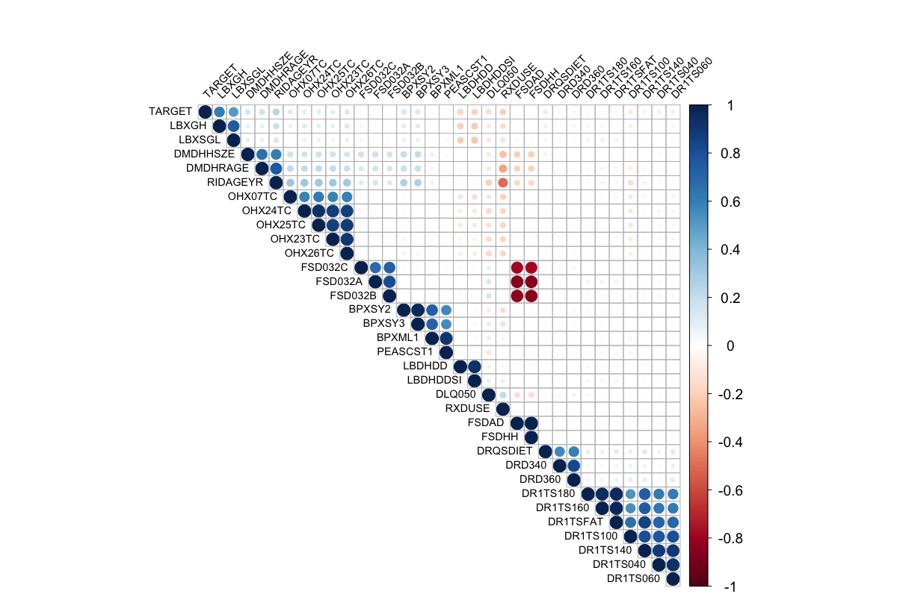{width=800px}


PCA 


```{r eval=FALSE, echo=TRUE}
pcmp <- princomp(Test_Data,retx=TRUE, cor =TRUE, center=TRUE, scale=TRUE)

plot(pcmp, main = "PCA for Demographics", col.axis="blue",npcs = 33)
abline(h = 1, col="red", lty=5)
```


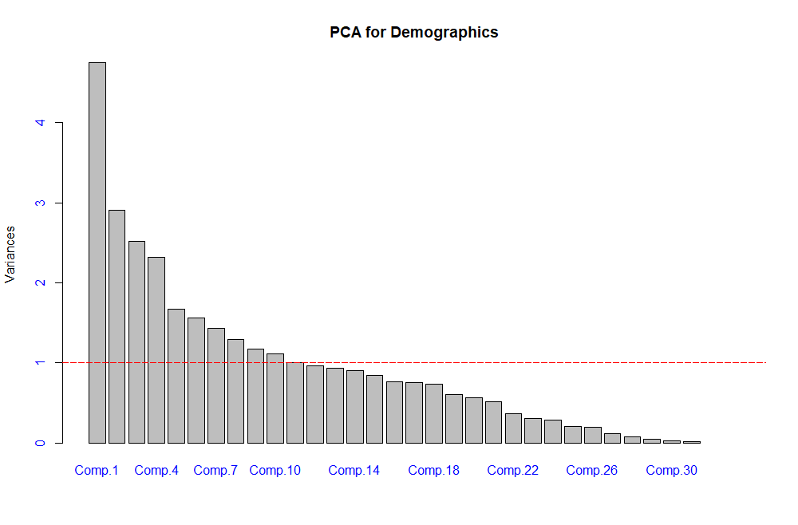{width=800px}
```{r eval=FALSE, echo=TRUE}

plot(pcmp, type = "l", main = "PCA for Demographics", col.axis="blue",npcs = 33)
abline(h = 1, col="red", lty=5)
abline(v = 11, col="blue", lty=5)

```


{width=800px}

We notice is that the first 10 components has an Eigenvalue >1 and explains almost 80% of variance. So if wereduce dimensionality from 35 to 10 we will lose 20% of variance!

```{r eval=FALSE, echo=TRUE}
library("factoextra")
fviz_pca_ind(pcmp, geom.ind = "point", pointshape = 21, 
             pointsize = 2, 
             fill.ind = Demo_target$HAS_DIABETES, 
             col.ind = "black", 
             palette = "jco", 
             addEllipses = TRUE,
             label = "var",
             col.var = "black",
             repel = TRUE,
             legend.title = "HAS_DIABETES") +
  ggtitle("2D PCA-plot from 30 feature dataset") +
  theme(plot.title = element_text(hjust = 0.5))

```


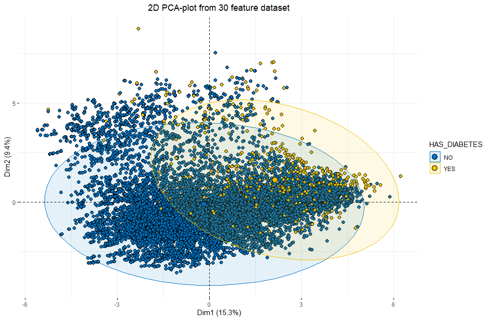{width=800px}


The two first components explains only 30% of the variance. We need 18 principal components to explain more than 95% of the variance and 27 to explain more than 0.99
Based on the analysis for Correlation and PCA, we decide to keep the below seleced variables.

```{r eval=FALSE, echo=TRUE}
Demo_select_colns <- c("SEQN","HAS_DIABETES","TARGET","WTINT2YR","WTMEC2YR","DMDHHSZE","DMDHRAGE","RIDAGEYR","SIAPROXY","DMDHHSZA","DMDHRMAR","DMDHREDU","DMDHRGND","RIDEXMON")

Demo_target_final <- subset(Demo_target2, select = Demo_select_colns)

Demo_target_final   = read.csv("Data/Target Datasets/Demo_target_final.csv", header = TRUE, na.strings = c("NA","","#NA"))


```


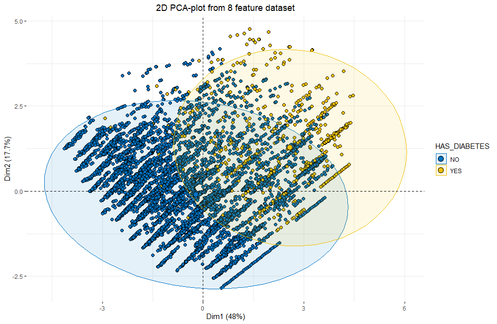{width=800px}


#### DIET DATA MINING FOR DIABETES

We now will keep the associated features related to Diabetes disease using PCA and Correlation plots.


 Correlation Plot:
```{r eval=FALSE, echo=TRUE}
corrplot(combi_cor$r, type = "upper", order = "hclust", tl.col = "black", tl.srt = 55)
require(corrplot)

# let remove 
#7 =DIQ010  : "told by a doctor that you have diabetes or sugar diabetes?"  
#8 = DIQ050  : "{Is SP/Are you} now taking insulin"

combi_diabetes_cor=rcorr(as.matrix(combined_target_final[-c(1,2,7,8,39,40,41,42)]))

corrplot(combi_diabetes_cor$r, 
         type = "upper", order = "hclust", tl.col = "black",
         tl.srt = 45,tl.cex =0.4,
         cl.cex = 0.7)

```


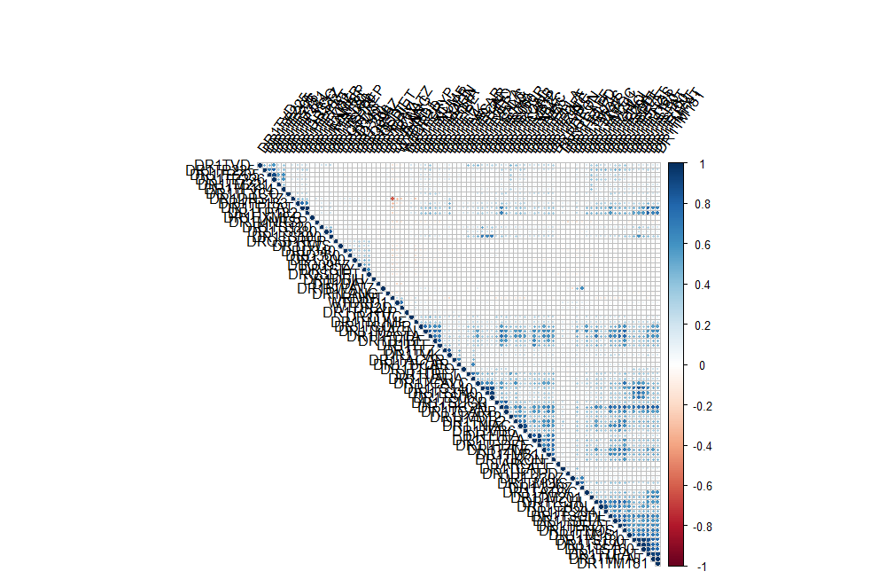{width=800px}


 PCA 


```{r eval=FALSE, echo=TRUE}
pcmp <- princomp(Test_Data,retx=TRUE, cor =TRUE, center=TRUE, scale=TRUE)

plot(pcmp, main = "PCA for Diet", col.axis="blue",npcs = 90)
abline(h = 1, col="red", lty=5)

```


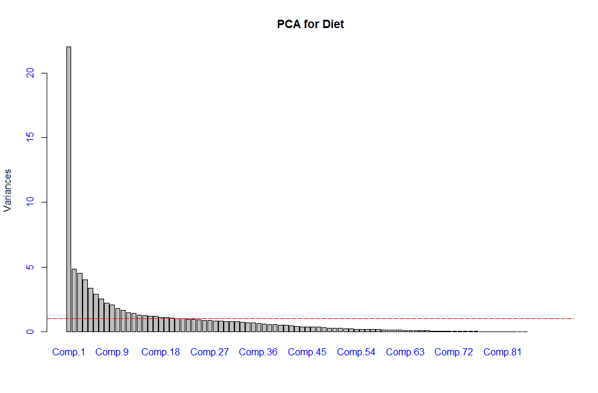{width=800px}
```{r eval=FALSE, echo=TRUE}


plot(pcmp, type = "l", main = "PCA for Diet", col.axis="blue",npcs = 90)
abline(h = 1, col="red", lty=5)
abline(v = 24, col="blue", lty=5)

```


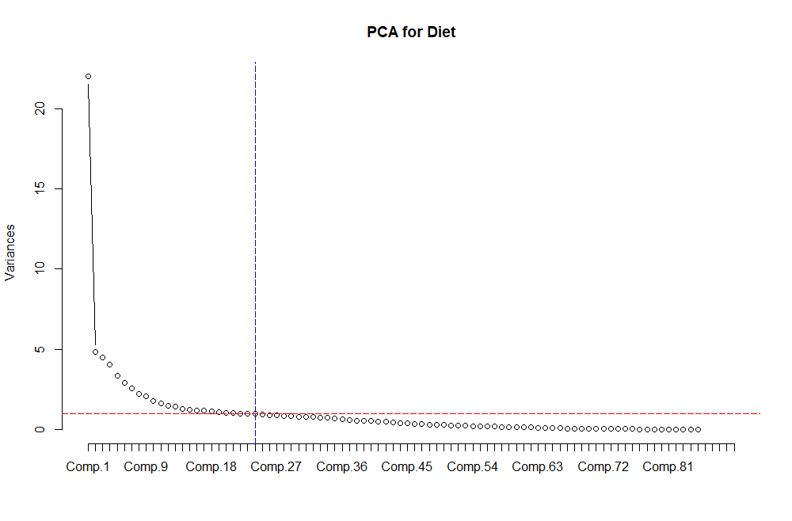{width=800px}

We notice is that the first 24 components has an Eigenvalue >1 and explains almost 90% of variance. So if wereduce dimensionality from 87 to 24 we will lose 10% of variance!

```{r eval=FALSE, echo=TRUE}
library("factoextra")
fviz_pca_ind(pcmp, geom.ind = "point", pointshape = 21, 
             pointsize = 2, 
             fill.ind = Diet_target$HAS_DIABETES, 
             col.ind = "black", 
             palette = "jco", 
             addEllipses = TRUE,
             label = "var",
             col.var = "black",
             repel = TRUE,
             legend.title = "HAS_DIABETES") +
  ggtitle("2D PCA-plot from 87 feature dataset") +
  theme(plot.title = element_text(hjust = 0.5))
```


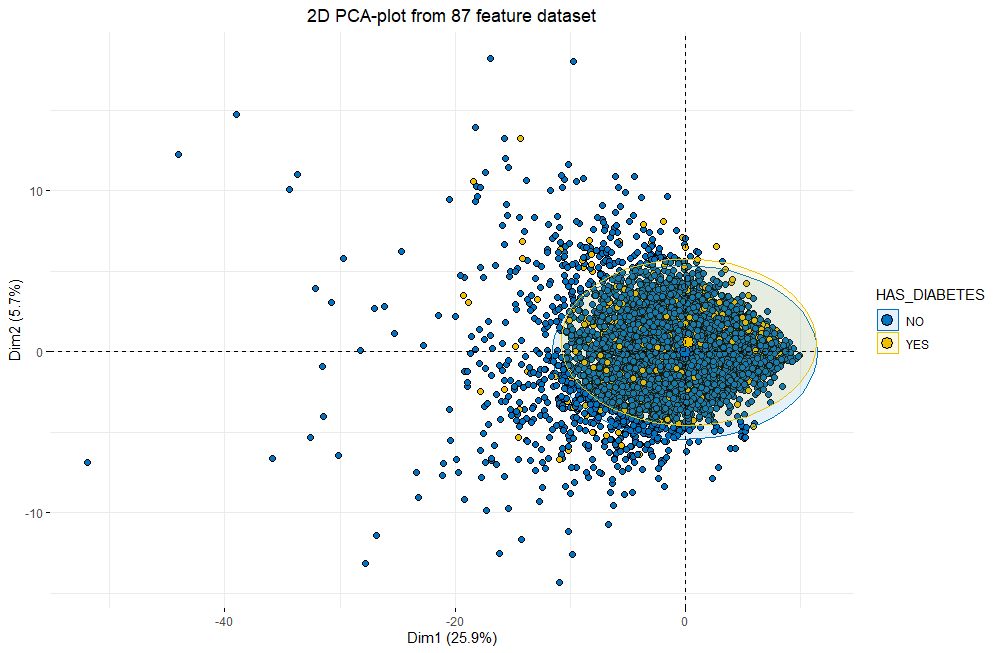{width=800px}

The two first components explains only 35% of the variance. We need 27 principal components to explain more than 95% of the variance and 35 to explain more than 0.99
Based on the analysis for Correlation and PCA, we decide to keep the below 13 selected variables.


```{r eval=FALSE, echo=TRUE}
Diet_select_colns <- c("SEQN","HAS_DIABETES","TARGET","DR1TSFAT","DR1TS040","DR1TS060","DR1TS100","DR1TS140","DR1TS160","DR1TS180","DR1DRSTZ","DRDINT","DR1STY","DRQSDIET","DRD340","DRD360")


```


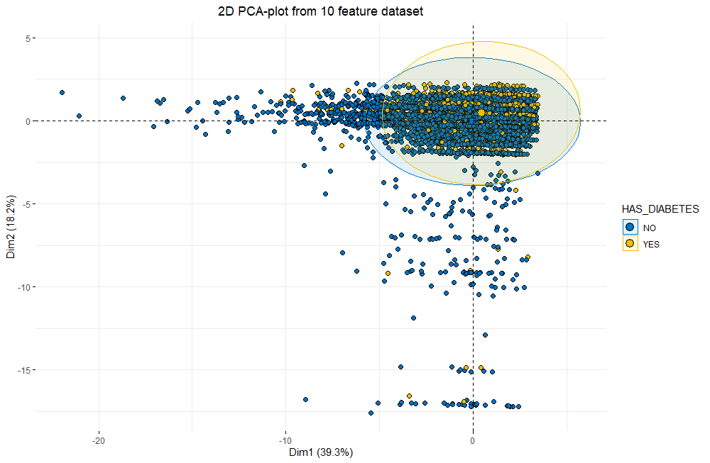{width=800px}


#### EXAMS DATA MINING FOR DIABETES

We now will keep the associated features related to Diabetes disease using PCA and Correlation plots.


 Correlation Plot:
```{r eval=FALSE, echo=TRUE}
corrplot(combi_cor$r, type = "upper", order = "hclust", tl.col = "black", tl.srt = 55)

```


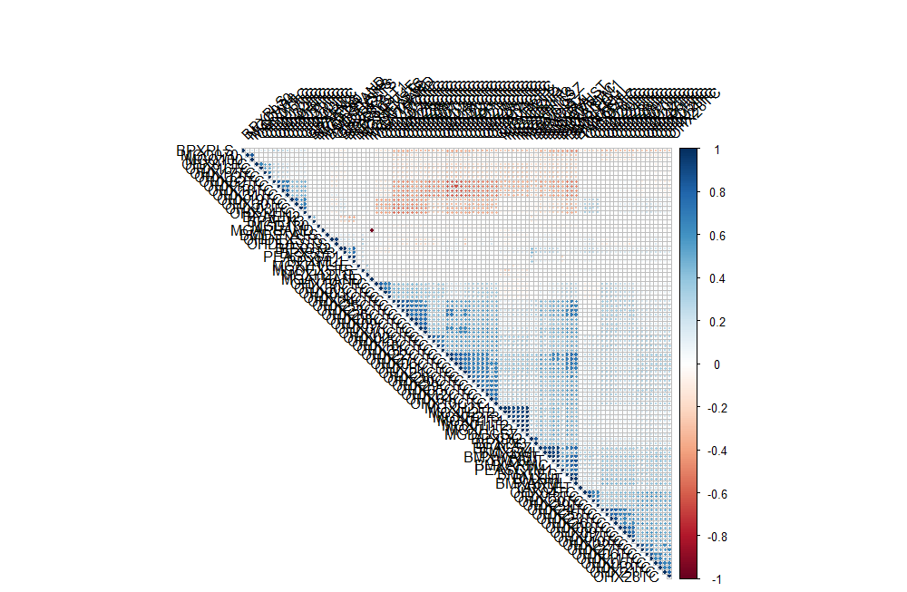{width=800px}


 PCA 


```{r eval=FALSE, echo=TRUE}
pcmp <- princomp(Test_Data,retx=TRUE, cor =TRUE, center=TRUE, scale=TRUE)

plot(pcmp, main = "PCA for Examination", col.axis="blue", npcs=100)
abline(h = 1, col="red", lty=5)
```


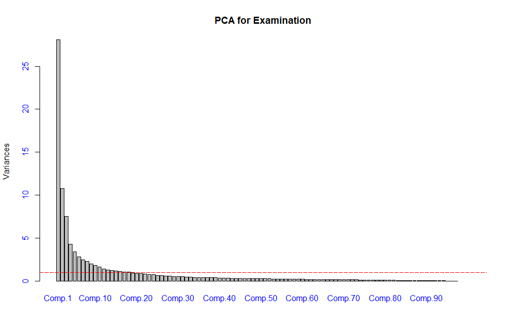{width=800px}
```{r eval=FALSE, echo=TRUE}


plot(pcmp, type = "l", main = "PCA for Examination", col.axis="blue", npcs=100)
abline(h = 1, col="red", lty=5)
abline(v = 14, col="blue", lty=5)

```


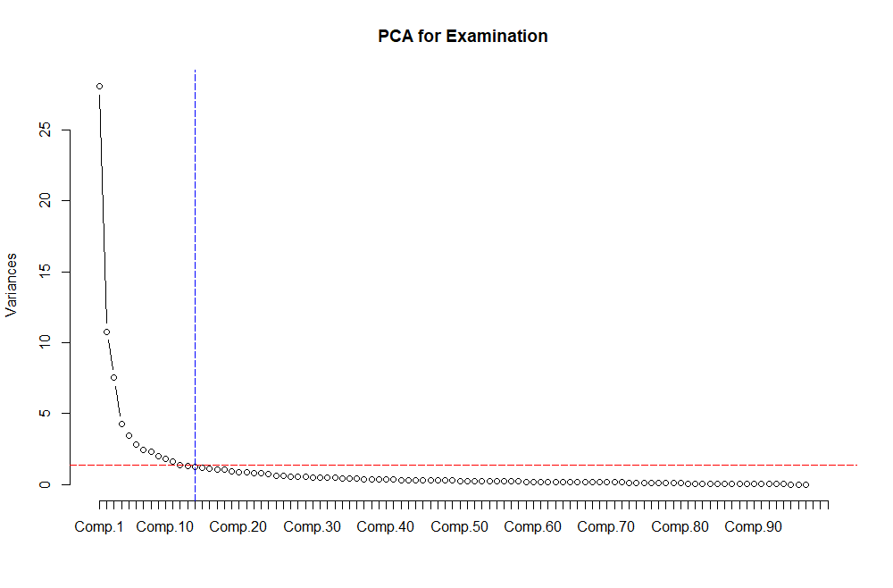{width=800px}

We notice is that the first 14 components has an Eigenvalue >1 and explains almost 75% of variance. So if we reduce dimensionality from 97 to 14 we will lose 25% of variance!

```{r eval=FALSE, echo=TRUE}
fviz_pca_ind(pcmp, geom.ind = "point", pointshape = 21, 
             pointsize = 2, 
             fill.ind = Exam_target$HAS_DIABETES, 
             col.ind = "black", 
             palette = "jco", 
             addEllipses = TRUE,
             label = "var",
             col.var = "black",
             repel = TRUE,
             legend.title = "HAS_DIABETES") +
  ggtitle("2D PCA-plot from 97 feature dataset") +
  theme(plot.title = element_text(hjust = 0.5))
```


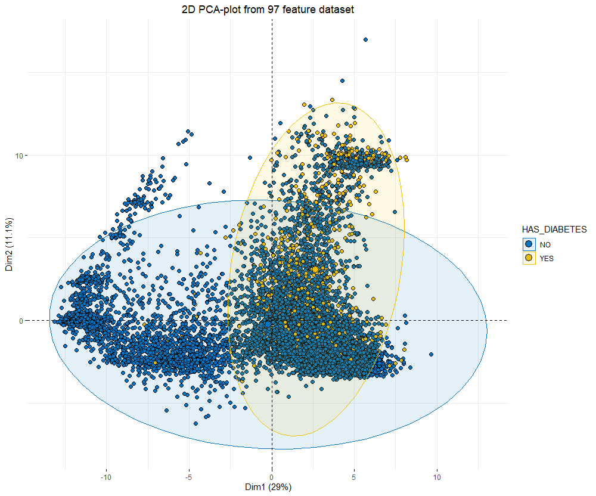{width=800px}


The two first components explains only 40% of the variance. We need 35 principal components to explain more than 95% of the variance and 42 to explain more than 0.99
Based on the analysis for Correlation and PCA, we decide to keep the below selected 31 variables.


```{r eval=FALSE, echo=TRUE}
Exam_select_colns <- c("SEQN","HAS_DIABETES","TARGET","BMXBMI","BMXWAIST","BPXDI2","BPXML1","BPXSY2","BPXSY3","OHX02TC","OHX03TC","OHX04TC","OHX05TC","OHX06TC","OHX07TC","OHX08TC","OHX09TC","OHX10TC","OHX11TC","OHX12TC","OHX13TC","OHX14TC","OHX15TC","OHX18TC","OHX19TC","OHX20TC","OHX23TC","OHX24TC","OHX25TC","OHX26TC","OHX29TC","OHX30TC","OHX31TC","PEASCST1")


```


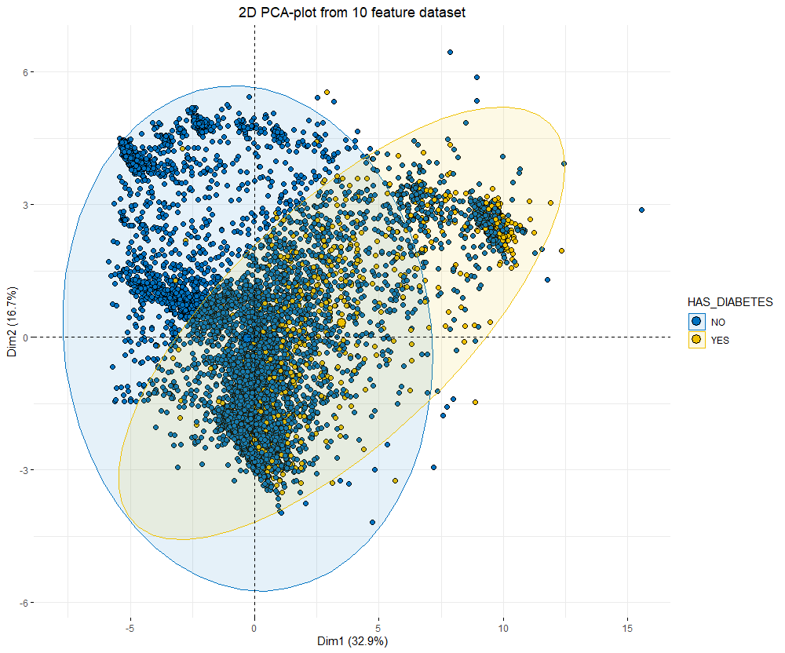{width=800px}


#### LABS DATA MINING FOR DIABETES

We now will keep the associated features related to Diabetes disease using PCA and Correlation plots.


 Correlation Plot:
```{r eval=FALSE, echo=TRUE}
corrplot(combi_cor$r, type = "upper", order = "hclust", tl.col = "black", tl.srt = 55)

```


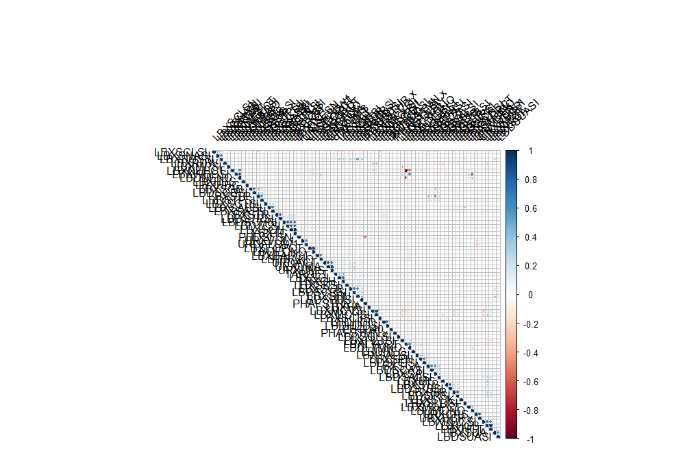{width=800px}


PCA 


```{r eval=FALSE, echo=TRUE}
pcmp <- princomp(Test_Data,retx=TRUE, cor =TRUE, center=TRUE, scale=TRUE)

plot(pcmp, main = "PCA for Labs", col.axis="blue",npcs=80)
abline(h = 1, col="red", lty=5)
```


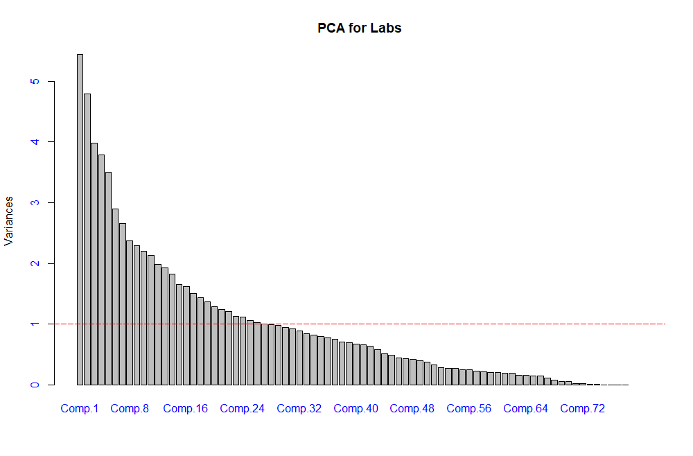{width=800px}
```{r eval=FALSE, echo=TRUE}

plot(pcmp, type = "l", main = "PCA for Labs", col.axis="blue",npcs=80)
abline(h = 1, col="red", lty=5)
abline(v = 26, col="blue", lty=5)

```


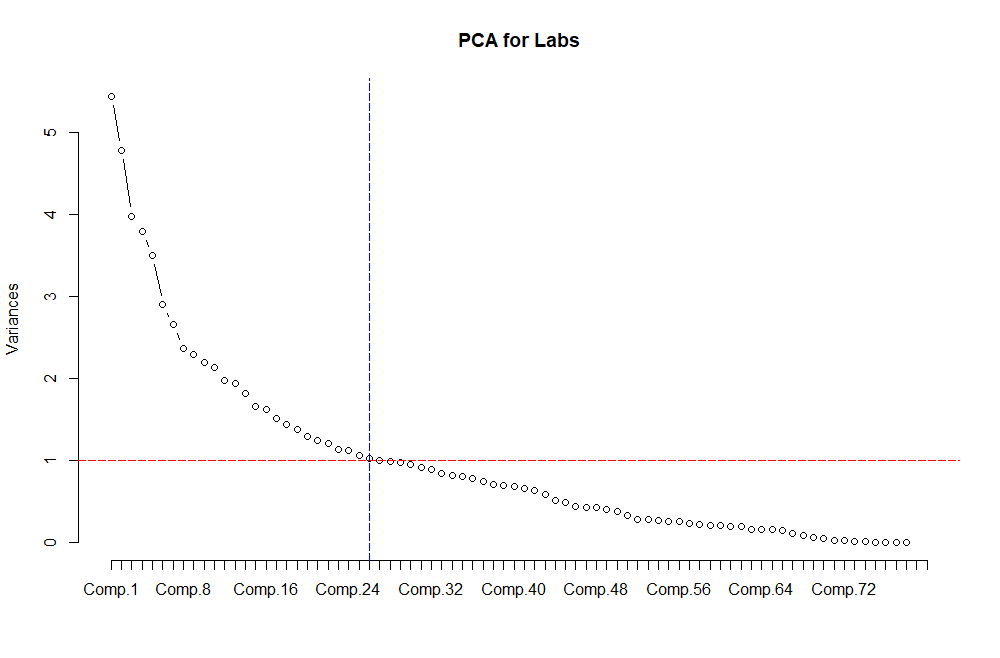{width=800px}

We notice is that the first 24 components has an Eigenvalue >1 and explains almost 70% of variance. So if we reduce dimensionality from 77 to 24 we will lose 20% of variance!

```{r eval=FALSE, echo=TRUE}
fviz_pca_ind(pcmp, geom.ind = "point", pointshape = 21, 
             pointsize = 2, 
             fill.ind = Labs_target$HAS_DIABETES, 
             col.ind = "black", 
             palette = "jco", 
             addEllipses = TRUE,
             label = "var",
             col.var = "black",
             repel = TRUE,
             legend.title = "HAS_DIABETES") +
  ggtitle("2D PCA-plot from 77 feature dataset") +
  theme(plot.title = element_text(hjust = 0.5))
```


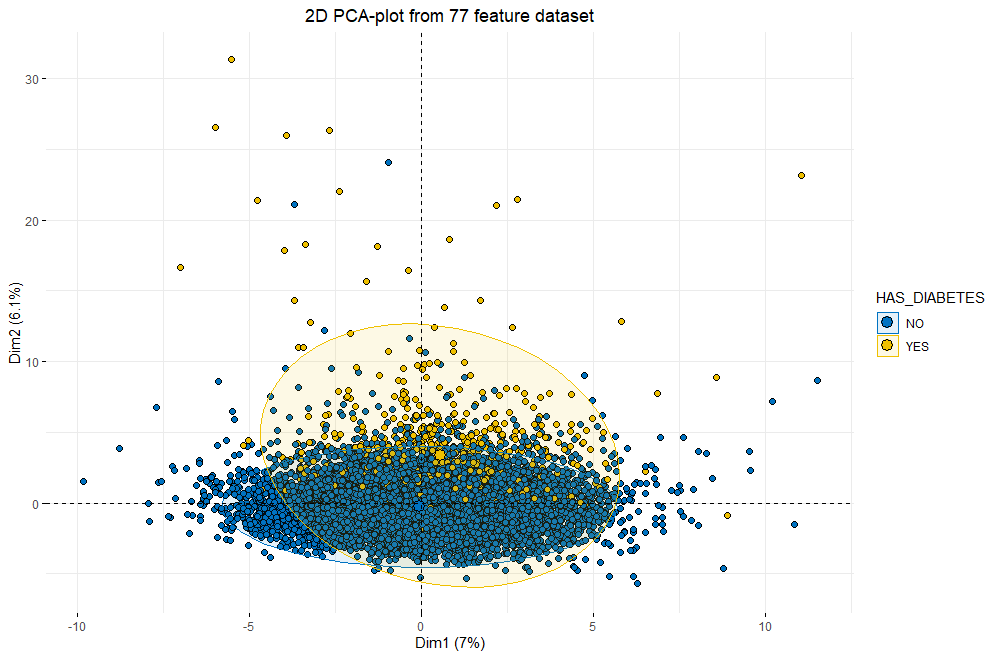{width=800px}

The two first components explains only 20% of the variance. We need 22 principal components to explain more than 80% of the variance and 37 to explain more than 0.99
Based on the analysis for Correlation and PCA, we decide to keep the below selected 19 variables.


```{r eval=FALSE, echo=TRUE}
Labs_select_colns <- c("SEQN","HAS_DIABETES","TARGET","LBXGH","LBXSGL","LBXHGB","LBXSOSSI","LBXSNASI","URXCRS","LBXHCT","URXUCR.x","LBDSGBSI","LBXMC","LBDHDDSI","LBXSGB","LBDHDD","URXVOL1","URDFLOW1","LBDLYMNO","LBXLYPCT","LBXSCLSI","LBXNEPCT")


```


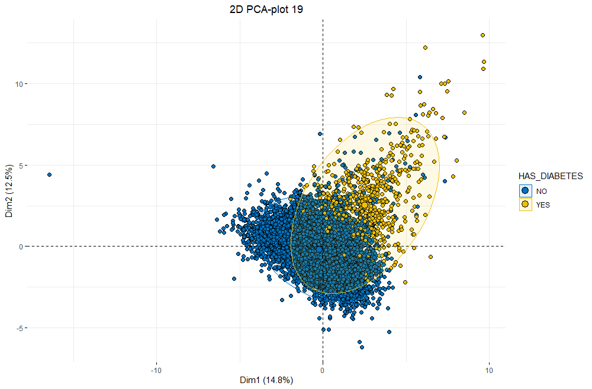{width=800px}


#### MEDICATIONS DATA MINING FOR DIABETES

We will run the MFA to find relation among features for data reduction.

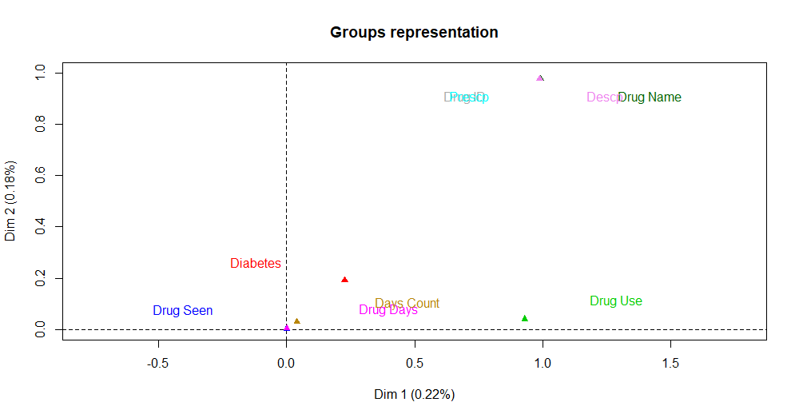{width=800px}


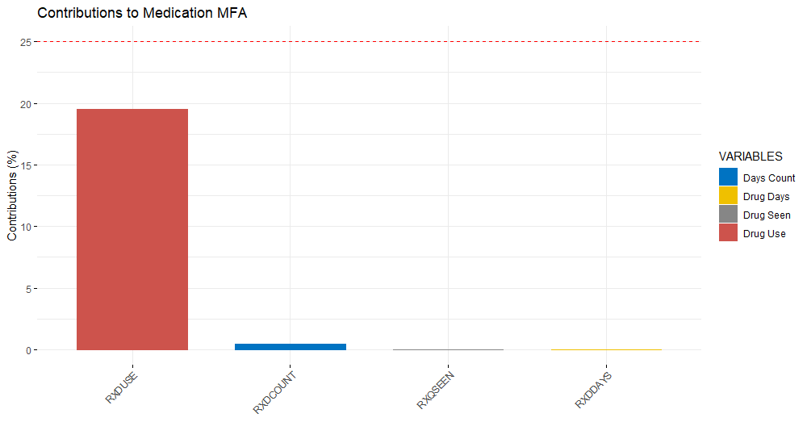{width=800px}

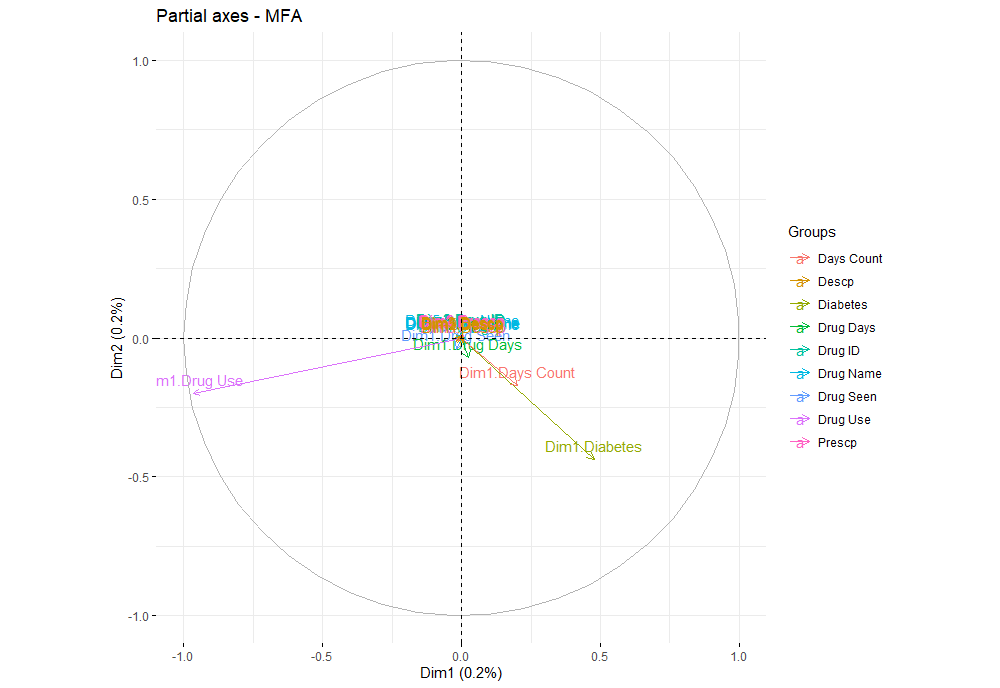{width=800px}


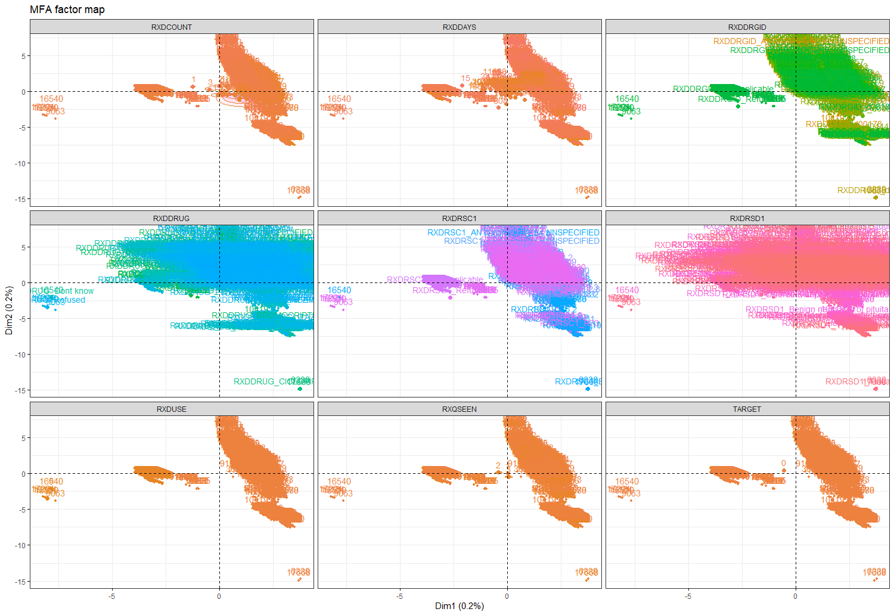{width=800px}

We notice is that the  component RXDUSE explains almost 75% of variance on 5 other components. So if we reduce dimensionality from 9 to 1 we will lose 25% of variance!
We ananlyised each feauture in each dimension and found that the only feature having greater vairiance is RXDUSE.


#### QUESTIONNAIRE DATA MINING FOR DIABETES

We now will keep the associated features related to Diabetes disease using PCA and Correlation plots.


 Correlation Plot:
```{r eval=FALSE, echo=TRUE}
corrplot(combi_cor$r, type = "upper", order = "hclust", tl.col = "black", tl.srt = 55)

```


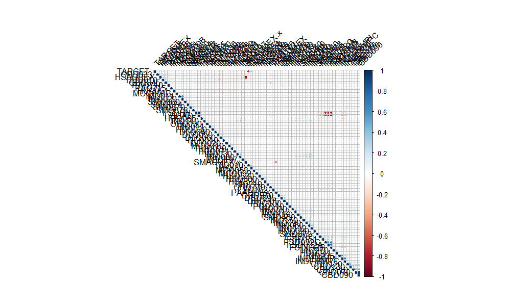{width=800px}


 PCA 


```{r eval=FALSE, echo=TRUE}
pcmp <- princomp(Test_Data,retx=TRUE, cor =TRUE, center=TRUE, scale=TRUE)

plot(pcmp, main = "PCA for Questionnaire", col.axis="blue",npcs=80)
abline(h = 1, col="red", lty=5)
```


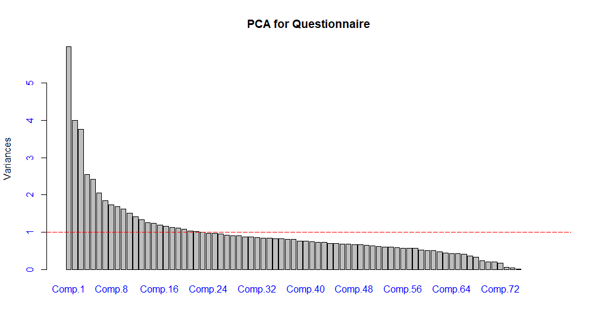{width=800px}
```{r eval=FALSE, echo=TRUE}
plot(pcmp, type = "l", main = "PCA for Questionnaire", col.axis="blue",npcs=80)
abline(h = 1, col="red", lty=5)
abline(v = 22, col="blue", lty=5)

```


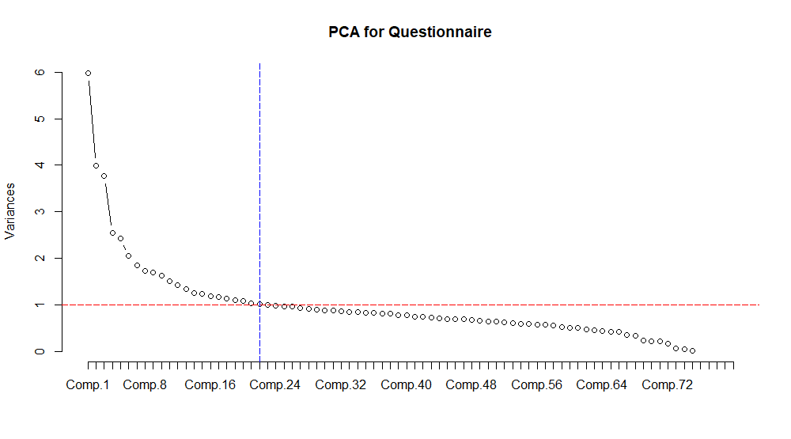{width=800px}

We notice is that the first 22 components has an Eigenvalue >1 and explains almost 70% of variance. So if we reduce dimensionality from 75 to 10 we will lose 30% of variance!

```{r eval=FALSE, echo=TRUE}
fviz_pca_ind(pcmp, geom.ind = "point", pointshape = 21, 
             pointsize = 2, 
             fill.ind = ques_target$HAS_DIABETES, 
             col.ind = "black", 
             palette = "jco", 
             addEllipses = TRUE,
             label = "var",
             col.var = "black",
             repel = TRUE,
             legend.title = "HAS_DIABETES") +
  ggtitle("2D PCA-plot from 75 feature dataset") +
  theme(plot.title = element_text(hjust = 0.5))
```


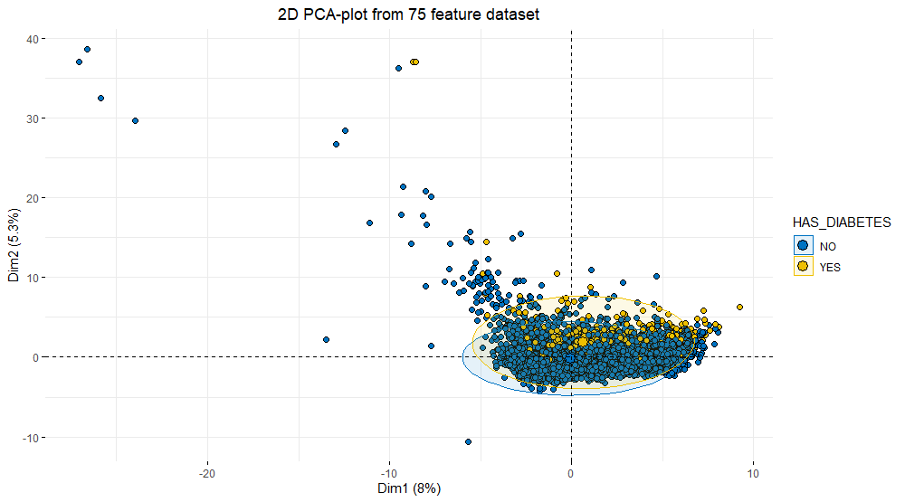{width=800px}

The two first components explains only 35% of the variance. We need 35 principal components to explain more than 95% of the variance and 38 to explain more than 0.99
Based on the analysis for Correlation and PCA, we decide to keep the below selected 15 variables.


```{r eval=FALSE, echo=TRUE}
ques_select_colns <- c("SEQN","HAS_DIABETES","TARGET","PAAQUEX","SMAQUEX.x","DBD910","FSDAD","DBD895","FSDHH","DIQ010","DBD905","FSD032B","FSD032C","FSD032A","DLQ050","DIQ050","HSAQUEX","DLQ060")

```


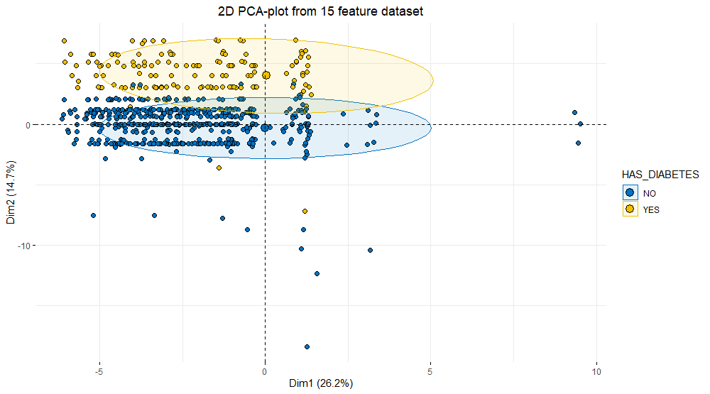{width=800px}

#### Combined Data Mining

```{r}

```


We now will keep the associated features related to Diabetes disease using PCA and Correlation plots.


 Correlation Plot:
```{r eval=FALSE, echo=TRUE}
corrplot(combi_cor$r, type = "upper", order = "hclust", tl.col = "black", tl.srt = 55)

```


{width=800px}


 PCA 


```{r eval=FALSE, echo=TRUE}
pcmp <- princomp(Test_Data,retx=TRUE, cor =TRUE, center=TRUE, scale=TRUE)

plot(pcmp, main = "PCA for Questionnaire", col.axis="blue",npcs=80)
abline(h = 1, col="red", lty=5)
```


{width=800px}
```{r eval=FALSE, echo=TRUE}
plot(pcmp, type = "l", main = "PCA for Questionnaire", col.axis="blue",npcs=80)
abline(h = 1, col="red", lty=5)
abline(v = 22, col="blue", lty=5)

```


{width=800px}


```{r eval=FALSE, echo=TRUE}
fviz_pca_ind(pcmp, geom.ind = "point", pointshape = 21, 
             pointsize = 2, 
             fill.ind = ques_target$HAS_DIABETES, 
             col.ind = "black", 
             palette = "jco", 
             addEllipses = TRUE,
             label = "var",
             col.var = "black",
             repel = TRUE,
             legend.title = "HAS_DIABETES") +
  ggtitle("2D PCA-plot from 75 feature dataset") +
  theme(plot.title = element_text(hjust = 0.5))
```


{width=800px}


```{r eval=FALSE, echo=TRUE}
ques_select_colns <- c("SEQN","HAS_DIABETES","TARGET","PAAQUEX","SMAQUEX.x","DBD910","FSDAD","DBD895","FSDHH","DIQ010","DBD905","FSD032B","FSD032C","FSD032A","DLQ050","DIQ050","HSAQUEX","DLQ060")

```


{width=800px}


select features correlated to the TARGET ( HAS_DIABETES) with "abs(coefficiant) > 0.1" 

```{r eval=FALSE, echo=TRUE}
# ++++++++++++++++++++++++++++
# flattenCorrMatrix
# ++++++++++++++++++++++++++++
# cormat : matrix of the correlation coefficients
# pmat : matrix of the correlation p-values
flattenCorrMatrix <- function(cormat, pmat) {
  ut <- upper.tri(cormat)
  data.frame(
    row = rownames(cormat)[row(cormat)[ut]],
    column = rownames(cormat)[col(cormat)[ut]],
    cor  =(cormat)[ut],
    p = pmat[ut]
  )
}

CorrMatrix = as.data.frame(flattenCorrMatrix(combi_diabetes_cor$r, combi_diabetes_cor$P))

#withdraw feasture correlated to the TARGET and select cor > 0.1 

TARGET_CorrMatrix <- CorrMatrix %>%
  filter(row=="TARGET")%>%
  arrange(desc(abs(cor)))%>%
  filter(abs(cor)>0.1)

head(TARGET_CorrMatrix)

      row   column        cor p
1  TARGET    LBXGH  0.6089779 0
2  TARGET   LBXSGL  0.5035482 0
3  TARGET RIDAGEYR  0.2402681 0
4  TARGET   RXDUSE -0.2004047 0
5  TARGET LBDHDDSI -0.1918771 0
6  TARGET   LBDHDD -0.1899955 0
7  TARGET DMDHRAGE  0.1700048 0
8  TARGET DMDHHSZE  0.1578885 0
9  TARGET   DLQ050 -0.1493532 0
10 TARGET   BPXSY2  0.1413383 0
11 TARGET   BPXSY3  0.1389114 0
12 TARGET  OHX26TC  0.1328777 0
13 TARGET  OHX07TC  0.1167468 0
14 TARGET  OHX25TC  0.1032902 0
15 TARGET  OHX23TC  0.1000596 0
```


#### PCA FOR DIABETES


```{r eval=FALSE, echo=TRUE}
pcmp <- princomp(Test_Data,retx=TRUE, cor =TRUE, center=TRUE, scale=TRUE)

Demo_target2 <- as.data.frame(cbind(Demo_target2, pcmp$scores[,1:5]))

plot(pcmp, main = "PCA for Demographics", col.axis="blue",npcs = 20)
abline(h = 1, col="red", lty=5)

plot(pcmp, type = "l", main = "PCA for Demographics", col.axis="blue",npcs = 20)
abline(h = 1, col="red", lty=5)
abline(v = 10, col="blue", lty=5)

```


```{r, eval=FALSE, echo=TRUE}
combined_target_final <- read_csv("Data/Target Datasets/combined_target_final.csv")

library(devtools)
library(ggbiplot)
combined_target_final.pca <- prcomp(combined_target_final[-c(1,2,7,8,39,40,41,42)], center = TRUE,scale = TRUE)
summary(combined_target_final.pca)

screeplot(combined_target_final.pca, type = "l", npcs = 20, main = "Screeplot of the first 20 PCs")
abline(h = 1, col="red", lty=5)
legend("topright", legend=c("Eigenvalue = 1"),
       col=c("red"), lty=5, cex=0.6)


cumpro <- cumsum(combined_target_final.pca$sdev^2 / sum(combined_target_final.pca$sdev^2))
plot(cumpro[0:20], xlab = "PC #", ylab = "Amount of explained variance", main = "Cumulative variance plot")
abline(v = 9, col="blue", lty=5)
abline(h = 0.79850, col="blue", lty=5)
legend("topleft", legend=c("Cut-off @ PC9"),
       col=c("blue"), lty=5, cex=0.6)


```


{width=350px}
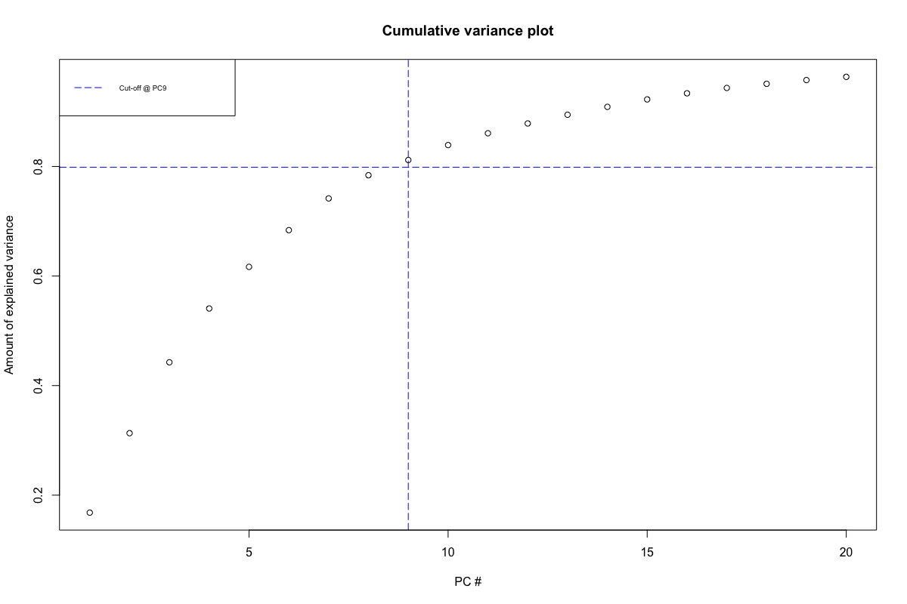{width=350px}


We notice is that the first 9 components has an Eigenvalue >1 
and explains almost 80% of variance. 
So if  wereduce dimensionality from 35  to 8  we will lose 
  20% of variance!

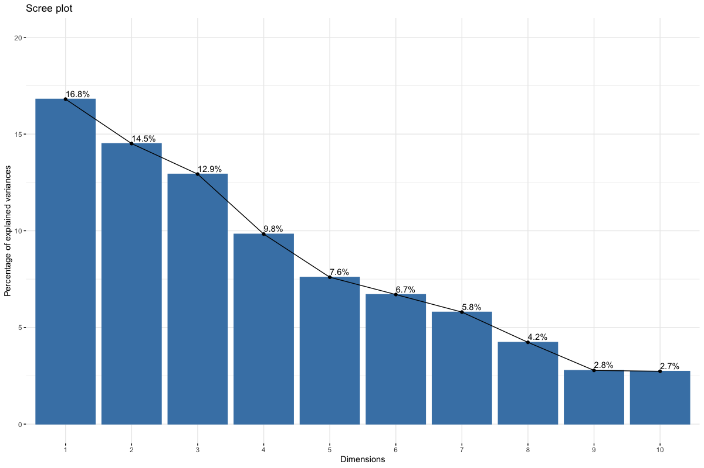{width=350px}
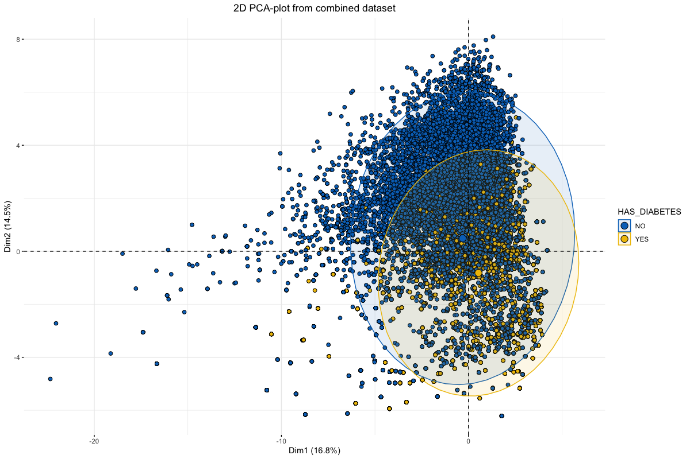{width=350px}

The two first components explains only 30%  of the variance. 
We need 18 principal components to explain more than 95% of the variance 
and 27 to explain more than 0.99


### Applying machine learning models  {.tabset}


```{r, eval=FALSE, echo=TRUE}
fitControl <- trainControl(method="cv",
                           number = 5,
                           preProcOptions = list(thresh = 0.99), # threshold for pca preprocess
                           classProbs = TRUE,
                           summaryFunction = twoClassSummary)
```


We are going to create a training and test set of these data:

```{r, eval=FALSE, echo=TRUE}
combined_target_final <- read_csv("Data/Target Datasets/combined_target_final.csv")

require(caret)
require(dplyr)
require(caretEnsemble)
require(pROC)
set.seed(101)


data_index <- createDataPartition(combined_target_final$TARGET, p=0.75, list = FALSE)
train_Combined <- combined_target_final[data_index,-c(1,2,7,8,39,40,41,42) ]
test_Combined <- combined_target_final[-data_index, -c(1,2,7,8,39,40,41,42)]

train_Combined$TARGET =  as.factor(train_Combined$TARGET)
test_Combined$TARGET =  as.factor(test_Combined$TARGET)

 #try to predict class probabilities in R - caret
levels(train_Combined$TARGET) <- make.names(levels(factor(train_Combined$TARGET)))
levels(test_Combined$TARGET) <- make.names(levels(factor(test_Combined$TARGET)))


```


#### Logistic Regression

Let's try Logistic Regression:

```{r model_lr, eval=FALSE, echo=TRUE, message=FALSE, warning=FALSE, cache=FALSE}

model_lr <- train(TARGET~.,train_Combined,
                  method = "glmnet",
                     metric="ROC",
                  #tuneGrid = expand.grid(alpha = c(0,  .1,  .2, .4, .6, .8, 1),lambda = seq(.01, .2, length = 20)),
                     preProcess = c("center", "scale"),
                  trControl=fitControl) 


```


```{r, eval=FALSE, echo=TRUE}

pred_lr <- predict(model_lr, test_Combined)
cm_lr <- confusionMatrix(pred_lr, test_Combined$TARGET, positive = "X1")
cm_lr

Confusion Matrix and Statistics

          Reference
Prediction    X0    X1
        X0 12909  2327
        X1   839  5731
                                          
               Accuracy : 0.8548          
                 95% CI : (0.8501, 0.8595)
    No Information Rate : 0.6305          
    P-Value [Acc > NIR] : < 2.2e-16       
                                          
                  Kappa : 0.676           
                                          
 Mcnemar's Test P-Value : < 2.2e-16       
                                          
            Sensitivity : 0.7112          
            Specificity : 0.9390          
         Pos Pred Value : 0.8723          
         Neg Pred Value : 0.8473          
             Prevalence : 0.3695          
         Detection Rate : 0.2628          
   Detection Prevalence : 0.3013          
      Balanced Accuracy : 0.8251          
                                          
       'Positive' Class : X1 
```


#### Logistic Regression with  PCA

Logistic Regression  with  pca:


```{r model_pca_lr, eval=FALSE, echo=TRUE, message=FALSE, warning=FALSE, cache=FALSE}

model_pca_lr <- train(TARGET~.,
                      train_Combined,
                      method = "glmnet",
                      metric="ROC",
                      #family = "binomial", 
                      #tuneGrid = expand.grid(alpha = c(0,  .1,  .2, .4, .6, .8, 1),lambda = seq(.01, .2, length = 20)),
                      preProcess = c('center', 'scale', 'pca'),
                      trControl=fitControl)


```


```{r, eval=FALSE, echo=TRUE}
pred_pca_lr <- predict(model_pca_lr, test_Combined)
cm_pca_lr <- confusionMatrix(pred_pca_rf, test_Combined$TARGET, positive = "X1")
cm_pca_lr
Confusion Matrix and Statistics

          Reference
Prediction    X0    X1
        X0 12949  2296
        X1   799  5762
                                          
               Accuracy : 0.8581          
                 95% CI : (0.8534, 0.8627)
    No Information Rate : 0.6305          
    P-Value [Acc > NIR] : < 2.2e-16       
                                          
                  Kappa : 0.6832          
                                          
 Mcnemar's Test P-Value : < 2.2e-16       
                                          
            Sensitivity : 0.7151          
            Specificity : 0.9419          
         Pos Pred Value : 0.8782          
         Neg Pred Value : 0.8494          
             Prevalence : 0.3695          
         Detection Rate : 0.2642          
   Detection Prevalence : 0.3009          
      Balanced Accuracy : 0.8285          
                                          
       'Positive' Class : X1 
```


#### Logistic Regression with correlated features


Let's try Logistic Regression  with the top five  features correlated to the TARGET ( HAS_DIABETES):

1   "LBXGH": "Glycohemoglobin (%)"

2   "LBXSGL": "Glucose, refrigerated serum (mg/dL)"

3   "RIDAGEYR":    "Age in years of the participant " 

4   "RXDUSE" :  "In the past 30 days, have you taken medication for which a prescription is needed? " 

5  "LBDHDDSI": "Direct HDL-Cholesterol (mmol/L)"


```{r model_corr_lr, eval=FALSE, echo=TRUE, message=FALSE, warning=FALSE, cache=FALSE}

model_corr_lr <- train(TARGET~ LBXGH  +
                         LBXSGL  +
                         RIDAGEYR  +
                         RXDUSE  +
                         LBDHDDSI  ,
                         #LBDHDD  +
                         #DMDHRAGE  +
                         #DMDHHSZE  +
                         #DLQ050  + 
                         #BPXSY2  + 
                         #BPXSY3  + 
                         #OHX26TC  + 
                         #OHX07TC  + 
                         #OHX25TC  , 
                         #OHX23TC  , 
                         data = train_Combined,
                       method = "glmnet",
                       metric="ROC",
                       preProcess = c("center", "scale"),
                       trControl=fitControl) 


```

```{r,eval=FALSE, echo=TRUE}
pred_corr_lr <- predict(model_corr_lr, test_Combined)
cm_corr_lr <- confusionMatrix(pred_corr_lr, test_Combined$TARGET, positive = "X1")
cm_corr_lr

Confusion Matrix and Statistics

          Reference
Prediction    X0    X1
        X0 12951  2340
        X1   797  5718
                                          
               Accuracy : 0.8561          
                 95% CI : (0.8514, 0.8608)
    No Information Rate : 0.6305          
    P-Value [Acc > NIR] : < 2.2e-16       
                                          
                  Kappa : 0.6785          
                                          
 Mcnemar's Test P-Value : < 2.2e-16       
                                          
            Sensitivity : 0.7096          
            Specificity : 0.9420          
         Pos Pred Value : 0.8777          
         Neg Pred Value : 0.8470          
             Prevalence : 0.3695          
         Detection Rate : 0.2622          
   Detection Prevalence : 0.2988          
      Balanced Accuracy : 0.8258          
                                          
       'Positive' Class : X1   

```

#### Random Forest

Let's try random forest:

```{r model_rf, eval=FALSE, echo=TRUE, message=FALSE, warning=FALSE, cache=FALSE}
model_rf <- train(as.factor(TARGET)~.,
                  train_Combined,
                  method="ranger",
                  metric="ROC",
                  #tuneLength=10,
                  #tuneGrid = expand.grid(mtry = c(2, 3, 6)),
                  #tuneGrid = data.frame(mtry = 3)
                  tuneGrid = tunegrid,
                  preProcess = c('center', 'scale'),
                  trControl=fitControl)
```


```{r,eval=FALSE, echo=TRUE}
pred_rf <- predict(model_rf, test_Combined)
cm_rf <- confusionMatrix(pred_rf, test_Combined$TARGET, positive = "X1")
cm_rf
Confusion Matrix and Statistics

          Reference
Prediction    X0    X1
        X0 13739    20
        X1     9  8038
                                          
               Accuracy : 0.9987          
                 95% CI : (0.9981, 0.9991)
    No Information Rate : 0.6305          
    P-Value [Acc > NIR] : < 2e-16         
                                          
                  Kappa : 0.9971          
                                          
 Mcnemar's Test P-Value : 0.06332         
                                          
            Sensitivity : 0.9975          
            Specificity : 0.9993          
         Pos Pred Value : 0.9989          
         Neg Pred Value : 0.9985          
             Prevalence : 0.3695          
         Detection Rate : 0.3686          
   Detection Prevalence : 0.3690          
      Balanced Accuracy : 0.9984          
                                          
       'Positive' Class : X1              
                                       
```

#### Random Forest with PCA

Random forest with pca

```{r model_pca_rf, eval=FALSE, echo=TRUE,message=FALSE, warning=FALSE, cache=FALSE}
model_pca_rf <- train(TARGET~.,
                  train_Combined,
                  method="ranger",
                  metric="ROC",
                  #tuneLength=10,
                  #tuneGrid = expand.grid(mtry = c(2, 3, 6)),
                  preProcess = c('center', 'scale', 'pca'),
                  trControl=fitControl)
```

```{r, eval=FALSE, echo=TRUE}
pred_pca_rf <- predict(model_pca_rf, test_Combined)
cm_pca_rf <- confusionMatrix(pred_pca_rf, test_Combined$TARGET, positive = "X1")
cm_pca_rf
Confusion Matrix and Statistics

          Reference
Prediction    X0    X1
        X0 13743    22
        X1     5  8036
                                          
               Accuracy : 0.9988          
                 95% CI : (0.9982, 0.9992)
    No Information Rate : 0.6305          
    P-Value [Acc > NIR] : < 2.2e-16       
                                          
                  Kappa : 0.9973          
                                          
 Mcnemar's Test P-Value : 0.002076        
                                          
            Sensitivity : 0.9973          
            Specificity : 0.9996          
         Pos Pred Value : 0.9994          
         Neg Pred Value : 0.9984          
             Prevalence : 0.3695          
         Detection Rate : 0.3685          
   Detection Prevalence : 0.3688          
      Balanced Accuracy : 0.9985          
                                          
       'Positive' Class : X1          
                                
```


#### Random Forest with correlated features

Let's try Random forest with the top five  features correlated to the TARGET ( HAS_DIABETES): 


1   "LBXGH": "Glycohemoglobin (%)"

2   "LBXSGL": "Glucose, refrigerated serum (mg/dL)"

3   "RIDAGEYR":    "Age in years of the participant " 

4   "RXDUSE" :  "In the past 30 days, have you taken medication for which a prescription is needed? " 

5  "LBDHDDSI": "Direct HDL-Cholesterol (mmol/L)"


```{r model_corr_rf, eval=FALSE, echo=TRUE,message=FALSE, warning=FALSE, cache=FALSE}

model_corr_rf <- train(TARGET~ LBXGH  +
                         LBXSGL  +
                         RIDAGEYR  +
                         RXDUSE  +
                         LBDHDDSI  ,
                       #LBDHDD  +
                       #DMDHRAGE  +
                       #DMDHHSZE  +
                       #DLQ050  + 
                       #BPXSY2  + 
                       #BPXSY3  + 
                       #OHX26TC  + 
                       #OHX07TC  + 
                       #OHX25TC  , 
                       #OHX23TC  , 
                       data = train_Combined,
                       method="ranger",
                       metric="ROC",
                       preProcess = c("center", "scale"),
                       trControl=fitControl) 

```


```{r, eval=FALSE, echo=TRUE}

pred_corr_rf <- predict(model_corr_rf, test_Combined)
cm_corr_rf <- confusionMatrix(pred_corr_rf, test_Combined$TARGET, positive = "X1")
cm_corr_rf
Confusion Matrix and Statistics

          Reference
Prediction    X0    X1
        X0 13736    20
        X1    12  8038
                                         
               Accuracy : 0.9985         
                 95% CI : (0.9979, 0.999)
    No Information Rate : 0.6305         
    P-Value [Acc > NIR] : <2e-16         
                                         
                  Kappa : 0.9968         
                                         
 Mcnemar's Test P-Value : 0.2159         
                                         
            Sensitivity : 0.9975         
            Specificity : 0.9991         
         Pos Pred Value : 0.9985         
         Neg Pred Value : 0.9985         
             Prevalence : 0.3695         
         Detection Rate : 0.3686         
   Detection Prevalence : 0.3692         
      Balanced Accuracy : 0.9983         
                                         
       'Positive' Class : X1     

```

#### KNN

Let's try KNN model

```{r model_knn, eval=FALSE, echo=TRUE, message=FALSE, warning=FALSE, cache=FALSE}

model_knn <- train(TARGET~.,
                   train_Combined,
                   method="knn",
                   metric="ROC",
                   preProcess = c('center', 'scale'),
                   tuneLength=10,
                   trControl=fitControl)
```

```{r, eval=FALSE, echo=TRUE}
pred_knn <- predict(model_knn, test_Combined)
cm_knn <- confusionMatrix(pred_knn, test_Combined$TARGET, positive = "X1")
> cm_knn
Confusion Matrix and Statistics

          Reference
Prediction    X0    X1
        X0 13673    58
        X1    75  8000
                                          
               Accuracy : 0.9939          
                 95% CI : (0.9928, 0.9949)
    No Information Rate : 0.6305          
    P-Value [Acc > NIR] : <2e-16          
                                          
                  Kappa : 0.9869          
                                          
 Mcnemar's Test P-Value : 0.1653          
                                          
            Sensitivity : 0.9928          
            Specificity : 0.9945          
         Pos Pred Value : 0.9907          
         Neg Pred Value : 0.9958          
             Prevalence : 0.3695          
         Detection Rate : 0.3669          
   Detection Prevalence : 0.3703          
      Balanced Accuracy : 0.9937          
                                          
       'Positive' Class : X1     
```

```{r, eval=FALSE, echo=TRUE}
pred_prob_knn <- predict(model_knn, test_Combined, type="prob")
roc_knn <- roc(test_Combined$TARGET, pred_prob_knn$X1)
plot(roc_knn)
```

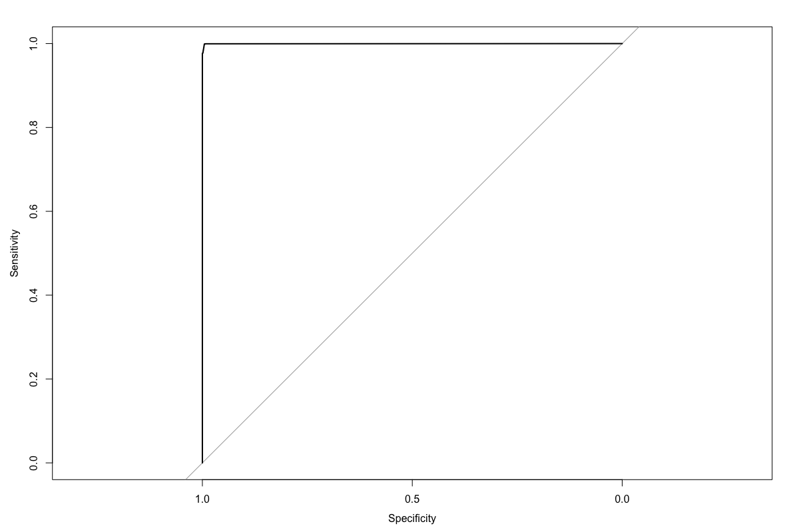{width=500px}

#### SVM with radial kernel
 

```{r model_svm, eval=FALSE, echo=TRUE, message=FALSE, warning=FALSE, cache=FALSE}
model_svm <- train(TARGET~.,
                    train_Combined,
                    method="svmRadial",
                    metric="ROC",
                    preProcess=c('center', 'scale'),
                    trace=FALSE,
                    trControl=fitControl)
```

```{r, eval=FALSE, echo=TRUE}
pred_svm <- predict(model_svm, test_Combined)
cm_svm <- confusionMatrix(pred_svm, test_Combined$TARGET, positive = "X1")
> cm_svm

Confusion Matrix and Statistics

          Reference
Prediction    X0    X1
        X0 13470   507
        X1   278  7551
                                          
               Accuracy : 0.964           
                 95% CI : (0.9614, 0.9664)
    No Information Rate : 0.6305          
    P-Value [Acc > NIR] : < 2.2e-16       
                                          
                  Kappa : 0.9223          
                                          
 Mcnemar's Test P-Value : 4.03e-16        
                                          
            Sensitivity : 0.9371          
            Specificity : 0.9798          
         Pos Pred Value : 0.9645          
         Neg Pred Value : 0.9637          
             Prevalence : 0.3695          
         Detection Rate : 0.3463          
   Detection Prevalence : 0.3590          
      Balanced Accuracy : 0.9584          
                                          
       'Positive' Class : X1              
                             
``` 


```{r, eval=FALSE, echo=TRUE}


```


### Model result comparasion 

Let's compare the models and check their correlation:

```{r, eval=FALSE, echo=TRUE}
model_list <- list(LR= model_lr, PCA_LR= model_pca_lr, CORR_LR= model_corr_lr,RF=model_rf, 
                   PCA_RF=model_pca_rf, CORR_RF=model_corr_rf,KNN = model_knn, SVM=model_svm)
resamples <- resamples(model_list)


```

#### Correlation between models {.tabset .tabset-fade}

```{r, eval=FALSE, echo=TRUE}
model_cor <- modelCor(resamples)
```

##### Plot 
```{r, eval=FALSE, echo=TRUE}
corrplot(model_cor)
```

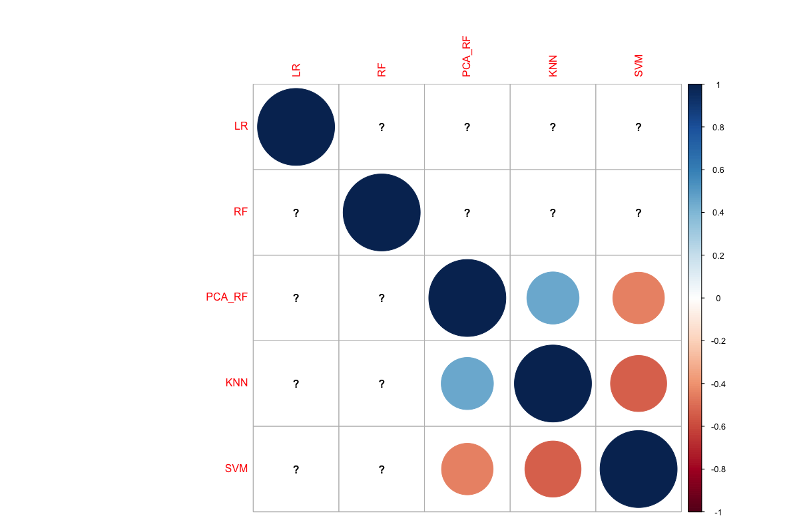{width=500px}

##### Data
```{r, eval=FALSE, echo=TRUE}
model_cor
                LR     PCA_LR    CORR_LR         RF      PCA_RF    CORR_RF
LR       1.0000000 -0.2797105  0.2728638  0.1528731 -0.46610641  0.4907913
PCA_LR  -0.2797105  1.0000000  0.8339244 -0.9275219  0.89006376  0.1853586
CORR_LR  0.2728638  0.8339244  1.0000000 -0.8590370  0.56778253  0.5814183
RF       0.1528731 -0.9275219 -0.8590370  1.0000000 -0.80942818 -0.4135697
PCA_RF  -0.4661064  0.8900638  0.5677825 -0.8094282  1.00000000 -0.1984461
CORR_RF  0.4907913  0.1853586  0.5814183 -0.4135697 -0.19844606  1.0000000
KNN      0.6309999  0.4464693  0.8433293 -0.4786641  0.05167214  0.7598467
SVM      0.3891005 -0.6609020 -0.4504645  0.8274750 -0.75982536 -0.1669214
                KNN         SVM
LR       0.63099993  0.38910048
PCA_LR   0.44646929 -0.66090198
CORR_LR  0.84332932 -0.45046447
RF      -0.47866414  0.82747497
PCA_RF   0.05167214 -0.75982536
CORR_RF  0.75984669 -0.16692139
KNN      1.00000000  0.02863682
SVM      0.02863682  1.00000000
```


#### Comparasion

```{r, eval=FALSE, echo=TRUE}
bwplot(resamples, metric="ROC")
```


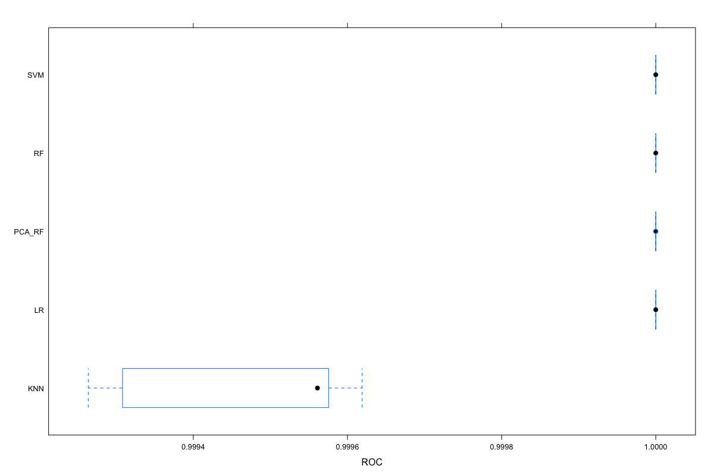{width=500px}

Most of the models have a low variability with respect of the processed sample.
Random Forest (RF, PCA_RF, and CORR_RF) achieve a great auc with a very low variability.


```{r, eval=FALSE, echo=TRUE}
cm_list <- list(LR= model_rf, PCA_LR=model_pca_lr, CORR_LR= model_corr_lr,RF=model_rf, PCA_RF=model_pca_rf, CORR_RF=model_corr_rf, KNN = model_knn, SVM=model_svm)

```

Let's remember how these models result with the testing dataset. Prediction classes are obtained by default with 
a threshold of 0.5 which could not be the best with an unbalanced dataset like this.

```{r, eval=FALSE, echo=TRUE}
cm_list <- list(LR= cm_lr, PCA_LR= cm_pca_lr, CORR_LR= cm_corr_lr,RF=cm_rf, PCA_RF=cm_pca_rf,  KNN = cm_knn, SVM=cm_svm)
cm_list_results <- sapply(cm_list, function(x) x$byClass)
cm_list_results
                            LR    PCA_LR   CORR_LR        RF    PCA_RF   CORR_RF
Sensitivity          0.7112187 0.7150658 0.7096054 0.9975180 0.9972698 0.9975180
Specificity          0.9389729 0.9418825 0.9420279 0.9993454 0.9996363 0.9991271
Pos Pred Value       0.8722983 0.8782198 0.8776669 0.9988816 0.9993782 0.9985093
Neg Pred Value       0.8472696 0.8493932 0.8469688 0.9985464 0.9984017 0.9985461
Precision            0.8722983 0.8782198 0.8776669 0.9988816 0.9993782 0.9985093
Recall               0.7112187 0.7150658 0.7096054 0.9975180 0.9972698 0.9975180
F1                   0.7835658 0.7882892 0.7847389 0.9981993 0.9983229 0.9980134
Prevalence           0.3695313 0.3695313 0.3695313 0.3695313 0.3695313 0.3695313
Detection Rate       0.2628176 0.2642392 0.2622214 0.3686141 0.3685224 0.3686141
Detection Prevalence 0.3012932 0.3008805 0.2987710 0.3690269 0.3687517 0.3691645
Balanced Accuracy    0.8250958 0.8284741 0.8258166 0.9984317 0.9984531 0.9983226
                           KNN       SVM
Sensitivity          0.9928022 0.9370812
Specificity          0.9945447 0.9797789
Pos Pred Value       0.9907121 0.9644910
Neg Pred Value       0.9957760 0.9637261
Precision            0.9907121 0.9644910
Recall               0.9928022 0.9370812
F1                   0.9917560 0.9505885
Prevalence           0.3695313 0.3695313
Detection Rate       0.3668715 0.3462808
Detection Prevalence 0.3703109 0.3590296
Balanced Accuracy    0.9936734 0.9584300
```


The best results for Sensitivity (detection of diabetes) is the Random forest with the top five correlated features, and The  with PCA has a great F1 score.


```{r, eval=FALSE, echo=TRUE}
require(nnet)
cm_results_max <- apply(cm_list_results, 1, which.is.max)
```


```{r, eval=FALSE, echo=TRUE}

output_report <- data.frame(metric=names(cm_results_max), 
                            best_model=colnames(cm_list_results)[cm_results_max],
                            value=mapply(function(x,y) {cm_list_results[x,y]}, 
                                         names(cm_results_max), 
                                         cm_results_max))
rownames(output_report) <- NULL
output_report
                 metric best_model     value
1           Sensitivity    CORR_RF 0.9975180
2           Specificity     PCA_RF 0.9996363
3        Pos Pred Value     PCA_RF 0.9993782
4        Neg Pred Value         RF 0.9985464
5             Precision     PCA_RF 0.9993782
6                Recall         RF 0.9975180
7                    F1     PCA_RF 0.9983229
8            Prevalence        SVM 0.3695313
9        Detection Rate    CORR_RF 0.3686141
10 Detection Prevalence        KNN 0.3703109
11    Balanced Accuracy     PCA_RF 0.9984531

```

### Conclusions

We have found Random forest with the top five  features correlated to the TARGET ( HAS_DIABETES)  model preprocessed data with good results over the test set. This model has a **sensibility of 0.997** with a **F1 score of 0.998**.


```{r, eval=FALSE, echo=TRUE}


```


# Shiny App

The ShinyApp was built to assist to predict a patients condition based on the selected attribues.


# Problem 2: Unsupervised Association 

Find associations with diseases and diet/demographics data.  

## Introduction
Associating mining if often used with market basket analysis.  However, for healthcare dataset used NHANES, we will explore the associations between the data and attempt to provide value to addressing marketing business problems for the pharmedical company in adversiting their drugs and attracting individuals to clinical trails.  

## Preparing the data for association algorithms.

Our first task is to prepare the data for associating mining algorithms.  

```{r eval=FALSE, echo=TRUE}

# Take interesting attributes from "data_selected" data
# "data_selected" is a subset of all the dataset combined.
association_dataset <- data_selected
association_target_dataset <- target_disease_dataset[ -c(2,3,4)]

# Merge our association data with the target dataset 
# Target dataset contains all diseases (diabetes, cancer, hypertension)
association_dataset <- merge(association_dataset, association_target_dataset,by="ID")

```

Since the associations rules will reference the values of the attributes.  If a value says "Yes", it might be ambigious what this means.  However, if the value was, "US Citizen", then the meaning would be  precise.    Below are a couple of examples where, we have re-coded the values for attributes as shown below:

```{r eval=FALSE, echo=TRUE}
association_dataset <- association_dataset %>%
  mutate(Milk_30   = recode(Milk_30 ,
                                      "Never" =	"Does not drink milk",	
                                      "Often-once a day or more?"  =	"Drinks milk multiple times a day",	
                                      "Rarely-less than once a week "  =	"Drinks milk once a week",
                                      "Refused" = "Might be a milk drinker",
                                      "Sometimes-once a week or more, but less than once a day" = "Drinks milk multiple times a week",
                                      "Varied"  = "Might be a milk drinker"
  ) )

association_dataset <- association_dataset %>%
  mutate(Food_assistance   = recode(Food_assistance ,
                            "No" =	"Has not requested emergency food assistance",	
                            "Refused"  =	"Unknown if emergency food assistance was requested",	
                            "Yes"  =	"Has requested emergency food assistance"
  ) )

association_dataset <- association_dataset %>%
  mutate(Insurance_current   = recode(Insurance_current ,
                                    "No" =	"No health insurance coverage",	
                                    "Refused"  =	"Health insurance coverage unknown",	
                                    "Unknown"  =	"Health insurance coverage unknown",
                                    "Yes"    = "Has health insurance coverage"
  ) )


association_dataset <- association_dataset %>%
  mutate(HAS_CANCER   = recode(HAS_CANCER ,
                                 "YES" =	"HAS CANCER",	
                                 "NO"  =	"NO CANCER"
  ) )

```

The above recoding was performed for 18 attributes.  Within the association dataset, we selected 18 attributes.  We focused on attributes that were categorial values.  For the purpose of association mining, numerical values may not add value unless they are binned into categories. For now, we have focused on 18 attributes that were available in the cleaned dataset. Sincer, the dataset is rich with many attributes.  In the future, more attributes could be added into association mining algorithms if the business finds value in the suggestions of this type of analysis.

## Transform dataset into a transactional dataset

In order to apply association algorithms, the dataset has to transformed into a tranactional dataset.  First, we need to merge all categorical values requiring for mining into a single description attriubte:

```{r eval=FALSE, echo=TRUE}

# Select columns required for mining analysis
association_test_columns <- c("ID", "Gender", "Race", "Country_of_birth", "Citizenship_status",
                              'Marital_status', "Family_income", "Dominant_hand_exam", "Milk_30", "Food_assistance",
                              "Insurance_current", "Health_institution", "Gaming_hours", "Smoking_relatives", "Ride_motor_vehicle",
                              'HAS_DIABETES', 'HAS_CANCER', 'HAS_HYPERTENSION')

subset_association = subset(association_dataset, select=association_test_columns)

# Add a description attribute with all the attributes requried for unsupervised association mining analysis 
subset_association <- subset_association %>% 
  mutate(description= paste(subset_association$Race, ",",
                            subset_association$Gender, ",",
                            subset_association$Country_of_birth, ",",
                            subset_association$Citizenship_status, ",",
                            subset_association$Marital_status, ",",
                            subset_association$Family_income, ",",
                            subset_association$Dominant_hand_exam, ",",
                            subset_association$Milk_30, ",",
                            subset_association$Food_assistance, ",", 
                            subset_association$Insurance_current, ",",
                            subset_association$Health_institution, ",",
                            subset_association$Gaming_hours, ",",
                            subset_association$Smoking_relatives, ",",
                            subset_association$Ride_motor_vehicle, "," ,
                            subset_association$HAS_DIABETES, ",",
                            subset_association$HAS_CANCER, ",", 
                            subset_association$HAS_HYPERTENSION
                            ))

#Group descriptions by individual IDs and place into transactionData dataset.
transactionData <- ddply(subset_association, c("ID"),
                         function(subset_association)paste(subset_association$description))

# Remove the ID from the transaction dataset as it is not used.
transactionData$ID <- NULL

# Write the transaction dataset
write.csv(transactionData, "Data/Working/transactiondata.csv", quote=FALSE , row.names = FALSE)

# Read in the transaction dataset for use with the unsupervised algorithms
individuals_transaction_class <- read.transactions('Data/Working/transactiondata.csv', format = 'basket',sep=',')
```

## Apply Association algorithms to the data 

Now data is prepared, we can apply the association algorithms.  

### Frequent values 

First, we create association rules against the dataset.  

```{r eval=FALSE, echo=TRUE}

# Create mining rules for all values.  This will tell us which values are likely to be found together
rules_for_individuals <- apriori(individuals_transaction_class, parameter = list(supp=0.001, conf=0.85, maxlen=5))
```


We plot the 20 most frequent values found within the data. 

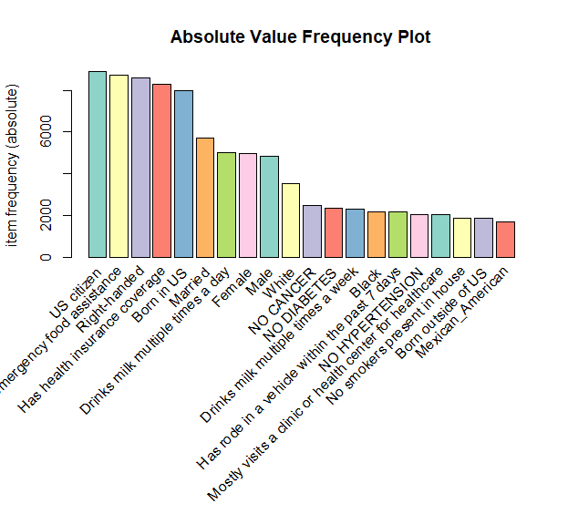{width=500px}

Per the above, as expected, US citizen, right-handed, born in US are some of the most frequent values.  Also, it is also that the values for not having diseases is also at the top of the list.  

OVer 400,000 rules are produced for entire data, let's take a glance at 5 of them below.

```{r eval=FALSE, echo=TRUE}
 inspect(rules_for_individuals[1:5])
    lhs                                                                                                                                                                                                                                         rhs                                               support confidence     lift count
[1] {}                                                                                                                                                                                                                                       => {Right-handed}                                0.874363155  0.8743632 1.000000  8581
[2] {}                                                                                                                                                                                                                                       => {Has not requested emergency food assistance} 0.889341757  0.8893418 1.000000  8728
[3] {}                                                                                                                                                                                                                                       => {US citizen}                                  0.905339311  0.9053393 1.000000  8885
[4] {Mostly visits doctors office for healthcare , Does not play video games , No smokers present in house , Has not rode in a vehicle within the past 7 days , HAS DIABETES , NO CANCER , NO HYPERTENSION}                                  => {Has not requested emergency food assistance} 0.001018953  1.0000000 1.124427    10
[5] {Mostly visits doctors office for healthcare , Plays less than an hours of video games over the past 30 days , Smokers present in house , Has not rode in a vehicle within the past 7 days , NO DIABETES , NO CANCER , HAS HYPERTENSION} => {US citizen}                                  0.001018953  1.0000000 1.104558    10

```

In the above output, we can see different association mining rules for the entire dataset.  The rules have LHS and RHS which demonstrate the relation between itemsets(collections of values).  The items on LHS are associated and occur with the single item on the RHS. Now we will proceed to create association rules for having and not having the particular diseases (cancer, diabetes, hypertension).  The RHS will be set to the particular health conditions/disases.  And we will observe what typse of associations are discovered on the LHS. 


### Association rules for having diseases {.tabset}


In order to produce a list of association rules, we had to experiement with "conf"(confidence) parameter.  For example, with positive cancer rules, we had to lower the confidence to 0.4 to produce mining rules.  For each health condition(disaease),we have created 2 sets of rules.  The first set of rules allow larger number of items to be produced on the LHS (maxlen=15); whereas, the second set of rules forces the rules to have a small amount of rules (maxlen=3).  

```{r eval=FALSE, echo=TRUE}

# Association for having cancer (large itemset allowed on LHS, maxlen=15)
has_cancer.association.rules <- apriori(individuals_transaction_class, parameter = list(supp=0.001, conf=0.4, maxlen=15), appearance=list(default="lhs", rhs="HAS CANCER"))

# Association for having cancer (small itemset allowed on LHS, maxlen=3)
has_cancer.association.rules_smallitemset <- apriori(individuals_transaction_class, parameter = list(supp=0.001, conf=0.1, maxlen=3), appearance=list(default="lhs", rhs="HAS CANCER"))

# Association for having diabetes (large itemset allowed on LHS, maxlen=15)
has_diabetes.association.rules <- apriori(individuals_transaction_class, parameter = list(supp=0.001, conf=0.7, maxlen=15), appearance=list(default="lhs", rhs="HAS DIABETES"))

# Association for having diabetes (small itemset allowed on LHS, maxlen=3)
has_diabetes.association.rules_smallitemset <- apriori(individuals_transaction_class, parameter = list(supp=0.001, conf=0.4, maxlen=3), appearance=list(default="lhs", rhs="HAS DIABETES"))

# Association for having hypertension (large itemset allowed on LHS, maxlen=15)
has_hypertension.association.rules_smallitemset <- apriori(individuals_transaction_class, parameter = list(supp=0.001, conf=0.4, maxlen=3), appearance=list(default="lhs", rhs="HAS HYPERTENSION"))

# Association for having hypertension (small itemset allowed on LHS, maxlen=3)
has_hypertension.association.rules <- apriori(individuals_transaction_class, parameter = list(supp=0.001, conf=0.8, maxlen=15), appearance=list(default="lhs", rhs="HAS HYPERTENSION"))

```


#### Cancer

For cancer association rules, we will examine both large and small items found in conjunction with an individual having cancer.  

First, we inspected the  rules where individual has cancer and observed which large itemsets occur in conjunction with cancer.  The confidence level was set 0.4 for this set of rules which might be considered low.  However, a handful of rules were generated for this item.  Of note, those that have cancer are also associated with having hypertension and cancer.  An interesting observation is that drinking milk occurs in multiple rules.   

```{r eval=FALSE, echo=TRUE}
> inspect(has_cancer.association.rules)
     lhs                                                            rhs              support confidence     lift count
[1]  {Has health insurance coverage,                                                                                  
      HAS HYPERTENSION,                                                                                               
      Male,                                                                                                           
      Mostly visits outpatient departments for healthcare}       => {HAS CANCER} 0.001018953  0.4347826 47.94333    10
[2]  {Has health insurance coverage,                                                                                  
      HAS HYPERTENSION,                                                                                               
      Male,                                                                                                           
      Mostly visits outpatient departments for healthcare,                                                            
      US citizen}                                                => {HAS CANCER} 0.001018953  0.4347826 47.94333    10
[3]  {{you do not/SP does not} use a computer outside of school,                                                      
      Drinks milk multiple times a week,                                                                              
      HAS DIABETES,                                                                                                   
      Has not requested emergency food assistance,                                                                    
      Mostly visits a clinic or health center for healthcare}    => {HAS CANCER} 0.001018953  0.4761905 52.50936    10
[4]  {Born in US,                                                                                                     
      Drinks milk multiple times a day,                                                                               
      HAS DIABETES,                                                                                                   
      Has health insurance coverage,                                                                                  
      No smokers present in house}                               => {HAS CANCER} 0.001018953  0.4000000 44.10787    10
[5]  {Born in US,                                                                                                     
      HAS DIABETES,                                                                                                   
      Has health insurance coverage,                                                                                  
      No smokers present in house,                                                                                    
      Right-handed,                                                                                                   
      White}                                                     => {HAS CANCER} 0.001018953  0.4000000 44.10787    10
[6]  {Born in US,                                                                                                     
      Drinks milk multiple times a day,                                                                               
      HAS DIABETES,                                                                                                   
      Has health insurance coverage,                                                                                  
      No smokers present in house,                                                                                    
      Right-handed}                                              => {HAS CANCER} 0.001018953  0.4000000 44.10787    10
[7]  {Born in US,                                                                                                     
      Drinks milk multiple times a day,                                                                               
      HAS DIABETES,                                                                                                   
      Has health insurance coverage,                                                                                  
      No smokers present in house,                                                                                    
      US citizen}                                                => {HAS CANCER} 0.001018953  0.4000000 44.10787    10
[8]  {Born in US,                                                                                                     
      Drinks milk multiple times a day,                                                                               
      Has health insurance coverage,                                                                                  
      HAS HYPERTENSION,                                                                                               
      Male,                                                                                                           
      No smokers present in house}                               => {HAS CANCER} 0.001120848  0.4583333 50.54026    11
[9]  {Drinks milk multiple times a day,                                                                               
      Has health insurance coverage,                                                                                  
      HAS HYPERTENSION,                                                                                               
      Male,                                                                                                           
      No smokers present in house,                                                                                    
      Right-handed}                                              => {HAS CANCER} 0.001120848  0.4074074 44.92468    11
[10] {Drinks milk multiple times a day,                                                                               
      Has health insurance coverage,                                                                                  
      HAS HYPERTENSION,                                                                                               
      Male,                                                                                                           
      No smokers present in house,                                                                                    
      US citizen}                                                => {HAS CANCER} 0.001222743  0.4137931 45.62883    12
```

Next, we inspected rules where individual has cancer and observed which small itemsets. The confidence level was set even lower to generate results for small itemsets in conjunction with cancer.   Again, we similar items such having diabetes and hypertension appear in the small itemsets.   

```{r eval=FALSE, echo=TRUE}
> inspect(has_cancer.association.rules_smallitemset)
     lhs                                                                                    rhs          support     confidence lift     count
[1]  {Mostly visits outpatient departments for healthcare}                               => {HAS CANCER} 0.001018953 0.1010101  11.13835 10   
[2]  {HAS DIABETES}                                                                      => {HAS CANCER} 0.003362543 0.1658291  18.28592 33   
[3]  {HAS HYPERTENSION}                                                                  => {HAS CANCER} 0.005400448 0.1051587  11.59582 53   
[4]  {HAS HYPERTENSION,Mostly visits outpatient departments for healthcare}              => {HAS CANCER} 0.001018953 0.2500000  27.56742 10   
[5]  {Male,Mostly visits outpatient departments for healthcare}                          => {HAS CANCER} 0.001018953 0.1666667  18.37828 10   
[6]  {Has health insurance coverage,Mostly visits outpatient departments for healthcare} => {HAS CANCER} 0.001018953 0.1234568  13.61354 10   
[7]  {Mostly visits outpatient departments for healthcare,US citizen}                    => {HAS CANCER} 0.001018953 0.1111111  12.25218 10   
[8]  {HAS DIABETES,HAS HYPERTENSION}                                                     => {HAS CANCER} 0.002343591 0.1782946  19.66048 23   
[9]  {Does not play video games,HAS DIABETES}                                            => {HAS CANCER} 0.002139800 0.1794872  19.79199 21   
[10] {Born outside of US,HAS DIABETES}                                                   => {HAS CANCER} 0.001018953 0.1219512  13.44752 10   
[11] {Drinks milk multiple times a week,HAS DIABETES}                                    => {HAS CANCER} 0.001324638 0.2166667  23.89176 13   
[12] {HAS DIABETES,No smokers present in house}                                          => {HAS CANCER} 0.003056858 0.2000000  22.05393 30   
[13] {HAS DIABETES,Mostly visits a clinic or health center for healthcare}               => {HAS CANCER} 0.002649277 0.1733333  19.11341 26   
[14] {HAS DIABETES,NO HYPERTENSION}                                                      => {HAS CANCER} 0.001018953 0.1428571  15.75281 10   
[15] {HAS DIABETES,Has rode in a vehicle within the past 7 days}                         => {HAS CANCER} 0.002649277 0.1656051  18.26122 26   
[16] {HAS DIABETES,White}                                                                => {HAS CANCER} 0.001222743 0.2926829  32.27405 12   
[17] {HAS DIABETES,Male}                                                                 => {HAS CANCER} 0.001732219 0.1666667  18.37828 17   
[18] {Female,HAS DIABETES}                                                               => {HAS CANCER} 0.001630324 0.1649485  18.18881 16   
[19] {Drinks milk multiple times a day,HAS DIABETES}                                     => {HAS CANCER} 0.001426534 0.2121212  23.39053 14   
[20] {HAS DIABETES,Married}                                                              => {HAS CANCER} 0.001426534 0.1473684  16.25027 14   
[21] {Born in US,HAS DIABETES}                                                           => {HAS CANCER} 0.002343591 0.1965812  21.67694 23   
[22] {HAS DIABETES,Has health insurance coverage}                                        => {HAS CANCER} 0.002751172 0.1849315  20.39233 27   
[23] {HAS DIABETES,Right-handed}                                                         => {HAS CANCER} 0.003056858 0.1685393  18.58477 30   
[24] {HAS DIABETES,Has not requested emergency food assistance}                          => {HAS CANCER} 0.002751172 0.1730769  19.08513 27   
[25] {HAS DIABETES,US citizen}                                                           => {HAS CANCER} 0.002853067 0.1728395  19.05895 28   
[26] {HAS HYPERTENSION,Widowed}                                                          => {HAS CANCER} 0.001120848 0.2037037  22.46234 11   
[27] {No smokers present in house,Widowed}                                               => {HAS CANCER} 0.001528429 0.1648352  18.17632 15   
[28] {Has rode in a vehicle within the past 7 days,Widowed}                              => {HAS CANCER} 0.001018953 0.1052632  11.60733 10   
[29] {HAS HYPERTENSION,Has not rode in a vehicle within the past 7 days}                 => {HAS CANCER} 0.001120848 0.1235955  13.62883 11   
[30] {HAS HYPERTENSION,Plays less than an hours of video games over the past 30 days}    => {HAS CANCER} 0.001018953 0.1020408  11.25201 10   
[31] {Divorced,HAS HYPERTENSION}                                                         => {HAS CANCER} 0.001120848 0.1358025  14.97489 11   
[32] {HAS HYPERTENSION,Has requested emergency food assistance}                          => {HAS CANCER} 0.001426534 0.1359223  14.98811 14   
[33] {Does not play video games,HAS HYPERTENSION}                                        => {HAS CANCER} 0.002445486 0.1159420  12.78489 24   
[34] {Black,HAS HYPERTENSION}                                                            => {HAS CANCER} 0.001528429 0.1027397  11.32907 15   
[35] {Drinks milk multiple times a week,HAS HYPERTENSION}                                => {HAS CANCER} 0.002037905 0.1226994  13.53002 20   
[36] {HAS HYPERTENSION,No smokers present in house}                                      => {HAS CANCER} 0.004177705 0.1198830  13.21946 41   
[37] {HAS HYPERTENSION,Has rode in a vehicle within the past 7 days}                     => {HAS CANCER} 0.004279601 0.1012048  11.15982 42   
[38] {HAS HYPERTENSION,White}                                                            => {HAS CANCER} 0.002343591 0.1586207  17.49105 23   
[39] {HAS HYPERTENSION,Male}                                                             => {HAS CANCER} 0.002751172 0.1097561  12.10277 27   
[40] {Female,HAS HYPERTENSION}                                                           => {HAS CANCER} 0.002649277 0.1007752  11.11245 26   
[41] {Drinks milk multiple times a day,HAS HYPERTENSION}                                 => {HAS CANCER} 0.002343591 0.1428571  15.75281 23   
[42] {Born in US,HAS HYPERTENSION}                                                       => {HAS CANCER} 0.004483391 0.1282799  14.14538 44   
[43] {Has health insurance coverage,HAS HYPERTENSION}                                    => {HAS CANCER} 0.004890972 0.1333333  14.70262 48   
[44] {HAS HYPERTENSION,Right-handed}                                                     => {HAS CANCER} 0.004890972 0.1083521  11.94795 48   
[45] {HAS HYPERTENSION,US citizen}                                                       => {HAS CANCER} 0.005094763 0.1187648  13.09616 50   
> 
```

In order to build the association mining lists, we had to reduce confidence levels to under 0.5.  

#### Diabetes

As with cancer association rules, we will examine both large and small items found in conjunction with an individual having diabetes.

For large itemset with a positive diabetes results, we were able to increase the confidence level to 0.7.   32 rules were generated for this result.  Of note, a household income between “20000-24999”daily/weekly milk consumption and  appears in several rules.  Also interesting, that there are rules where an individual has health insurance coverage.  None of the rules contain the opposite condition of not having health insurance coverage.   

```{r eval=FALSE, echo=TRUE}
> inspect(has_diabetes.association.rules)
     lhs                                                            rhs                support confidence     lift count
[1]  {{you do not/SP does not} use a computer outside of school,                                                        
      Drinks milk multiple times a week,                                                                                
      HAS CANCER,                                                                                                       
      Mostly visits a clinic or health center for healthcare}    => {HAS DIABETES} 0.001120848  0.7857143 38.74874    11
[2]  {{you do not/SP does not} use a computer outside of school,                                                        
      Drinks milk multiple times a week,                                                                                
      HAS CANCER,                                                                                                       
      Has not requested emergency food assistance}               => {HAS DIABETES} 0.001018953  0.9090909 44.83326    10
[3]  {Drinks milk multiple times a week,                                                                                
      HAS HYPERTENSION,                                                                                                 
      Has rode in a vehicle within the past 7 days,                                                                     
      Household income between $20000 - $24999}                  => {HAS DIABETES} 0.001324638  0.7222222 35.61753    13
[4]  {{you do not/SP does not} use a computer outside of school,                                                        
      HAS CANCER,                                                                                                       
      HAS HYPERTENSION,                                                                                                 
      Mostly visits a clinic or health center for healthcare,                                                           
      US citizen}                                                => {HAS DIABETES} 0.001018953  0.7142857 35.22613    10
[5]  {{you do not/SP does not} use a computer outside of school,                                                        
      HAS CANCER,                                                                                                       
      HAS HYPERTENSION,                                                                                                 
      Has not requested emergency food assistance,                                                                      
      US citizen}                                                => {HAS DIABETES} 0.001018953  0.7142857 35.22613    10
[6]  {{you do not/SP does not} use a computer outside of school,                                                        
      Drinks milk multiple times a week,                                                                                
      HAS CANCER,                                                                                                       
      Has not requested emergency food assistance,                                                                      
      Mostly visits a clinic or health center for healthcare}    => {HAS DIABETES} 0.001018953  0.9090909 44.83326    10
[7]  {{you do not/SP does not} use a computer outside of school,                                                        
      HAS CANCER,                                                                                                       
      Has not requested emergency food assistance,                                                                      
      Mostly visits a clinic or health center for healthcare,                                                           
      US citizen}                                                => {HAS DIABETES} 0.001018953  0.7692308 37.93583    10
[8]  {{you do not/SP does not} use a computer outside of school,                                                        
      Drinks milk multiple times a day,                                                                                 
      HAS HYPERTENSION,                                                                                                 
      Has not rode in a vehicle within the past 7 days,                                                                 
      US citizen}                                                => {HAS DIABETES} 0.001018953  0.7142857 35.22613    10
[9]  {Drinks milk multiple times a week,                                                                                
      HAS HYPERTENSION,                                                                                                 
      Has rode in a vehicle within the past 7 days,                                                                     
      Household income between $20000 - $24999,                                                                         
      Mostly visits a clinic or health center for healthcare}    => {HAS DIABETES} 0.001120848  0.7333333 36.16549    11
[10] {Drinks milk multiple times a week,                                                                                
      HAS HYPERTENSION,                                                                                                 
      Household income between $20000 - $24999,                                                                         
      Mostly visits a clinic or health center for healthcare,                                                           
      Right-handed}                                              => {HAS DIABETES} 0.001222743  0.7058824 34.81171    12
[11] {Drinks milk multiple times a week,                                                                                
      HAS HYPERTENSION,                                                                                                 
      Has rode in a vehicle within the past 7 days,                                                                     
      Household income between $20000 - $24999,                                                                         
      Right-handed}                                              => {HAS DIABETES} 0.001324638  0.7647059 37.71268    13
[12] {Drinks milk multiple times a week,                                                                                
      HAS HYPERTENSION,                                                                                                 
      Has not requested emergency food assistance,                                                                      
      Has rode in a vehicle within the past 7 days,                                                                     
      Household income between $20000 - $24999}                  => {HAS DIABETES} 0.001018953  0.7142857 35.22613    10
[13] {Drinks milk multiple times a week,                                                                                
      HAS HYPERTENSION,                                                                                                 
      Has rode in a vehicle within the past 7 days,                                                                     
      Household income between $20000 - $24999,                                                                         
      US citizen}                                                => {HAS DIABETES} 0.001120848  0.7857143 38.74874    11
[14] {Drinks milk multiple times a week,                                                                                
      Has health insurance coverage,                                                                                    
      HAS HYPERTENSION,                                                                                                 
      Has rode in a vehicle within the past 7 days,                                                                     
      Mexican_American}                                          => {HAS DIABETES} 0.001222743  0.7058824 34.81171    12
[15] {Drinks milk multiple times a week,                                                                                
      Has health insurance coverage,                                                                                    
      HAS HYPERTENSION,                                                                                                 
      Mexican_American,                                                                                                 
      US citizen}                                                => {HAS DIABETES} 0.001018953  0.7142857 35.22613    10
[16] {Drinks milk multiple times a week,                                                                                
      HAS HYPERTENSION,                                                                                                 
      Has not requested emergency food assistance,                                                                      
      Mexican_American,                                                                                                 
      US citizen}                                                => {HAS DIABETES} 0.001018953  0.7142857 35.22613    10
[17] {Born in US,                                                                                                       
      Has health insurance coverage,                                                                                    
      HAS HYPERTENSION,                                                                                                 
      Mexican_American,                                                                                                 
      No smokers present in house}                               => {HAS DIABETES} 0.001222743  0.7058824 34.81171    12
[18] {Born in US,                                                                                                       
      Drinks milk multiple times a day,                                                                                 
      Has health insurance coverage,                                                                                    
      HAS HYPERTENSION,                                                                                                 
      Right-handed,                                                                                                     
      Widowed}                                                   => {HAS DIABETES} 0.001018953  0.7142857 35.22613    10
[19] {Drinks milk multiple times a week,                                                                                
      HAS HYPERTENSION,                                                                                                 
      Has rode in a vehicle within the past 7 days,                                                                     
      Household income between $20000 - $24999,                                                                         
      Mostly visits a clinic or health center for healthcare,                                                           
      Right-handed}                                              => {HAS DIABETES} 0.001120848  0.7857143 38.74874    11
[20] {Drinks milk multiple times a week,                                                                                
      HAS HYPERTENSION,                                                                                                 
      Has not requested emergency food assistance,                                                                      
      Household income between $20000 - $24999,                                                                         
      Mostly visits a clinic or health center for healthcare,                                                           
      Right-handed}                                              => {HAS DIABETES} 0.001018953  0.7142857 35.22613    10
[21] {Drinks milk multiple times a week,                                                                                
      HAS HYPERTENSION,                                                                                                 
      Household income between $20000 - $24999,                                                                         
      Mostly visits a clinic or health center for healthcare,                                                           
      Right-handed,                                                                                                     
      US citizen}                                                => {HAS DIABETES} 0.001018953  0.7142857 35.22613    10
[22] {Drinks milk multiple times a week,                                                                                
      HAS HYPERTENSION,                                                                                                 
      Has rode in a vehicle within the past 7 days,                                                                     
      Household income between $20000 - $24999,                                                                         
      NO CANCER,                                                                                                        
      Right-handed}                                              => {HAS DIABETES} 0.001120848  0.7333333 36.16549    11
[23] {Drinks milk multiple times a week,                                                                                
      HAS HYPERTENSION,                                                                                                 
      Has not requested emergency food assistance,                                                                      
      Has rode in a vehicle within the past 7 days,                                                                     
      Household income between $20000 - $24999,                                                                         
      Right-handed}                                              => {HAS DIABETES} 0.001018953  0.7692308 37.93583    10
[24] {Drinks milk multiple times a week,                                                                                
      HAS HYPERTENSION,                                                                                                 
      Has rode in a vehicle within the past 7 days,                                                                     
      Household income between $20000 - $24999,                                                                         
      Right-handed,                                                                                                     
      US citizen}                                                => {HAS DIABETES} 0.001120848  0.7857143 38.74874    11
[25] {Has health insurance coverage,                                                                                    
      HAS HYPERTENSION,                                                                                                 
      Household income between $20000 - $24999,                                                                         
      Male,                                                                                                             
      No smokers present in house,                                                                                      
      Right-handed}                                              => {HAS DIABETES} 0.001018953  0.7142857 35.22613    10
[26] {Drinks milk multiple times a week,                                                                                
      Has health insurance coverage,                                                                                    
      HAS HYPERTENSION,                                                                                                 
      Has not requested emergency food assistance,                                                                      
      Has rode in a vehicle within the past 7 days,                                                                     
      Mexican_American}                                          => {HAS DIABETES} 0.001120848  0.7333333 36.16549    11
[27] {Drinks milk multiple times a week,                                                                                
      Has health insurance coverage,                                                                                    
      HAS HYPERTENSION,                                                                                                 
      Has rode in a vehicle within the past 7 days,                                                                     
      Mexican_American,                                                                                                 
      US citizen}                                                => {HAS DIABETES} 0.001018953  0.7692308 37.93583    10
[28] {Drinks milk multiple times a week,                                                                                
      HAS HYPERTENSION,                                                                                                 
      Has not requested emergency food assistance,                                                                      
      Has rode in a vehicle within the past 7 days,                                                                     
      Mexican_American,                                                                                                 
      US citizen}                                                => {HAS DIABETES} 0.001018953  0.7142857 35.22613    10
[29] {Born in US,                                                                                                       
      Has health insurance coverage,                                                                                    
      HAS HYPERTENSION,                                                                                                 
      Has rode in a vehicle within the past 7 days,                                                                     
      Mexican_American,                                                                                                 
      No smokers present in house}                               => {HAS DIABETES} 0.001222743  0.7500000 36.98744    12
[30] {Born in US,                                                                                                       
      Has health insurance coverage,                                                                                    
      HAS HYPERTENSION,                                                                                                 
      Mexican_American,                                                                                                 
      No smokers present in house,                                                                                      
      Right-handed}                                              => {HAS DIABETES} 0.001222743  0.7058824 34.81171    12
[31] {Born in US,                                                                                                       
      Has health insurance coverage,                                                                                    
      HAS HYPERTENSION,                                                                                                 
      Has not requested emergency food assistance,                                                                      
      Mexican_American,                                                                                                 
      No smokers present in house}                               => {HAS DIABETES} 0.001018953  0.7142857 35.22613    10
[32] {Born in US,                                                                                                       
      Has health insurance coverage,                                                                                    
      HAS HYPERTENSION,                                                                                                 
      Mexican_American,                                                                                                 
      No smokers present in house,                                                                                      
      US citizen}                                                => {HAS DIABETES} 0.001222743  0.7058824 34.81171    12
>
```

For small itemsets,  all the rules include having cancer in association with diabetes.  

```{r eval=FALSE, echo=TRUE}
> inspect(has_diabetes.association.rules_smallitemset)
    lhs                                                                    rhs            support     confidence lift     count
[1] {HAS CANCER,HAS HYPERTENSION}                                       => {HAS DIABETES} 0.002343591 0.4339623  21.40154 23   
[2] {Does not play video games,HAS CANCER}                              => {HAS DIABETES} 0.002139800 0.5384615  26.55508 21   
[3] {Born outside of US,HAS CANCER}                                     => {HAS DIABETES} 0.001018953 0.5882353  29.00975 10   
[4] {Drinks milk multiple times a week,HAS CANCER}                      => {HAS DIABETES} 0.001324638 0.4062500  20.03486 13   
[5] {HAS CANCER,No smokers present in house}                            => {HAS DIABETES} 0.003056858 0.4225352  20.83799 30   
[6] {HAS CANCER,Mostly visits a clinic or health center for healthcare} => {HAS DIABETES} 0.002649277 0.4000000  19.72663 26   
[7] {Drinks milk multiple times a day,HAS CANCER}                       => {HAS DIABETES} 0.001426534 0.4000000  19.72663 14   
[8] {HAS CANCER,Has not requested emergency food assistance}            => {HAS DIABETES} 0.002751172 0.4218750  20.80543 27   
> 
```


#### Hypertention


First, we inspected the association rules with large itemsets for those individuals with hypertension.  Rules with confidence levels of 1 are also found within this itemset.  Unlike the previous 2 health conditions, race is appearing more prominently within the association rules.      

```{r eval=FALSE, echo=TRUE}
inspect(has_hypertension.association.rules[1:100])
      lhs                                                                rhs                    support confidence     lift count
[1]   {HAS CANCER,                                                                                                               
       Mostly visits outpatient departments for healthcare}           => {HAS HYPERTENSION} 0.001018953  1.0000000 19.47222    10
[2]   {Black,                                                                                                                    
       HAS CANCER}                                                    => {HAS HYPERTENSION} 0.001528429  0.8333333 16.22685    15
[3]   {HAS DIABETES,                                                                                                             
       Household income between $20000 - $24999}                      => {HAS HYPERTENSION} 0.002649277  0.8387097 16.33154    26
[4]   {Black,                                                                                                                    
       HAS DIABETES}                                                  => {HAS HYPERTENSION} 0.004177705  0.8200000 15.96722    41
[5]   {HAS CANCER,                                                                                                               
       Male,                                                                                                                     
       Mostly visits outpatient departments for healthcare}           => {HAS HYPERTENSION} 0.001018953  1.0000000 19.47222    10
[6]   {HAS CANCER,                                                                                                               
       Has health insurance coverage,                                                                                            
       Mostly visits outpatient departments for healthcare}           => {HAS HYPERTENSION} 0.001018953  1.0000000 19.47222    10
[7]   {HAS CANCER,                                                                                                               
       Mostly visits outpatient departments for healthcare,                                                                      
       US citizen}                                                    => {HAS HYPERTENSION} 0.001018953  1.0000000 19.47222    10
[8]   {HAS CANCER,                                                                                                               
       Has rode in a vehicle within the past 7 days,                                                                             
       Plays less than an hours of video games over the past 30 days} => {HAS HYPERTENSION} 0.001018953  0.8333333 16.22685    10
[9]   {{you do not/SP does not} use a computer outside of school,                                                                
       Black,                                                                                                                    
       HAS CANCER}                                                    => {HAS HYPERTENSION} 0.001120848  0.9166667 17.84954    11
[10]  {Black,                                                                                                                    
       Drinks milk multiple times a week,                                                                                        
       HAS CANCER}                                                    => {HAS HYPERTENSION} 0.001018953  0.9090909 17.70202    10
[11]  {Black,                                                                                                                    
       HAS CANCER,                                                                                                               
       No smokers present in house}                                   => {HAS HYPERTENSION} 0.001120848  0.8461538 16.47650    11
[12]  {Black,                                                                                                                    
       HAS CANCER,                                                                                                               
       Mostly visits a clinic or health center for healthcare}        => {HAS HYPERTENSION} 0.001018953  0.8333333 16.22685    10
[13]  {Black,                                                                                                                    
       HAS CANCER,                                                                                                               
       Male}                                                          => {HAS HYPERTENSION} 0.001120848  0.8461538 16.47650    11
[14]  {Black,                                                                                                                    
       Born in US,                                                                                                               
       HAS CANCER}                                                    => {HAS HYPERTENSION} 0.001528429  0.8333333 16.22685    15
[15]  {Black,                                                                                                                    
       HAS CANCER,                                                                                                               
       Has health insurance coverage}                                 => {HAS HYPERTENSION} 0.001426534  0.8235294 16.03595    14
[16]  {Black,                                                                                                                    
       HAS CANCER,                                                                                                               
       Right-handed}                                                  => {HAS HYPERTENSION} 0.001324638  0.8666667 16.87593    13
[17]  {Black,                                                                                                                    
       HAS CANCER,                                                                                                               
       Has not requested emergency food assistance}                   => {HAS HYPERTENSION} 0.001018953  0.8333333 16.22685    10
[18]  {Black,                                                                                                                    
       HAS CANCER,                                                                                                               
       US citizen}                                                    => {HAS HYPERTENSION} 0.001528429  0.8333333 16.22685    15
[19]  {Drinks milk multiple times a day,                                                                                         
       HAS CANCER,                                                                                                               
       Male}                                                          => {HAS HYPERTENSION} 0.001426534  0.8235294 16.03595    14
[20]  {$5000 - $9999,                                                                                                            
       HAS DIABETES,                                                                                                             
       No smokers present in house}                                   => {HAS HYPERTENSION} 0.001120848  0.8461538 16.47650    11
[21]  {$5000 - $9999,                                                                                                            
       HAS DIABETES,                                                                                                             
       Has health insurance coverage}                                 => {HAS HYPERTENSION} 0.001018953  0.8333333 16.22685    10
[22]  {$5000 - $9999,                                                                                                            
       HAS DIABETES,                                                                                                             
       Right-handed}                                                  => {HAS HYPERTENSION} 0.001222743  0.8000000 15.57778    12
[23]  {$5000 - $9999,                                                                                                            
       HAS DIABETES,                                                                                                             
       US citizen}                                                    => {HAS HYPERTENSION} 0.001018953  0.8333333 16.22685    10
[24]  {HAS DIABETES,                                                                                                             
       White,                                                                                                                    
       Widowed}                                                       => {HAS HYPERTENSION} 0.001120848  0.8461538 16.47650    11
[25]  {Female,                                                                                                                   
       HAS DIABETES,                                                                                                             
       Widowed}                                                       => {HAS HYPERTENSION} 0.001426534  0.8750000 17.03819    14
[26]  {Born in US,                                                                                                               
       HAS DIABETES,                                                                                                             
       Widowed}                                                       => {HAS HYPERTENSION} 0.001426534  0.8235294 16.03595    14
[27]  {HAS DIABETES,                                                                                                             
       Has health insurance coverage,                                                                                            
       Widowed}                                                       => {HAS HYPERTENSION} 0.002037905  0.8000000 15.57778    20
[28]  {HAS DIABETES,                                                                                                             
       US citizen,                                                                                                               
       Widowed}                                                       => {HAS HYPERTENSION} 0.002037905  0.8000000 15.57778    20
[29]  {Female,                                                                                                                   
       HAS DIABETES,                                                                                                             
       Has not rode in a vehicle within the past 7 days}              => {HAS HYPERTENSION} 0.002139800  0.8076923 15.72756    21
[30]  {Born in US,                                                                                                               
       HAS DIABETES,                                                                                                             
       Has not rode in a vehicle within the past 7 days}              => {HAS HYPERTENSION} 0.001324638  0.8125000 15.82118    13
[31]  {$10000 - $14999,                                                                                                          
       {you do not/SP does not} use a computer outside of school,                                                                
       HAS DIABETES}                                                  => {HAS HYPERTENSION} 0.001222743  0.8000000 15.57778    12
[32]  {$10000 - $14999,                                                                                                          
       Born in US,                                                                                                               
       HAS DIABETES}                                                  => {HAS HYPERTENSION} 0.001018953  0.8333333 16.22685    10
[33]  {HAS DIABETES,                                                                                                             
       Has not requested emergency food assistance,                                                                              
       Plays less than an hours of video games over the past 30 days} => {HAS HYPERTENSION} 0.001630324  0.8000000 15.57778    16
[34]  {Black,                                                                                                                    
       HAS DIABETES,                                                                                                             
       Smokers present in house}                                      => {HAS HYPERTENSION} 0.001426534  0.8235294 16.03595    14
[35]  {Black,                                                                                                                    
       HAS DIABETES,                                                                                                             
       Household income between $20000 - $24999}                      => {HAS HYPERTENSION} 0.001120848  1.0000000 19.47222    11
[36]  {Drinks milk multiple times a week,                                                                                        
       HAS DIABETES,                                                                                                             
       Household income between $20000 - $24999}                      => {HAS HYPERTENSION} 0.001426534  0.8750000 17.03819    14
[37]  {HAS DIABETES,                                                                                                             
       Household income between $20000 - $24999,                                                                                 
       Mostly visits a clinic or health center for healthcare}        => {HAS HYPERTENSION} 0.002343591  0.8214286 15.99504    23
[38]  {HAS DIABETES,                                                                                                             
       Has rode in a vehicle within the past 7 days,                                                                             
       Household income between $20000 - $24999}                      => {HAS HYPERTENSION} 0.002139800  0.8750000 17.03819    21
[39]  {HAS DIABETES,                                                                                                             
       Household income between $20000 - $24999,                                                                                 
       NO CANCER}                                                     => {HAS HYPERTENSION} 0.002139800  0.8750000 17.03819    21
[40]  {Female,                                                                                                                   
       HAS DIABETES,                                                                                                             
       Household income between $20000 - $24999}                      => {HAS HYPERTENSION} 0.001324638  0.9285714 18.08135    13
[41]  {Born in US,                                                                                                               
       HAS DIABETES,                                                                                                             
       Household income between $20000 - $24999}                      => {HAS HYPERTENSION} 0.002037905  0.9090909 17.70202    20
[42]  {HAS DIABETES,                                                                                                             
       Has health insurance coverage,                                                                                            
       Household income between $20000 - $24999}                      => {HAS HYPERTENSION} 0.002139800  0.8400000 16.35667    21
[43]  {HAS DIABETES,                                                                                                             
       Household income between $20000 - $24999,                                                                                 
       Right-handed}                                                  => {HAS HYPERTENSION} 0.002343591  0.8214286 15.99504    23
[44]  {HAS DIABETES,                                                                                                             
       Has not requested emergency food assistance,                                                                              
       Household income between $20000 - $24999}                      => {HAS HYPERTENSION} 0.001834115  0.8181818 15.93182    18
[45]  {HAS DIABETES,                                                                                                             
       Household income between $20000 - $24999,                                                                                 
       US citizen}                                                    => {HAS HYPERTENSION} 0.002445486  0.8888889 17.30864    24
[46]  {Divorced,                                                                                                                 
       Female,                                                                                                                   
       HAS DIABETES}                                                  => {HAS HYPERTENSION} 0.001324638  0.8125000 15.82118    13
[47]  {Divorced,                                                                                                                 
       HAS DIABETES,                                                                                                             
       Has health insurance coverage}                                 => {HAS HYPERTENSION} 0.001630324  0.8000000 15.57778    16
[48]  {{you do not/SP does not} use a computer outside of school,                                                                
       HAS DIABETES,                                                                                                             
       Has requested emergency food assistance}                       => {HAS HYPERTENSION} 0.002343591  0.8518519 16.58745    23
[49]  {Black,                                                                                                                    
       HAS DIABETES,                                                                                                             
       Has requested emergency food assistance}                       => {HAS HYPERTENSION} 0.001630324  0.8888889 17.30864    16
[50]  {{you do not/SP does not} use a computer outside of school,                                                                
       Black,                                                                                                                    
       HAS DIABETES}                                                  => {HAS HYPERTENSION} 0.002751172  0.9642857 18.77679    27
[51]  {Born in US,                                                                                                               
       HAS DIABETES,                                                                                                             
       Mexican_American}                                              => {HAS HYPERTENSION} 0.001630324  0.8000000 15.57778    16
[52]  {Black,                                                                                                                    
       Drinks milk multiple times a week,                                                                                        
       HAS DIABETES}                                                  => {HAS HYPERTENSION} 0.001732219  0.8947368 17.42251    17
[53]  {Black,                                                                                                                    
       HAS DIABETES,                                                                                                             
       No smokers present in house}                                   => {HAS HYPERTENSION} 0.002649277  0.8125000 15.82118    26
[54]  {Black,                                                                                                                    
       HAS DIABETES,                                                                                                             
       Mostly visits a clinic or health center for healthcare}        => {HAS HYPERTENSION} 0.003566334  0.8536585 16.62263    35
[55]  {Black,                                                                                                                    
       HAS DIABETES,                                                                                                             
       Has rode in a vehicle within the past 7 days}                  => {HAS HYPERTENSION} 0.003362543  0.8250000 16.06458    33
[56]  {Black,                                                                                                                    
       HAS DIABETES,                                                                                                             
       NO CANCER}                                                     => {HAS HYPERTENSION} 0.003464439  0.8095238 15.76323    34
[57]  {Black,                                                                                                                    
       Female,                                                                                                                   
       HAS DIABETES}                                                  => {HAS HYPERTENSION} 0.001936010  0.8636364 16.81692    19
[58]  {Black,                                                                                                                    
       Drinks milk multiple times a day,                                                                                         
       HAS DIABETES}                                                  => {HAS HYPERTENSION} 0.001018953  0.8333333 16.22685    10
[59]  {Black,                                                                                                                    
       HAS DIABETES,                                                                                                             
       Married}                                                       => {HAS HYPERTENSION} 0.001834115  0.8181818 15.93182    18
[60]  {Black,                                                                                                                    
       Born in US,                                                                                                               
       HAS DIABETES}                                                  => {HAS HYPERTENSION} 0.004075810  0.8695652 16.93237    40
[61]  {Black,                                                                                                                    
       HAS DIABETES,                                                                                                             
       Has health insurance coverage}                                 => {HAS HYPERTENSION} 0.003056858  0.8571429 16.69048    30
[62]  {Black,                                                                                                                    
       HAS DIABETES,                                                                                                             
       US citizen}                                                    => {HAS HYPERTENSION} 0.004177705  0.8200000 15.96722    41
[63]  {Born in US,                                                                                                               
       Drinks milk multiple times a week,                                                                                        
       HAS DIABETES}                                                  => {HAS HYPERTENSION} 0.003056858  0.8108108 15.78829    30
[64]  {Drinks milk multiple times a week,                                                                                        
       HAS DIABETES,                                                                                                             
       US citizen}                                                    => {HAS HYPERTENSION} 0.003770124  0.8043478 15.66244    37
[65]  {HAS CANCER,                                                                                                               
       Has health insurance coverage,                                                                                            
       Male,                                                                                                                     
       Mostly visits outpatient departments for healthcare}           => {HAS HYPERTENSION} 0.001018953  1.0000000 19.47222    10
[66]  {HAS CANCER,                                                                                                               
       Male,                                                                                                                     
       Mostly visits outpatient departments for healthcare,                                                                      
       US citizen}                                                    => {HAS HYPERTENSION} 0.001018953  1.0000000 19.47222    10
[67]  {HAS CANCER,                                                                                                               
       Has health insurance coverage,                                                                                            
       Mostly visits outpatient departments for healthcare,                                                                      
       US citizen}                                                    => {HAS HYPERTENSION} 0.001018953  1.0000000 19.47222    10
[68]  {HAS CANCER,                                                                                                               
       Has health insurance coverage,                                                                                            
       Has rode in a vehicle within the past 7 days,                                                                             
       Smokers present in house}                                      => {HAS HYPERTENSION} 0.001018953  0.8333333 16.22685    10
[69]  {{you do not/SP does not} use a computer outside of school,                                                                
       Black,                                                                                                                    
       Born in US,                                                                                                               
       HAS CANCER}                                                    => {HAS HYPERTENSION} 0.001120848  0.9166667 17.84954    11
[70]  {{you do not/SP does not} use a computer outside of school,                                                                
       Black,                                                                                                                    
       HAS CANCER,                                                                                                               
       Has health insurance coverage}                                 => {HAS HYPERTENSION} 0.001018953  0.9090909 17.70202    10
[71]  {{you do not/SP does not} use a computer outside of school,                                                                
       Black,                                                                                                                    
       HAS CANCER,                                                                                                               
       US citizen}                                                    => {HAS HYPERTENSION} 0.001120848  0.9166667 17.84954    11
[72]  {Black,                                                                                                                    
       Born in US,                                                                                                               
       Drinks milk multiple times a week,                                                                                        
       HAS CANCER}                                                    => {HAS HYPERTENSION} 0.001018953  0.9090909 17.70202    10
[73]  {Black,                                                                                                                    
       Drinks milk multiple times a week,                                                                                        
       HAS CANCER,                                                                                                               
       US citizen}                                                    => {HAS HYPERTENSION} 0.001018953  0.9090909 17.70202    10
[74]  {Black,                                                                                                                    
       Born in US,                                                                                                               
       HAS CANCER,                                                                                                               
       No smokers present in house}                                   => {HAS HYPERTENSION} 0.001120848  0.8461538 16.47650    11
[75]  {Black,                                                                                                                    
       HAS CANCER,                                                                                                               
       Has health insurance coverage,                                                                                            
       No smokers present in house}                                   => {HAS HYPERTENSION} 0.001120848  0.8461538 16.47650    11
[76]  {Black,                                                                                                                    
       HAS CANCER,                                                                                                               
       No smokers present in house,                                                                                              
       Right-handed}                                                  => {HAS HYPERTENSION} 0.001018953  0.9090909 17.70202    10
[77]  {Black,                                                                                                                    
       HAS CANCER,                                                                                                               
       No smokers present in house,                                                                                              
       US citizen}                                                    => {HAS HYPERTENSION} 0.001120848  0.8461538 16.47650    11
[78]  {Black,                                                                                                                    
       Born in US,                                                                                                               
       HAS CANCER,                                                                                                               
       Mostly visits a clinic or health center for healthcare}        => {HAS HYPERTENSION} 0.001018953  0.8333333 16.22685    10
[79]  {Black,                                                                                                                    
       HAS CANCER,                                                                                                               
       Mostly visits a clinic or health center for healthcare,                                                                   
       US citizen}                                                    => {HAS HYPERTENSION} 0.001018953  0.8333333 16.22685    10
[80]  {Black,                                                                                                                    
       Born in US,                                                                                                               
       HAS CANCER,                                                                                                               
       Male}                                                          => {HAS HYPERTENSION} 0.001120848  0.8461538 16.47650    11
[81]  {Black,                                                                                                                    
       HAS CANCER,                                                                                                               
       Has health insurance coverage,                                                                                            
       Male}                                                          => {HAS HYPERTENSION} 0.001120848  0.8461538 16.47650    11
[82]  {Black,                                                                                                                    
       HAS CANCER,                                                                                                               
       Male,                                                                                                                     
       US citizen}                                                    => {HAS HYPERTENSION} 0.001120848  0.8461538 16.47650    11
[83]  {Black,                                                                                                                    
       Born in US,                                                                                                               
       HAS CANCER,                                                                                                               
       Has health insurance coverage}                                 => {HAS HYPERTENSION} 0.001426534  0.8235294 16.03595    14
[84]  {Black,                                                                                                                    
       Born in US,                                                                                                               
       HAS CANCER,                                                                                                               
       Right-handed}                                                  => {HAS HYPERTENSION} 0.001324638  0.8666667 16.87593    13
[85]  {Black,                                                                                                                    
       Born in US,                                                                                                               
       HAS CANCER,                                                                                                               
       Has not requested emergency food assistance}                   => {HAS HYPERTENSION} 0.001018953  0.8333333 16.22685    10
[86]  {Black,                                                                                                                    
       Born in US,                                                                                                               
       HAS CANCER,                                                                                                               
       US citizen}                                                    => {HAS HYPERTENSION} 0.001528429  0.8333333 16.22685    15
[87]  {Black,                                                                                                                    
       HAS CANCER,                                                                                                               
       Has health insurance coverage,                                                                                            
       Right-handed}                                                  => {HAS HYPERTENSION} 0.001222743  0.8571429 16.69048    12
[88]  {Black,                                                                                                                    
       HAS CANCER,                                                                                                               
       Has health insurance coverage,                                                                                            
       US citizen}                                                    => {HAS HYPERTENSION} 0.001426534  0.8235294 16.03595    14
[89]  {Black,                                                                                                                    
       HAS CANCER,                                                                                                               
       Right-handed,                                                                                                             
       US citizen}                                                    => {HAS HYPERTENSION} 0.001324638  0.8666667 16.87593    13
[90]  {Black,                                                                                                                    
       HAS CANCER,                                                                                                               
       Has not requested emergency food assistance,                                                                              
       US citizen}                                                    => {HAS HYPERTENSION} 0.001018953  0.8333333 16.22685    10
[91]  {Drinks milk multiple times a day,                                                                                         
       HAS CANCER,                                                                                                               
       Male,                                                                                                                     
       No smokers present in house}                                   => {HAS HYPERTENSION} 0.001222743  0.8000000 15.57778    12
[92]  {Drinks milk multiple times a day,                                                                                         
       HAS CANCER,                                                                                                               
       Has rode in a vehicle within the past 7 days,                                                                             
       Male}                                                          => {HAS HYPERTENSION} 0.001120848  0.8461538 16.47650    11
[93]  {Born in US,                                                                                                               
       Drinks milk multiple times a day,                                                                                         
       HAS CANCER,                                                                                                               
       Male}                                                          => {HAS HYPERTENSION} 0.001324638  0.8125000 15.82118    13
[94]  {Drinks milk multiple times a day,                                                                                         
       HAS CANCER,                                                                                                               
       Has health insurance coverage,                                                                                            
       Male}                                                          => {HAS HYPERTENSION} 0.001426534  0.8235294 16.03595    14
[95]  {Drinks milk multiple times a day,                                                                                         
       HAS CANCER,                                                                                                               
       Male,                                                                                                                     
       Right-handed}                                                  => {HAS HYPERTENSION} 0.001324638  0.8125000 15.82118    13
[96]  {Drinks milk multiple times a day,                                                                                         
       HAS CANCER,                                                                                                               
       Male,                                                                                                                     
       US citizen}                                                    => {HAS HYPERTENSION} 0.001426534  0.8235294 16.03595    14
[97]  {Born in US,                                                                                                               
       HAS DIABETES,                                                                                                             
       Male,                                                                                                                     
       Mostly visits outpatient departments for healthcare}           => {HAS HYPERTENSION} 0.001018953  0.8333333 16.22685    10
[98]  {$5000 - $9999,                                                                                                            
       HAS DIABETES,                                                                                                             
       NO CANCER,                                                                                                                
       No smokers present in house}                                   => {HAS HYPERTENSION} 0.001018953  0.8333333 16.22685    10
[99]  {$5000 - $9999,                                                                                                            
       HAS DIABETES,                                                                                                             
       No smokers present in house,                                                                                              
       Right-handed}                                                  => {HAS HYPERTENSION} 0.001120848  0.9166667 17.84954    11
[100] {$5000 - $9999,                                                                                                            
       HAS DIABETES,                                                                                                             
       Has health insurance coverage,                                                                                            
       Right-handed}                                                  => {HAS HYPERTENSION} 0.001018953  0.8333333 16.22685    10
> 
```

Second, we inspected the association rules with small itemsets for those individuals with hypertension.  A martial value of “widowed” appears more frequently than other martial values within the rules.

```{r eval=FALSE, echo=TRUE}
> inspect(has_hypertension.association.rules_smallitemset)
     lhs                                                                rhs                    support confidence      lift count
[1]  {HAS CANCER}                                                    => {HAS HYPERTENSION} 0.005400448  0.5955056 11.595818    53
[2]  {Mostly visits outpatient departments for healthcare}           => {HAS HYPERTENSION} 0.004075810  0.4040404  7.867565    40
[3]  {HAS DIABETES}                                                  => {HAS HYPERTENSION} 0.013144487  0.6482412 12.622697   129
[4]  {HAS CANCER,                                                                                                                
      Mostly visits outpatient departments for healthcare}           => {HAS HYPERTENSION} 0.001018953  1.0000000 19.472222    10
[5]  {HAS CANCER,                                                                                                                
      HAS DIABETES}                                                  => {HAS HYPERTENSION} 0.002343591  0.6969697 13.571549    23
[6]  {HAS CANCER,                                                                                                                
      Widowed}                                                       => {HAS HYPERTENSION} 0.001120848  0.6875000 13.387153    11
[7]  {HAS CANCER,                                                                                                                
      Has not rode in a vehicle within the past 7 days}              => {HAS HYPERTENSION} 0.001120848  0.5789474 11.273392    11
[8]  {HAS CANCER,                                                                                                                
      Plays less than an hours of video games over the past 30 days} => {HAS HYPERTENSION} 0.001018953  0.7142857 13.908730    10
[9]  {HAS CANCER,                                                                                                                
      Smokers present in house}                                      => {HAS HYPERTENSION} 0.001222743  0.6666667 12.981481    12
[10] {Divorced,                                                                                                                  
      HAS CANCER}                                                    => {HAS HYPERTENSION} 0.001120848  0.7857143 15.299603    11
[11] {HAS CANCER,                                                                                                                
      Has requested emergency food assistance}                       => {HAS HYPERTENSION} 0.001426534  0.5600000 10.904444    14
[12] {Does not play video games,                                                                                                 
      HAS CANCER}                                                    => {HAS HYPERTENSION} 0.002445486  0.6153846 11.982906    24
[13] {Black,                                                                                                                     
      HAS CANCER}                                                    => {HAS HYPERTENSION} 0.001528429  0.8333333 16.226852    15
[14] {Drinks milk multiple times a week,                                                                                         
      HAS CANCER}                                                    => {HAS HYPERTENSION} 0.002037905  0.6250000 12.170139    20
[15] {HAS CANCER,                                                                                                                
      No smokers present in house}                                   => {HAS HYPERTENSION} 0.004177705  0.5774648 11.244523    41
[16] {HAS CANCER,                                                                                                                
      Mostly visits a clinic or health center for healthcare}        => {HAS HYPERTENSION} 0.003872020  0.5846154 11.383761    38
[17] {HAS CANCER,                                                                                                                
      Has rode in a vehicle within the past 7 days}                  => {HAS HYPERTENSION} 0.004279601  0.6000000 11.683333    42
[18] {HAS CANCER,                                                                                                                
      NO DIABETES}                                                   => {HAS HYPERTENSION} 0.003056858  0.5357143 10.431548    30
[19] {HAS CANCER,                                                                                                                
      White}                                                         => {HAS HYPERTENSION} 0.002343591  0.5609756 10.923442    23
[20] {HAS CANCER,                                                                                                                
      Male}                                                          => {HAS HYPERTENSION} 0.002751172  0.6279070 12.226744    27
[21] {Female,                                                                                                                    
      HAS CANCER}                                                    => {HAS HYPERTENSION} 0.002649277  0.5652174 11.006039    26
[22] {Drinks milk multiple times a day,                                                                                          
      HAS CANCER}                                                    => {HAS HYPERTENSION} 0.002343591  0.6571429 12.796032    23
[23] {HAS CANCER,                                                                                                                
      Married}                                                       => {HAS HYPERTENSION} 0.002037905  0.5128205  9.985755    20
[24] {Born in US,                                                                                                                
      HAS CANCER}                                                    => {HAS HYPERTENSION} 0.004483391  0.6111111 11.899691    44
[25] {HAS CANCER,                                                                                                                
      Has health insurance coverage}                                 => {HAS HYPERTENSION} 0.004890972  0.6153846 11.982906    48
[26] {HAS CANCER,                                                                                                                
      Right-handed}                                                  => {HAS HYPERTENSION} 0.004890972  0.6075949 11.831224    48
[27] {HAS CANCER,                                                                                                                
      Has not requested emergency food assistance}                   => {HAS HYPERTENSION} 0.003973915  0.6093750 11.865885    39
[28] {HAS CANCER,                                                                                                                
      US citizen}                                                    => {HAS HYPERTENSION} 0.005094763  0.6250000 12.170139    50
[29] {No health insurance coverage,                                                                                              
      Plays 4 hours of video games over the past 30 days}            => {HAS HYPERTENSION} 0.001222743  0.4285714  8.345238    12
[30] {Has rode in a vehicle within the past 7 days,                                                                              
      Under $20000}                                                  => {HAS HYPERTENSION} 0.001018953  0.4166667  8.113426    10
[31] {HAS DIABETES,                                                                                                              
      Mostly visits outpatient departments for healthcare}           => {HAS HYPERTENSION} 0.001324638  0.6842105 13.323099    13
[32] {Does not play video games,                                                                                                 
      Mostly visits outpatient departments for healthcare}           => {HAS HYPERTENSION} 0.001732219  0.4473684  8.711257    17
[33] {Black,                                                                                                                     
      Mostly visits outpatient departments for healthcare}           => {HAS HYPERTENSION} 0.001936010  0.5277778 10.277006    19
[34] {Drinks milk multiple times a week,                                                                                         
      Mostly visits outpatient departments for healthcare}           => {HAS HYPERTENSION} 0.001630324  0.6400000 12.462222    16
[35] {Mostly visits outpatient departments for healthcare,                                                                       
      No smokers present in house}                                   => {HAS HYPERTENSION} 0.002853067  0.4000000  7.788889    28
[36] {Has rode in a vehicle within the past 7 days,                                                                              
      Mostly visits outpatient departments for healthcare}           => {HAS HYPERTENSION} 0.003566334  0.4117647  8.017974    35
[37] {Mostly visits outpatient departments for healthcare,                                                                       
      White}                                                         => {HAS HYPERTENSION} 0.001222743  0.5000000  9.736111    12
[38] {Male,                                                                                                                      
      Mostly visits outpatient departments for healthcare}           => {HAS HYPERTENSION} 0.002853067  0.4666667  9.087037    28
[39] {Born in US,                                                                                                                
      Mostly visits outpatient departments for healthcare}           => {HAS HYPERTENSION} 0.003260648  0.4324324  8.420420    32
[40] {Has health insurance coverage,                                                                                             
      Mostly visits outpatient departments for healthcare}           => {HAS HYPERTENSION} 0.003464439  0.4197531  8.173525    34
[41] {Mostly visits outpatient departments for healthcare,                                                                       
      Right-handed}                                                  => {HAS HYPERTENSION} 0.003362543  0.4074074  7.933128    33
[42] {Mostly visits outpatient departments for healthcare,                                                                       
      US citizen}                                                    => {HAS HYPERTENSION} 0.003872020  0.4222222  8.221605    38
[43] {Plays 3 hours of video games over the past 30 days,                                                                        
      Rarely-less than once a week}                                  => {HAS HYPERTENSION} 0.001120848  0.4400000  8.567778    11
[44] {HAS DIABETES,                                                                                                              
      Mostly visits an emergency room for healthcare}                => {HAS HYPERTENSION} 0.001120848  0.5500000 10.709722    11
[45] {$5000 - $9999,                                                                                                             
      HAS DIABETES}                                                  => {HAS HYPERTENSION} 0.001222743  0.7500000 14.604167    12
[46] {HAS DIABETES,                                                                                                              
      Widowed}                                                       => {HAS HYPERTENSION} 0.002037905  0.7692308 14.978632    20
[47] {HAS DIABETES,                                                                                                              
      Plays 1 hour of video games over the past 30 days}             => {HAS HYPERTENSION} 0.001120848  0.6875000 13.387153    11
[48] {HAS DIABETES,                                                                                                              
      Has not rode in a vehicle within the past 7 days}              => {HAS HYPERTENSION} 0.002751172  0.6428571 12.517857    27
[49] {$10000 - $14999,                                                                                                           
      HAS DIABETES}                                                  => {HAS HYPERTENSION} 0.001426534  0.7368421 14.347953    14
[50] {$15000 - $19999,                                                                                                           
      HAS DIABETES}                                                  => {HAS HYPERTENSION} 0.001426534  0.7000000 13.630556    14
[51] {HAS DIABETES,                                                                                                              
      Household income between $45000 - $54999}                      => {HAS HYPERTENSION} 0.001018953  0.7692308 14.978632    10
[52] {HAS DIABETES,                                                                                                              
      Plays less than an hours of video games over the past 30 days} => {HAS HYPERTENSION} 0.001834115  0.7200000 14.020000    18
[53] {HAS DIABETES,                                                                                                              
      Smokers present in house}                                      => {HAS HYPERTENSION} 0.003260648  0.6666667 12.981481    32
[54] {HAS DIABETES,                                                                                                              
      Household income between $35000 - $44999}                      => {HAS HYPERTENSION} 0.001018953  0.7142857 13.908730    10
[55] {HAS DIABETES,                                                                                                              
      Household income between $20000 - $24999}                      => {HAS HYPERTENSION} 0.002649277  0.8387097 16.331541    26
[56] {HAS DIABETES,                                                                                                              
      Other_Hispanic}                                                => {HAS HYPERTENSION} 0.001630324  0.5333333 10.385185    16
[57] {HAS DIABETES,                                                                                                              
      Other}                                                         => {HAS HYPERTENSION} 0.001630324  0.4444444  8.654321    16
[58] {Divorced,                                                                                                                  
      HAS DIABETES}                                                  => {HAS HYPERTENSION} 0.002343591  0.6764706 13.172386    23
[59] {HAS DIABETES,                                                                                                              
      Has requested emergency food assistance}                       => {HAS HYPERTENSION} 0.003158753  0.7209302 14.038114    31
[60] {Does not play video games,                                                                                                 
      HAS DIABETES}                                                  => {HAS HYPERTENSION} 0.007845934  0.6581197 12.815052    77
[61] {HAS DIABETES,                                                                                                              
      Rarely-less than once a week}                                  => {HAS HYPERTENSION} 0.002241696  0.6111111 11.899691    22
[62] {Does not drink milk,                                                                                                       
      HAS DIABETES}                                                  => {HAS HYPERTENSION} 0.002241696  0.5945946 11.578078    22
[63] {HAS DIABETES,                                                                                                              
      Never_married}                                                 => {HAS HYPERTENSION} 0.001528429  0.6250000 12.170139    15
[64] {HAS DIABETES,                                                                                                              
      No health insurance coverage}                                  => {HAS HYPERTENSION} 0.002649277  0.4905660  9.552411    26
[65] {HAS DIABETES,                                                                                                              
      Mexican_American}                                              => {HAS HYPERTENSION} 0.003566334  0.6140351 11.956628    35
[66] {Born outside of US,                                                                                                        
      HAS DIABETES}                                                  => {HAS HYPERTENSION} 0.004381496  0.5243902 10.211043    43
[67] {Black,                                                                                                                     
      HAS DIABETES}                                                  => {HAS HYPERTENSION} 0.004177705  0.8200000 15.967222    41
[68] {Drinks milk multiple times a week,                                                                                         
      HAS DIABETES}                                                  => {HAS HYPERTENSION} 0.004483391  0.7333333 14.279630    44
[69] {HAS DIABETES,                                                                                                              
      No smokers present in house}                                   => {HAS HYPERTENSION} 0.009781944  0.6400000 12.462222    96
[70] {HAS DIABETES,                                                                                                              
      Mostly visits a clinic or health center for healthcare}        => {HAS HYPERTENSION} 0.010189525  0.6666667 12.981481   100
[71] {HAS DIABETES,                                                                                                              
      Has rode in a vehicle within the past 7 days}                  => {HAS HYPERTENSION} 0.010393316  0.6496815 12.650743   102
[72] {HAS DIABETES,                                                                                                              
      NO CANCER}                                                     => {HAS HYPERTENSION} 0.010800897  0.6385542 12.434070   106
[73] {HAS DIABETES,                                                                                                              
      White}                                                         => {HAS HYPERTENSION} 0.002649277  0.6341463 12.348238    26
[74] {HAS DIABETES,                                                                                                              
      Male}                                                          => {HAS HYPERTENSION} 0.006215610  0.5980392 11.645153    61
[75] {Female,                                                                                                                    
      HAS DIABETES}                                                  => {HAS HYPERTENSION} 0.006928877  0.7010309 13.650630    68
[76] {Drinks milk multiple times a day,                                                                                          
      HAS DIABETES}                                                  => {HAS HYPERTENSION} 0.004177705  0.6212121 12.096380    41
[77] {HAS DIABETES,                                                                                                              
      Married}                                                       => {HAS HYPERTENSION} 0.005706134  0.5894737 11.478363    56
[78] {Born in US,                                                                                                                
      HAS DIABETES}                                                  => {HAS HYPERTENSION} 0.008762992  0.7350427 14.312915    86
[79] {HAS DIABETES,                                                                                                              
      Has health insurance coverage}                                 => {HAS HYPERTENSION} 0.010495211  0.7054795 13.737253   103
[80] {HAS DIABETES,                                                                                                              
      Right-handed}                                                  => {HAS HYPERTENSION} 0.011717954  0.6460674 12.580368   115
[81] {HAS DIABETES,                                                                                                              
      Has not requested emergency food assistance}                   => {HAS HYPERTENSION} 0.009985735  0.6282051 12.232550    98
[82] {HAS DIABETES,                                                                                                              
      US citizen}                                                    => {HAS HYPERTENSION} 0.011514163  0.6975309 13.582476   113
[83] {Has not rode in a vehicle within the past 7 days,                                                                          
      Widowed}                                                       => {HAS HYPERTENSION} 0.001120848  0.4400000  8.567778    11
[84] {Plays less than an hours of video games over the past 30 days,                                                             
      Widowed}                                                       => {HAS HYPERTENSION} 0.001426534  0.4827586  9.400383    14
[85] {Does not play video games,                                                                                                 
      Widowed}                                                       => {HAS HYPERTENSION} 0.002954962  0.5471698 10.654612    29
[86] {No smokers present in house,                                                                                               
      Widowed}                                                       => {HAS HYPERTENSION} 0.004585286  0.4945055  9.629121    45
[87] {Mostly visits a clinic or health center for healthcare,                                                                    
      Widowed}                                                       => {HAS HYPERTENSION} 0.004075810  0.4597701  8.952746    40
[88] {Has rode in a vehicle within the past 7 days,                                                                              
      Widowed}                                                       => {HAS HYPERTENSION} 0.004381496  0.4526316  8.813743    43
[89] {NO CANCER,                                                                                                                 
      Widowed}                                                       => {HAS HYPERTENSION} 0.004381496  0.4134615  8.051015    43
> 
```


### Interactive Scatter Plots {.tabset}

For rules we examined in the previous section, we’ve taken the top 20 rules and created interactive scatter plots and graphs to visualize data.  

####  Cancer


```{r eval=TRUE, echo=FALSE, warning=FALSE, error=FALSE, message=FALSE, cache=TRUE, results='hide'}
library(arules)
library(arulesViz)

individuals_transaction_class <- read.transactions('Data/Working/transactiondata.csv', format = 'basket',sep=',')

has_cancer.association.rules <- apriori(individuals_transaction_class, parameter = list(supp=0.001, conf=0.4, maxlen=15), appearance=list(default="lhs", rhs="HAS CANCER"))
has_diabetes.association.rules <- apriori(individuals_transaction_class, parameter = list(supp=0.001, conf=0.7, maxlen=15), appearance=list(default="lhs", rhs="HAS DIABETES"))
has_hypertension.association.rules <- apriori(individuals_transaction_class, parameter = list(supp=0.001, conf=0.8, maxlen=15), appearance=list(default="lhs", rhs="HAS HYPERTENSION"))

has_cancer.association.rules_smallitemset <- apriori(individuals_transaction_class, parameter = list(supp=0.001, conf=0.1, maxlen=3), appearance=list(default="lhs", rhs="HAS CANCER"))
has_diabetes.association.rules_smallitemset <- apriori(individuals_transaction_class, parameter = list(supp=0.001, conf=0.4, maxlen=3), appearance=list(default="lhs", rhs="HAS DIABETES"))
has_hypertension.association.rules_smallitemset <- apriori(individuals_transaction_class, parameter = list(supp=0.001, conf=0.4, maxlen=3), appearance=list(default="lhs", rhs="HAS HYPERTENSION"))

no_cancer.association.rules <- apriori(individuals_transaction_class, parameter = list(supp=0.001, conf=0.9,maxlen=10), appearance=list(default="lhs", rhs="NO CANCER"))
no_diabetes.association.rules <- apriori(individuals_transaction_class, parameter = list(supp=0.001, conf=0.9, maxlen=10), appearance=list(default="lhs", rhs="NO DIABETES"))
no_hypertension.association.rules <- apriori(individuals_transaction_class, parameter = list(supp=0.001, conf=0.8, maxlen=10), appearance=list(default="lhs", rhs="NO HYPERTENSION"))


top20cancerrules <- head(has_cancer.association.rules, n=20, by="confidence")
top20cancerrules_smallitemset <- head(has_cancer.association.rules_smallitemset, n=20, by="confidence")

top20diabetesrules <- head(has_diabetes.association.rules, n=20, by="confidence")
top20diabetesrules_smallitemset <- head(has_diabetes.association.rules_smallitemset, n=20, by="confidence")

top20hypertensionrules <- head(has_hypertension.association.rules, n=20, by="confidence")
top20hypertensionrules_smallitemset <- head(has_hypertension.association.rules_smallitemset, n=20, by="confidence")

```


The following is a scatter graph for visualizing the top 20 association rules for cancer with large itemsets.  Please note, the points on the graph are interactive, please cursor over points to see association rule.    

CANCER (large itemsets)
```{r eval=TRUE, echo=FALSE, error=FALSE, warning=FALSE, message=FALSE,cache=TRUE }
plotly_arules(has_cancer.association.rules)
```
The following is a scatter graph for visualizing the top 20 association rules for cancer with small itemsets.

CANCER (small itemsets)

```{r eval=TRUE, echo=FALSE, error=FALSE, message=FALSE, warning=FALSE, cache=TRUE}
plotly_arules(has_cancer.association.rules_smallitemset)
```


####  Diabetes

The following is a scatter plot for visualizing the top 20 association rules for diabetes with large itemsets.

DIABETES (large itemsets)

```{r eval=TRUE, echo=FALSE, error=FALSE, warning=FALSE, message=FALSE,cache=TRUE }
plotly_arules(has_diabetes.association.rules)
```

The following is a scatter plot for visualizing the top 20 association rules for diabetes with small itemsets.  

DIABETES (small itemsets)

```{r eval=TRUE, echo=FALSE, error=FALSE, message=FALSE, warning=FALSE, cache=TRUE}
plotly_arules(has_diabetes.association.rules_smallitemset)
```

####  Hypertension

The following is a scatter plot for visualizing the top 20 association rules for hypertension with large itemsets.  

HYPER TENSION (large itemsets)

```{r eval=TRUE, echo=FALSE, error=FALSE, warning=FALSE, message=FALSE,cache=TRUE }
plotly_arules(has_hypertension.association.rules)
```

The following is a scatter plot for visualizing the top 20 association rules for hypertension with small itemsets.  

HYPER TENSION (small itemsets)

```{r eval=TRUE, echo=FALSE, error=FALSE, warning=FALSE, message=FALSE,cache=TRUE }
plotly_arules(has_hypertension.association.rules_smallitemset)
```


### Interactive Graph Visualization  {.tabset}

The following graphs are interactive.  Hover the cursor over the rule, to see the related values. Hover the cursor over a value, to see the related rules.  


####  Cancer 


The following is a graph for visualizing the top 20 association rules for cancer with large itemsets.

CANCER (large itemset)

```{r eval=TRUE, echo=FALSE, error=FALSE, warning=FALSE, message=FALSE,cache=TRUE }
plot(top20cancerrules, method= "graph", engine = "htmlwidget")

```
The following is a graph for visualizing the top 20 association rules for cancer with small itemsets.  

CANCER (small itemset)

```{r eval=TRUE, echo=FALSE, error=FALSE, warning=FALSE, message=FALSE,cache=TRUE }
plot(top20cancerrules_smallitemset, method= "graph", engine = "htmlwidget")
```

####  Diabetes

The following is a graph for visualizing the top 20 association rules for diabetes with large itemsets.  

DIABETES (large itemset)

```{r eval=TRUE, echo=FALSE, error=FALSE, warning=FALSE, message=FALSE,cache=TRUE }
 plot(top20diabetesrules, method= "graph", engine = "htmlwidget")
```
The following is a graph for visualizing the top 20 association rules for diabetes with small itemsets.  

DIABETES (small itemset)

```{r eval=TRUE, echo=FALSE, error=FALSE, warning=FALSE, message=FALSE,cache=TRUE }
plot(top20diabetesrules_smallitemset, method= "graph", engine = "htmlwidget")
```

####  Hypertension

The following is a graph for visualizing the top 20 association rules for hypertension with large itemsets.

HYPERTENSION (large itemset)

```{r eval=TRUE, echo=FALSE, error=FALSE, warning=FALSE, message=FALSE,cache=TRUE }
plot(top20hypertensionrules, method= "graph", engine = "htmlwidget")
```

The following is a graph for visualizing the top 20 association rules for hypertension with small itemsets.  

HYPERTENSION (small itemset)

```{r eval=TRUE, echo=FALSE, error=FALSE, warning=FALSE, message=FALSE,cache=TRUE }
 plot(top20hypertensionrules_smallitemset, method= "graph", engine = "htmlwidget")
```

### Individual Rule Representation  {.tabset}


#### cancer 

With the association rules for cancer, we’ve plotted the top 20 values that were represented in the itemsets.  


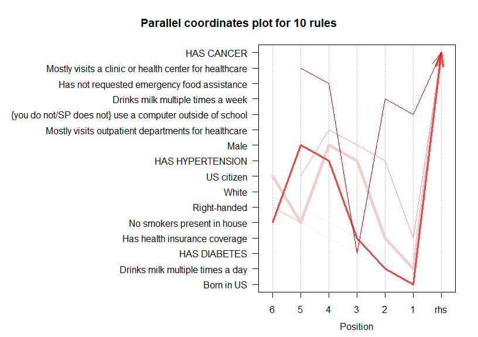{width=800px}

#### diabetes

With the association rules for diabetes, we’ve plotted the top 20 values that were represented in the itemsets.  

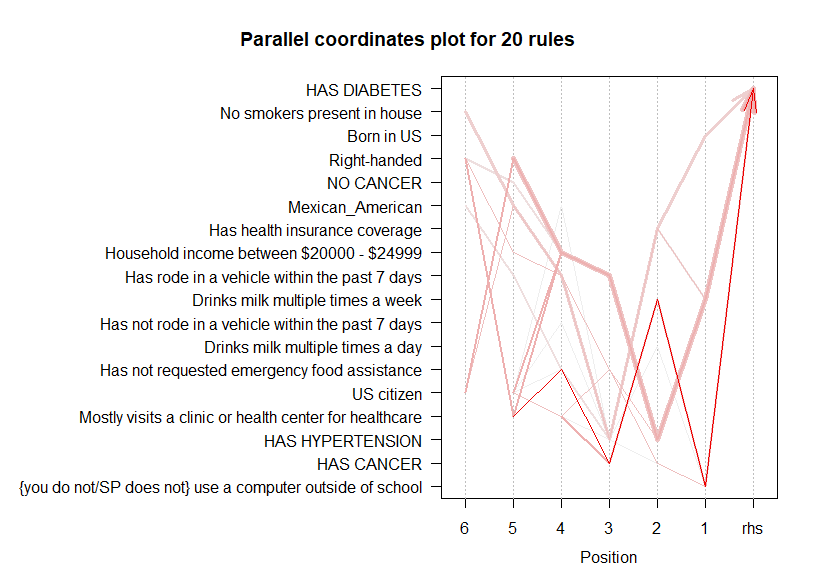{width=800px}

#### hypertension 
With the association rules for hypertension, we’ve plotted the top 20 values that were represented in the itemsets.  

{width=800px}

### Association rules for not having diseases

In the preceding section, we looked at associations between having diseases/health conditions and other values.  To complement our findings, we decided to also create association rules for not having the diseases.  This might yield beneficial findings and support any findings from the previous association rules involving positive values for diseases.  

The following rules were used: 
```{r eval=FALSE, echo=TRUE}
no_cancer.association.rules <- apriori(individuals_transaction_class, parameter = list(supp=0.001, conf=0.9,minlen=5,maxlen=10), appearance=list(default="lhs", rhs="NO CANCER"))
no_diabetes.association.rules <- apriori(individuals_transaction_class, parameter = list(supp=0.001, conf=0.9, minlen=5,maxlen=10), appearance=list(default="lhs", rhs="NO DIABETES"))
no_hypertension.association.rules <- apriori(individuals_transaction_class, parameter = list(supp=0.001, conf=0.8, minlen=5,maxlen=10), appearance=list(default="lhs", rhs="NO HYPERTENSION"))
```

The rules for not having Cancer 

Below, we’ve listed the top 20 association rules for not having cancer.  Of interest,  it appears “no health insurance”  and “visiting multiple places for healthcare” appears in many rules that lead to not having cancer. 

```{r eval=FALSE, echo=TRUE}
inspect(no_cancer.association.rules[1:20])
     lhs                                                           rhs             support confidence     lift count
[1]  {Has not rode in a vehicle within the past 7 days,                                                             
      NO DIABETES,                                                                                                  
      Smokers present in house,                                                                                     
      Visits multiple places for healthcare(not once location)} => {NO CANCER} 0.001018953  1.0000000 3.955663    10
[2]  {Has not rode in a vehicle within the past 7 days,                                                             
      Right-handed,                                                                                                 
      Smokers present in house,                                                                                     
      Visits multiple places for healthcare(not once location)} => {NO CANCER} 0.001018953  1.0000000 3.955663    10
[3]  {Has not requested emergency food assistance,                                                                  
      Has not rode in a vehicle within the past 7 days,                                                             
      Smokers present in house,                                                                                     
      Visits multiple places for healthcare(not once location)} => {NO CANCER} 0.001018953  1.0000000 3.955663    10
[4]  {Has not rode in a vehicle within the past 7 days,                                                             
      No health insurance coverage,                                                                                 
      NO HYPERTENSION,                                                                                              
      Visits multiple places for healthcare(not once location)} => {NO CANCER} 0.001222743  1.0000000 3.955663    12
[5]  {Has not rode in a vehicle within the past 7 days,                                                             
      NO DIABETES,                                                                                                  
      No health insurance coverage,                                                                                 
      Visits multiple places for healthcare(not once location)} => {NO CANCER} 0.001324638  1.0000000 3.955663    13
[6]  {Has not rode in a vehicle within the past 7 days,                                                             
      No health insurance coverage,                                                                                 
      Right-handed,                                                                                                 
      Visits multiple places for healthcare(not once location)} => {NO CANCER} 0.001324638  1.0000000 3.955663    13
[7]  {Has not requested emergency food assistance,                                                                  
      Has not rode in a vehicle within the past 7 days,                                                             
      No health insurance coverage,                                                                                 
      Visits multiple places for healthcare(not once location)} => {NO CANCER} 0.001222743  1.0000000 3.955663    12
[8]  {Born outside of US,                                                                                           
      Has not rode in a vehicle within the past 7 days,                                                             
      NO HYPERTENSION,                                                                                              
      Visits multiple places for healthcare(not once location)} => {NO CANCER} 0.001222743  1.0000000 3.955663    12
[9]  {Born outside of US,                                                                                           
      Has not rode in a vehicle within the past 7 days,                                                             
      NO DIABETES,                                                                                                  
      Visits multiple places for healthcare(not once location)} => {NO CANCER} 0.001222743  1.0000000 3.955663    12
[10] {Born outside of US,                                                                                           
      Has not rode in a vehicle within the past 7 days,                                                             
      Right-handed,                                                                                                 
      Visits multiple places for healthcare(not once location)} => {NO CANCER} 0.001222743  1.0000000 3.955663    12
[11] {Born outside of US,                                                                                           
      Has not requested emergency food assistance,                                                                  
      Has not rode in a vehicle within the past 7 days,                                                             
      Visits multiple places for healthcare(not once location)} => {NO CANCER} 0.001120848  1.0000000 3.955663    11
[12] {Has not rode in a vehicle within the past 7 days,                                                             
      Male,                                                                                                         
      NO HYPERTENSION,                                                                                              
      Visits multiple places for healthcare(not once location)} => {NO CANCER} 0.001018953  0.9090909 3.596057    10
[13] {Has not requested emergency food assistance,                                                                  
      Has not rode in a vehicle within the past 7 days,                                                             
      NO HYPERTENSION,                                                                                              
      Visits multiple places for healthcare(not once location)} => {NO CANCER} 0.001528429  0.9375000 3.708434    15
[14] {Has not rode in a vehicle within the past 7 days,                                                             
      Male,                                                                                                         
      NO DIABETES,                                                                                                  
      Visits multiple places for healthcare(not once location)} => {NO CANCER} 0.001120848  0.9166667 3.626024    11
[15] {Has not requested emergency food assistance,                                                                  
      Has not rode in a vehicle within the past 7 days,                                                             
      NO DIABETES,                                                                                                  
      Visits multiple places for healthcare(not once location)} => {NO CANCER} 0.001630324  0.9411765 3.722977    16
[16] {Has not rode in a vehicle within the past 7 days,                                                             
      Male,                                                                                                         
      Right-handed,                                                                                                 
      Visits multiple places for healthcare(not once location)} => {NO CANCER} 0.001120848  0.9166667 3.626024    11
[17] {Has not requested emergency food assistance,                                                                  
      Has not rode in a vehicle within the past 7 days,                                                             
      Male,                                                                                                         
      Visits multiple places for healthcare(not once location)} => {NO CANCER} 0.001120848  1.0000000 3.955663    11
[18] {Has not requested emergency food assistance,                                                                  
      Has not rode in a vehicle within the past 7 days,                                                             
      Right-handed,                                                                                                 
      Visits multiple places for healthcare(not once location)} => {NO CANCER} 0.001630324  0.9411765 3.722977    16
[19] {No health insurance coverage,                                                                                 
      NO HYPERTENSION,                                                                                              
      Smokers present in house,                                                                                     
      Visits multiple places for healthcare(not once location)} => {NO CANCER} 0.001222743  1.0000000 3.955663    12
[20] {NO DIABETES,                                                                                                  
      No health insurance coverage,                                                                                 
      Smokers present in house,                                                                                     
      Visits multiple places for healthcare(not once location)} => {NO CANCER} 0.001324638  1.0000000 3.955663    13
> 
```


The rules for not having Diabetes

Below, we’ve listed the top 20 association rules for not having diabetes.  There are multiple rules with the value where the individual receives health from various places (as opposed to one location).  

```{r eval=FALSE, echo=TRUE}
inspect(no_diabetes.association.rules[1:20])
     lhs                                                                rhs               support confidence     lift count
[1]  {Visits multiple places for healthcare(not once location)}      => {NO DIABETES} 0.005094763  0.9615385 3.979982    50
[2]  {Smokers present in houses}                                     => {NO DIABETES} 0.006317506  0.9841270 4.073480    62
[3]  {Plays 5 or more hours of video games over the past 30 days}    => {NO DIABETES} 0.015793764  0.9509202 3.936032   155
[4]  {Plays 3 hours of video games over the past 30 days}            => {NO DIABETES} 0.016812717  0.9649123 3.993947   165
[5]  {Mostly visits an emergency room for healthcare}                => {NO DIABETES} 0.027919299  0.9319728 3.857605   274
[6]  {Plays 2 hours of video games over the past 30 days}            => {NO DIABETES} 0.031791319  0.9483283 3.925303   312
[7]  {Plays 1 hour of video games over the past 30 days}             => {NO DIABETES} 0.038006929  0.9588689 3.968933   373
[8]  {Plays less than an hours of video games over the past 30 days} => {NO DIABETES} 0.054106379  0.9550360 3.953067   531
[9]  {Smokers present in house}                                      => {NO DIABETES} 0.060831465  0.9255814 3.831150   597
[10] {No smokers present in house}                                   => {NO DIABETES} 0.174444671  0.9194415 3.805735  1712
[11] {Mostly visits a clinic or health center for healthcare}        => {NO DIABETES} 0.193397188  0.9267578 3.836019  1898
[12] {NO HYPERTENSION}                                               => {NO DIABETES} 0.203382922  0.9661181 3.998938  1996
[13] {Has rode in a vehicle within the past 7 days}                  => {NO DIABETES} 0.205217037  0.9276831 3.839849  2014
[14] {NO CANCER}                                                     => {NO DIABETES} 0.235887508  0.9330915 3.862235  2315
[15] {Has not rode in a vehicle within the past 7 days,                                                                    
      Visits multiple places for healthcare(not once location)}      => {NO DIABETES} 0.001936010  1.0000000 4.139182    19
[16] {Smokers present in house,                                                                                            
      Visits multiple places for healthcare(not once location)}      => {NO DIABETES} 0.001834115  1.0000000 4.139182    18
[17] {Other,                                                                                                               
      Visits multiple places for healthcare(not once location)}      => {NO DIABETES} 0.002037905  1.0000000 4.139182    20
[18] {Does not play video games,                                                                                           
      Visits multiple places for healthcare(not once location)}      => {NO DIABETES} 0.002343591  0.9583333 3.966716    23
[19] {Household income between $25000 - $34999,                                                                            
      Visits multiple places for healthcare(not once location)}      => {NO DIABETES} 0.001120848  0.9166667 3.794250    11
[20] {Rarely-less than once a week,                                                                                        
      Visits multiple places for healthcare(not once location)}      => {NO DIABETES} 0.001222743  1.0000000 4.139182    12
> 
```

The rules for not having Hypertension 

Below, we’ve listed the top 20 association rules for not having hypertension.  Of interest, values smokers and non-smokers both appear in the results.  Many of the video game related values also appear in the rules below.   

```{r eval=FALSE, echo=TRUE}
inspect(no_hypertension.association.rules[1:20])
     lhs                                                                rhs                   support confidence     lift count
[1]  {Visits multiple places for healthcare(not once location)}      => {NO HYPERTENSION} 0.004789077  0.9038462 4.293488    47
[2]  {Smokers present in houses}                                     => {NO HYPERTENSION} 0.005400448  0.8412698 3.996235    53
[3]  {Healthcare is received from non-standard facility}             => {NO HYPERTENSION} 0.006419401  0.8289474 3.937701    63
[4]  {Plays 5 or more hours of video games over the past 30 days}    => {NO HYPERTENSION} 0.013450173  0.8098160 3.846822   132
[5]  {Plays 3 hours of video games over the past 30 days}            => {NO HYPERTENSION} 0.014774811  0.8479532 4.027983   145
[6]  {Mostly visits an emergency room for healthcare}                => {NO HYPERTENSION} 0.024454860  0.8163265 3.877749   240
[7]  {Plays 2 hours of video games over the past 30 days}            => {NO HYPERTENSION} 0.028632566  0.8541033 4.057198   281
[8]  {Plays 1 hour of video games over the past 30 days}             => {NO HYPERTENSION} 0.032300795  0.8149100 3.871020   317
[9]  {Plays less than an hours of video games over the past 30 days} => {NO HYPERTENSION} 0.046668025  0.8237410 3.912969   458
[10] {No smokers present in house}                                   => {NO HYPERTENSION} 0.154880783  0.8163265 3.877749  1520
[11] {Mostly visits a clinic or health center for healthcare}        => {NO HYPERTENSION} 0.168840432  0.8090820 3.843335  1657
[12] {Has rode in a vehicle within the past 7 days}                  => {NO HYPERTENSION} 0.178928062  0.8088439 3.842204  1756
[13] {NO DIABETES}                                                   => {NO HYPERTENSION} 0.203382922  0.8418389 3.998938  1996
[14] {NO CANCER}                                                     => {NO HYPERTENSION} 0.206847361  0.8182185 3.886736  2030
[15] {Has not rode in a vehicle within the past 7 days,                                                                        
      Visits multiple places for healthcare(not once location)}      => {NO HYPERTENSION} 0.001834115  0.9473684 4.500229    18
[16] {Smokers present in house,                                                                                                
      Visits multiple places for healthcare(not once location)}      => {NO HYPERTENSION} 0.001630324  0.8888889 4.222437    16
[17] {Other,                                                                                                                   
      Visits multiple places for healthcare(not once location)}      => {NO HYPERTENSION} 0.002037905  1.0000000 4.750242    20
[18] {Does not play video games,                                                                                               
      Visits multiple places for healthcare(not once location)}      => {NO HYPERTENSION} 0.002241696  0.9166667 4.354389    22
[19] {Household income between $25000 - $34999,                                                                                
      Visits multiple places for healthcare(not once location)}      => {NO HYPERTENSION} 0.001018953  0.8333333 3.958535    10
[20] {Rarely-less than once a week,                                                                                            
      Visits multiple places for healthcare(not once location)}      => {NO HYPERTENSION} 0.001120848  0.9166667 4.354389    11
> 
```


## Conclusion 

As we’ve gathered data for having diseases and not having diseases, we’ve attempted to gather insights from the findings that could provide business value to the marketing department as per the defined initial business problem.  Please note the association rules do not establish causation.  These association rules are only to highlight values that are associated or appear together.  And our conclusion is subjective based on our interpretation of the data.     

These association rules show what related items are found in conjunction with having different diseases and health conditions.  Below, we will discuss some of our findings: 

The value associated with drinking milk multiple times a day or week appears several times in diabetes and cancer conditions.  Additionally, the values for drinking milk do not appear in the association rules for not having cancer/diabetes.  It might be valid to position marketing  for drugs on cancer/diabetes in conjunction with milk placement. For example, youtube video often place advertisements in pairs.  Then, we could place a cancer drug advertisement appear after a milk advertisement in a youtube video.  Please we are not suggesting that milk usage causes cancer.  We are making a suggestion an association that is within the data.       

For hypertension, many of the associated values for income are under $24,999.  For marketing, placement of billboards in areas where salaries are under $24,999 could be helpful to market drugs towards those with hypertension.

Although, our business is focused on marketing drugs to patients for cancer, diabetes, and hypertension.  We can look for out of the box solutions. If the business was looking to develop drugs (or supplements) related to the prevention of hypertension, we could use data to identify associations with audiences that do not already have a disease.   

In summary, these are a few of the suggestions that could be derived from the data.  We think these suggestions could have value and provide the “so what” for our conclusions.  

### Limitations of the conclusions   

The association models used in the preceding sections contained 18 variables.  We will provide our results to the business.  However,  the associations rules could be improved by adding more categorical variables or numerical variables (which have been binned).  The activity of recoding and binning values from the raw data increases the overhead of adding more attributes.  However, in the event, the business is intrigued by the findings, more data can be incorporated in the association ruleset.  

Within the data for not having diseases, frequently, the condition not having medical insurance appears multiple times.  Is this an indication, people without medical insurance are truly not associated with the diseases? Recall the data for the field is based on a questionnaire that presuppositions, the individual has seen a doctor.  If the individual has not seen a doctor for diagnose due to health insurance coverage, then they may not have been able to accurately ascertain whether they have a particular disease.    


# Problem 3: Clustering problem

## Business case

The marketing department is struggling with high costs of television advertisements and is interested in ways to reduce their costs while still hitting their target markets for both the advertisement of drugs and attracting candidates for trails.

### Data preparation

#### Data labeling and feature selection

We only used the demographics database to avoid potential HIPAA breaches. The features below were selected to assist the marketing department with their market segmentation efforts:
```{r, eval=FALSE, echo=TRUE}
demographic = (
  read.csv("Data/Raw/demographic.csv", header = TRUE, na.strings = c("NA","","#NA")) %>%
  dplyr::select(c("SEQN","RIAGENDR","RIDAGEYR","RIDRETH3","DMDEDUC3","DMDEDUC2","DMDCITZN","DMDFMSIZ","DMDHRMAR","INDFMIN2")) %>%
  dplyr::rename(
    "ID" = "SEQN",
    "Gender" = "RIAGENDR",
    "Age" = "RIDAGEYR",
    "Race" = "RIDRETH3",
    "Education_level2" = "DMDEDUC3",
    "Education_level" = "DMDEDUC2",
    "Citizenship_status" = "DMDCITZN",
    "Family_members" = "DMDFMSIZ",
    "Marital_status" = "DMDHRMAR",
    "Family_income" = "INDFMIN2") %>%
  dplyr::mutate(
    Gender = dplyr::recode(
      Gender,
      "1" = "M",
      "2" = "F") %>%
      as.factor,
    Race = dplyr::recode(
      Race,
      "1" = "Hispanic",
      "2" = "Hispanic",
      "3" = "White",
      "4" = "Black",
      "6" = "Asian",
      "7" = "Other") %>%
      as.factor,
    Education_level2  = dplyr::recode(
      Education_level2,
      "0" = "None",
      "1" = "Primary",
      "2" = "Primary",
      "3" = "Primary",
      "4" = "Primary",
      "5" = "Primary",
      "6" = "Primary",
      "7" = "Primary",
      "8" = "Primary",
      "9" = "Primary",
      "10" = "Primary",
      "11" = "Primary",
      "12" = "Primary",
      "13" = "High_School",
      "14" = "High_School",
      "15" = "Primary",
      "55" = "Primary",
      "66" = "Unknown",
      "77" = "Unknown",
      "99" = "Unknown"),
    Education_level  = dplyr::recode(
      Education_level,
      "1" = "Primary",
      "2" = "Primary",
      "3" = "High_School",
      "4" = "High_School",
      "5" = "University",
      "7" = "Unknown",
      "9" = "Unknown"),
    Citizenship_status = dplyr::recode(
      Citizenship_status,
      "1" = "US",
      "2" = "Other",
      "7" = "Unknown",
      "9" = "Unknown") %>%
      as.factor,
    Marital_status = recode(
      Marital_status,
      "1"  = "Married",
      "2"  = "Widowed",
      "3"  = "Divorced",
      "4"  = "Separated",
      "5"  = "Never_married",
      "6"  = "Partner",
      "77" = "Unknown",
      "99" = "Unknown") %>%
      as.factor,
    Family_income = recode(
      Family_income,
      "1"  = "$0 - $4999",
      "2"  = "$5000 - $9999",
      "3"  = "$10000 - $14999",
      "4"  = "$15000 - $19999",
      "5"  = "$20000 - $24999",
      "6"  = "$25000 - $34999",
      "7"  = "$35000 - $44999",
      "8"  = "$45000 - $54999",
      "9"  = "$55000 - $64999",
      "10" = "$65000 - $74999",
      "12" = "$20000 and Over",
      "13" = "Under $20000",
      "14" = "$75000 - $99999",
      "15" = "$100000 and Over",
      "77" = "Unknown",
      "99" = "Unknown") %>%
      as.factor
    ))
```

#### Data cleanup

There were two columns for education, one that breaks down the elementary studies of the participants and another that more broadly indicates higher levels of education. We are not interested in such a level of granularity and proceeded to merge both columns and reduced the number of factors to mean "Highest level of education achieved", this helped reduce the missing values from over 40% in each column to under 17%.
```{r, eval=FALSE, echo=TRUE}
demographic$Education_level=as.factor(ifelse(!is.na(demographic$Education_level), demographic$Education_level, demographic$Education_level2))
demographic$Education_level2 = NULL
demographic$Family_members=as.factor(demographic$Family_members)
```

#### Data binning

For consistency, the Age feature was converted to categorical.
```{r, eval=FALSE, echo=TRUE}
demographic$Age = cut(demographic$Age,
                      include.lowest=TRUE,right=FALSE,
                      breaks=c(seq(0, 90, by=10)),
                      labels=c("0 to 9","10 to 19","20 to 29","30 to 39","40 to 49","50 to 59","60 to 69","70 to 79","80 to >80"))
                      #cbind(seq(0, 80, by=10), c(sapply(seq(0, 70, by=10), function(x)x+9), ">80")) %>% as.data.frame %>% unite(Age, sep=" to "))
```

#### Data verification

Check that features have the appropiate class and that missing values are below 25%.
```{r, eval=FALSE, echo=TRUE}
sapply(demographic, class)
```

##### Data imputation

Impute missing values
```{r, eval=FALSE, echo=TRUE}
mice = mice(demographic, m=5)
mice$predictorMatrix[,'ID']=0
demographic = mice::complete(mice)
rm(mice)
```

#### Data verification

Check that features have the appropiate class and that missing values are below 25%.
```{r, eval=FALSE, echo=TRUE}
apply(demographic, 2, function(x) length(which(x == "" | is.na(x) | x == "NA" | x == "-999" ))/length(x))
```

### Hierarchical clustering

Hierarchical clustering was chosen due to the features being categorical
```{r, eval=FALSE, echo=TRUE}
d = dist(demographic,method = "euclidean")
h_clust = hclust(d, method = "ward.D2")
h_clusters = cutree(h_clust,k=8)
demographic$cluster = as.factor(h_clusters)
rm(d, h_clust, h_clusters)

```

### Data visualization

The first plot is a tally of how many observations there are in each cluster. Subsequent plots show the distribution of the features among each cluster. All the plots are shown after the code.
```{r, eval=FALSE, echo=TRUE}
# General plot
general_plot = ggplot(demographic, aes(x=cluster, fill=cluster)) +
  geom_bar(stat="count") +
  labs(title="Observations per cluster",
       x="Cluster", y="Percent")
# Gender plot
gender_plot = ggplot(demographic, aes(x=cluster, fill=Gender)) +
  geom_bar(stat="count", position="fill") + 
  labs(title="Gender per cluster",
       x="Cluster", y="Percent")
  
# Age plot
age_plot = ggplot(demographic, aes(x=cluster, fill=Age)) +
  geom_bar(stat="count", position="fill") +
  labs(title="Age per cluster",
       x="Cluster", y="Percent")

# Race plot
race_plot = ggplot(demographic, aes(x=cluster, fill=Race)) +
  geom_bar(stat="count", position="fill") +
  labs(title="Race per cluster",
       x="Cluster", y="Percent")

# Education_level plot
education_level_plot = ggplot(demographic, aes(x=cluster, fill=Education_level)) +
  geom_bar(stat="count", position="fill") +
  labs(title="Education_level per cluster",
       x="Cluster", y="Percent")

# Citizenship_status plot
citizenship_status_plot = ggplot(demographic, aes(x=cluster, fill=Citizenship_status)) +
  geom_bar(stat="count", position="fill") +
  labs(title="Citizenship_status per cluster",
       x="Cluster", y="Percent")

# Family_members plot
family_members_plot = ggplot(demographic, aes(x=cluster, fill=Family_members)) +
  geom_bar(stat="count", position="fill") +
  labs(title="Family_members per cluster",
       x="Cluster", y="Percent")

# Marital_status plot
marital_status_plot = ggplot(demographic, aes(x=cluster, fill=Marital_status)) +
  geom_bar(stat="count", position="fill") +
  labs(title="Marital_status per cluster",
       x="Cluster", y="Percent")

# Family_income plot
family_income_plot = ggplot(demographic, aes(x=cluster, fill=Family_income)) +
  geom_bar(stat="count", position="fill") +
  labs(title="Family_income per cluster",
       x="Cluster", y="Percent")

# Final plot
grid.arrange(general_plot, gender_plot, age_plot,
             race_plot, education_level_plot,
             citizenship_status_plot, family_members_plot,
             marital_status_plot, family_income_plot) #%>%
  #ggsave(height=8, width=8, dpi = 300, filename = "Figures/Problem3.png")

```
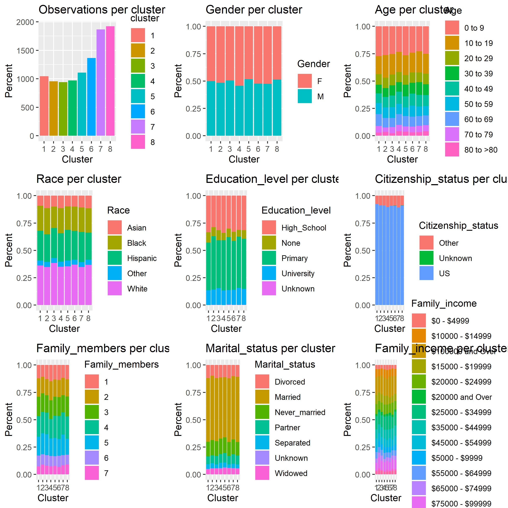{width=100%}

### Conclusion

Although the data appears to be very homogenous, with many of the clusters having similar proportions. There are two clusters, 7 and 8, that encompass more observations. The data from these two would be recommended to the marketing department for further analysis.


# Models against sub-datasets (OPTIONAL)

## Cluster Model for Demographic  {.tabset}

### PCA 


```{r, eval=FALSE, echo=TRUE}

demo_subset_8   = read.csv("Data/Working/demo_subset_8_imputed.csv", header = TRUE, na.strings = c("NA","","#NA"))[-1]
target_disease_dataset   = read.csv("Data/Working/target_disease_dataset.csv", header = TRUE, na.strings = c("NA","","#NA"))[-1]
demographic_imputed   = read.csv("Data/Clean_Imputes/demographic_imputed.csv", header = TRUE, na.strings = c("NA","","#NA"))

library(devtools)
#install_github("vqv/ggbiplot")
library(ggbiplot)

demo_subset_8.pca <- prcomp(demo_subset_8[,c(2:9)], center = TRUE,scale = TRUE)
summary(demo_subset_8.pca)
str(demo_subset_8.pca)

#ggbiplot(demo_subset_8.pca)

screeplot(demo_subset_8.pca, type = "l", npcs = 8, main = "Screeplot of the 8 PCs")
abline(h = 1, col="red", lty=5)
legend("topright", legend=c("Eigenvalue = 1"),
       col=c("red"), lty=5, cex=0.6)

cumpro <- cumsum(demo_subset_8.pca$sdev^2 / sum(demo_subset_8.pca$sdev^2))
plot(cumpro[0:8], xlab = "PC #", ylab = "Amount of explained variance", main = "Cumulative variance plot")
abline(v = 4, col="blue", lty=5)
abline(h = 0.5934, col="blue", lty=5)
legend("topleft", legend=c("Cut-off @ PC4"),
       
```

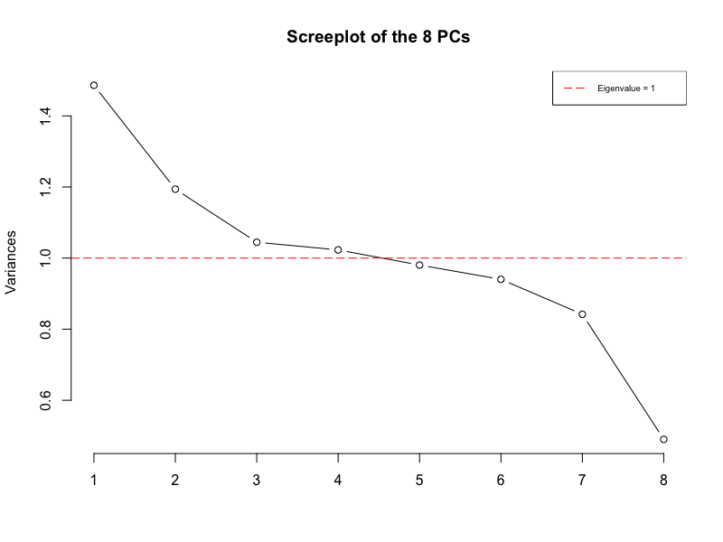{width=350px}
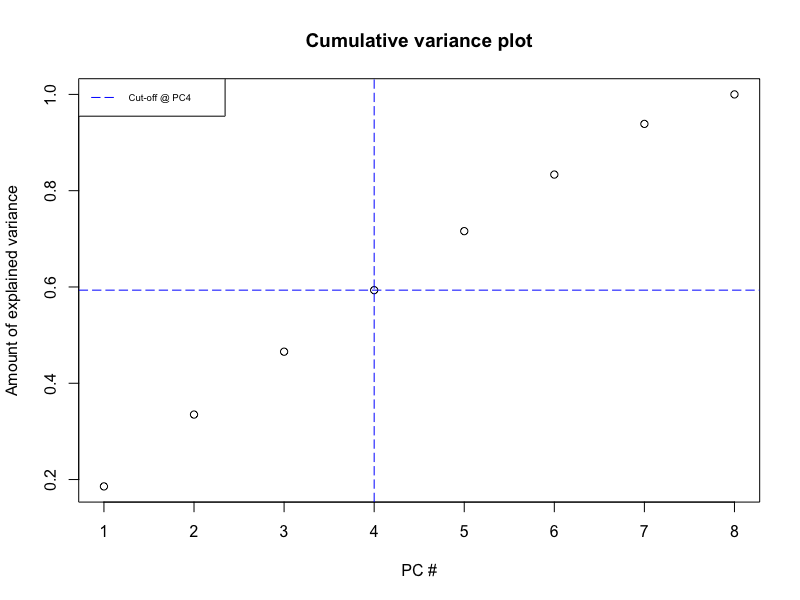{width=350px}

From the above graphs, we notice is that the first 4 components has an Eigenvalue >1 
and explains almost 60% of variance! We can not effectively reduce dimensionality from 8  to 4 becuase we will lose about 40% of variance!

```{r, eval=FALSE, echo=TRUE}

library("factoextra")
fviz_pca_ind(demo_subset_8.pca, geom.ind = "point", pointshape = 21, 
             pointsize = 2, 
             fill.ind = target_disease_dataset$HAS_DIABETES, 
             col.ind = "black", 
             palette = "jco", 
             addEllipses = TRUE,
             label = "var",
             col.var = "black",
             repel = TRUE,
             legend.title = "HAS_DIABETES") +
  ggtitle("2D PCA-plot from 8 feature dataset") +
  theme(plot.title = element_text(hjust = 0.5))


fviz_pca_ind(demo_subset_8.pca, geom.ind = "point", pointshape = 21, 
             pointsize = 2, 
             fill.ind = target_disease_dataset$HAS_HYPERTENSION, 
             col.ind = "black", 
             palette = "jco", 
             addEllipses = TRUE,
             label = "var",
             col.var = "black",
             repel = TRUE,
             legend.title = "HAS_HYPERTENSION") +
  ggtitle("2D PCA-plot from 8 feature dataset") +
  theme(plot.title = element_text(hjust = 0.5))

fviz_pca_ind(demo_subset_8.pca, geom.ind = "point", pointshape = 21, 
             pointsize = 2, 
             fill.ind = target_disease_dataset$HAS_CANCER, 
             col.ind = "black", 
             palette = "jco", 
             addEllipses = TRUE,
             label = "var",
             col.var = "black",
             repel = TRUE,
             legend.title = "HAS_CANCER") +
  ggtitle("2D PCA-plot from 8 feature dataset") +
  theme(plot.title = element_text(hjust = 0.5))


```

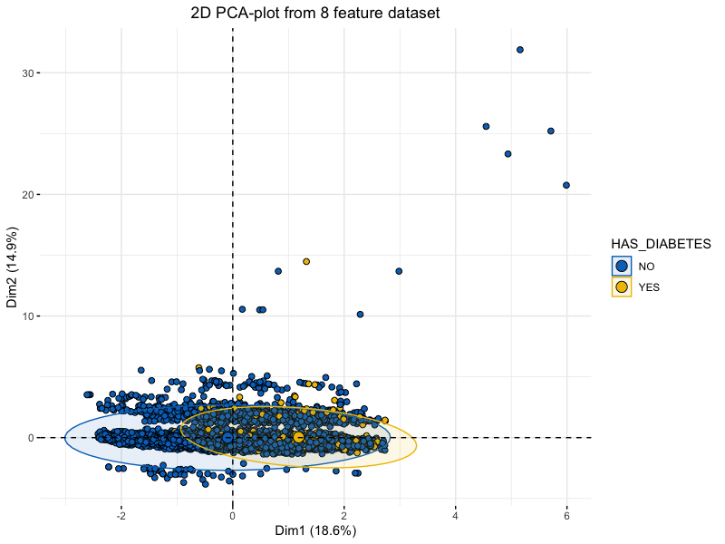{width=260px}
{width=260px}
{width=260px}

With just use the first two components, no diseases present separation between sick and healthy people 
. This  clearly  indicate that the we can not do classification base only on the demographics data. 


```{r, eval=FALSE, echo=TRUE}


```


### k-means Clustering 


```{r, eval=FALSE, echo=TRUE}

#Elbow plot method.
library(purrr)
set.seed(226)
# function to calculate total intra-cluster sum of square
demo8_iss <- function(k) {
  kmeans(demo_subset_8[,2:9],k,iter.max=100,nstart=100,algorithm="Lloyd" )$tot.withinss
}
k.values <- 1:10
demo8_iss_values <- map_dbl(k.values, demo8_iss)
plot(k.values, demo8_iss_values,
     type="b", pch = 19, frame = FALSE,
     xlab="Number of clusters K",
     ylab="Total intra-clusters sum of squares")
```

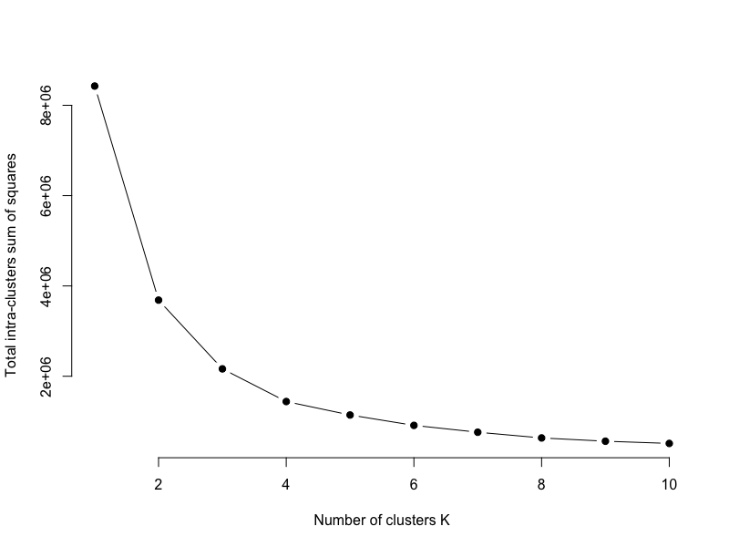{width=500px}

From the above graph, we conclude that 6 is the appropriate number of clusters 
since it seems to be appearing at the bend in the elbow plot.

Now, let us take k = 6 as our optimal cluster

```{r, eval=FALSE, echo=TRUE}

demo8_k6<-kmeans(demo_subset_8[,2:9],6,iter.max=100,nstart=50,algorithm="Lloyd")
demo8_k6

# Visualizing the Clustering Results using the First Two Principle Components

pcclust=prcomp(demo_subset_8[,2:9],scale=TRUE) #principal component analysis
summary(pcclust)
pcclust$rotation[,1:2]

set.seed(100)
ggplot(demo_subset_8, aes(x =Gender, y = Age)) +
  geom_point(stat = "identity", aes(color = as.factor(demo8_k6$cluster))) +
  scale_color_discrete(name=" ",
                       breaks=c("1", "2", "3", "4", "5","6"),
                       labels=c("Cluster 1", "Cluster 2", "Cluster 3", "Cluster 4", "Cluster 5","Cluster 6")) +
  ggtitle("Demographics Data ", subtitle = "Using K-means Clustering")


```


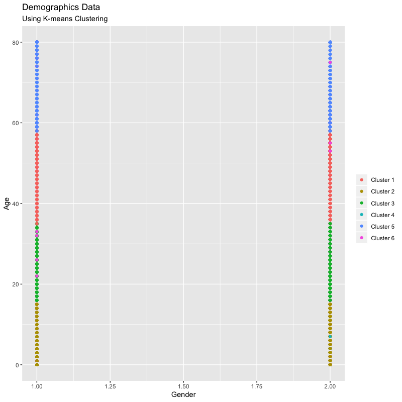{width=500px}


 From the above visualization, we observe that in the clusters distribution both Male and female  have almost the same range of age 

```{r, eval=FALSE, echo=TRUE}


```


## Applying machine learning models  {.tabset}

In this section, we will combine all the datasets and perform clustering algorithms.  

```{r, eval=FALSE, echo=TRUE}
```
###  PCA
```{r, eval=FALSE, echo=TRUE}
```
###  K-means 
```{r, eval=FALSE, echo=TRUE}
```
###  Hierarchical Agglomerative
```{r, eval=FALSE, echo=TRUE}
```
##  Summary of models
```{r, eval=FALSE, echo=TRUE}
```


## Models for Shiny

The model used in the ShinyApp to precit if a patient was changes to contract cancer is Random Forest, 
give it best performance.

## Link for ShinyApp
The ShinyApp can be accessed from:
https://ml1000-group6.shinyapps.io/NAHNES/


